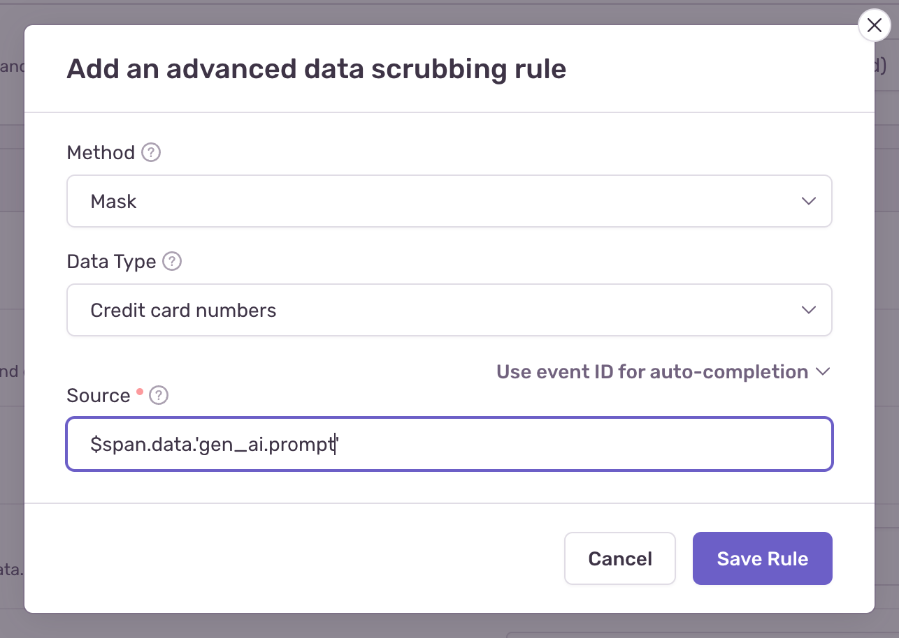

## SDK Data Collection Settings

AI inputs and outputs can contain sensitive information. You can omit this content while still collecting model names, token counts, and timing metadata. The controls depend on your SDK:

- **Python 2.70.0+:** Set `data_collection={"gen_ai": {"inputs": False, "outputs": False}}` to omit AI content. Providing `data_collection` opts into broader defaults for other categories and overrides `send_default_pii` and per-integration `include_prompts`. See [Python Privacy Controls](/platforms/python/agent-tracing/#privacy-controls).
- **JavaScript v11+:** Inputs and outputs are collected by default. Set `dataCollection: { genAI: { inputs: false, outputs: false } }` to omit them. Explicit integration `recordInputs` and `recordOutputs` options take precedence; Vercel AI also supports per-call controls. See [JavaScript Privacy Controls](/platforms/javascript/guides/node/agent-tracing/#privacy-controls).
- **Laravel:** AI content is off by default. `SENTRY_SEND_DEFAULT_PII=true` enables it along with other PII. See [Laravel setup](/platforms/php/guides/laravel/agent-tracing/#configure).
- **.NET:** `Sentry.Extensions.AI` records model inputs and outputs by default. Use `Experimental.RecordInputs` and `Experimental.RecordOutputs` on `AddSentry()` to control them. See [.NET options](/platforms/dotnet/tracing/instrumentation/ai-agents-module/#configuration-options).
- **React Native:** Use `recordInputs` and `recordOutputs` on the manual AI wrapper or callback handler. `dataCollection` is not supported by the React Native SDK. See [React Native integrations](/platforms/react-native/integrations/).

In JavaScript v10 versions that support `dataCollection`, setting it opts into the new collection defaults; omitting it preserves `sendDefaultPii` behavior. JavaScript v11 removed `sendDefaultPii`. For Python without `data_collection`, collection still depends on `send_default_pii` and integration overrides.

These options control automatically collected content. They do not filter arbitrary attributes you attach manually, including in [Ruby's manual instrumentation](/platforms/ruby/tracing/instrumentation/custom-instrumentation/ai-agents-module/). Omit or sanitize that content before attaching it.

## Server-Side PII Scrubbing

<Alert level="info">

Sentry has built-in [Server-Side Data Scrubbing](/security-legal-pii/scrubbing/server-side-scrubbing/) that automatically detects and removes common sensitive data like credit card numbers, social security numbers, and passwords from most event data.

However, the following agent span attributes are not protected by default:

- `gen_ai.input.messages`
- `gen_ai.tool.call.arguments`
- `gen_ai.tool.call.result`
- `gen_ai.output.messages`
- `gen_ai.response.object`

</Alert>
If you wish to enable Data Scrubbing for any of these fields you can add an [Advanced Data Scrubbing](/security-legal-pii/scrubbing/advanced-datascrubbing/) rule in [Organization-level **Security & Privacy** settings](https://sentry.io/orgredirect/organizations/:orgslug/settings/security-and-privacy/) or [Project-level **Security & Privacy** settings](https://sentry.io/orgredirect/organizations/:orgslug/settings/projects/:projectId/security-and-privacy/) in the following format: `$span.data.''`.

