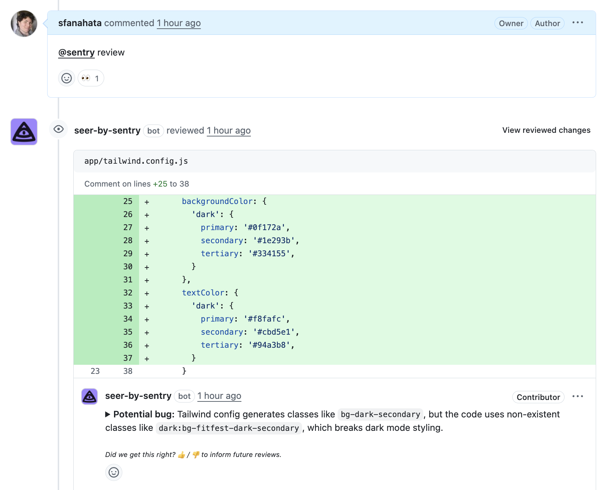

AI Code Review helps you generate new tests for uncovered code and reviews your code changes, predicting errors and offering suggestions for improvement before merging pull requests.

<Alert>
  AI Code Review is currently in <strong>beta</strong>. Beta features are
  still a work in progress and may have bugs. Please join the [Discord
  conversation](https://discord.com/channels/621778831602221064/1385700674557444190)
  to share your feedback.
</Alert>

## Getting Started

To enable AI Code Review in your GitHub organization or on specific repositories, you need to install the [Seer by Sentry GitHub app](https://github.com/apps/seer-by-sentry). This allows the assistant to analyze pull requests, provide insights, and write tests. **You must also have the [Sentry Github integration](/organization/integrations/source-code-mgmt/github/) enabled.**

1. Install the [Seer by Sentry GitHub app](https://github.com/apps/seer-by-sentry) in your GitHub organization or specific repositories.
2. Enable these required settings in your Sentry [organization settings](https://sentry.io/orgredirect/settings/:orgslug/):
   - `Show Generative AI Features`
   - `Enable AI Code Review`

If you're not an admin, share the Seer by Sentry GitHub App Integration link with your organization's admin or owner to install it.

## AI Code Review Commands

After installing the app, AI Code Review can help you in three ways:

1. **Error Prediction** - When you create a pull request and set it to `Ready for Review`, AI Code Review will check for errors in your code. If no error is found, you will see a 🎉 emoji as a reaction to your PR description. Otherwise, AI Code Review will add comments to your PR. 

2. **`@sentry review`** - Use this command in a PR comment, and the assistant will review the PR and predict errors, as well as make suggestions.

3. **`@sentry generate-test`** - Use this command in a PR comment, and the assistant will generate tests for your PR.

Once you have added a comment, the assistant will reply, acknowledging the request. For code reviews, you will then see comments added to your PR. For test generation, you will see a comment with a link to the generated tests.

## Frequently Asked Questions

- **What data does AI Code Review need access to for the AI system to function, and what information is sent to third-party AI providers?**

  AI Code Review requires access to your pull requests, including PR metadata, repository information, file names, directory structures, and code diffs. Only file names, code diffs, and PR descriptions are sent to the AI provider for analysis.

- **Does AI Code run anywhere outside of GitHub, and does it run in the background?**

AI Code Review only runs on GitHub. It will run once when a PR is marked `ready for review`, and otherwise only runs when triggered by a comment.

  You can learn more about AI privacy and security [here](/product/ai-in-sentry/ai-privacy-and-security/).

- **Why aren't `@sentry` commands working?**

  AI Code Review will respond with a message to enable the `Show Generative AI Features` and `Enable PR Review and Test Generation` settings in your [organization settings](https://sentry.io/orgredirect/settings/:orgslug/), if you have not already enabled them. Once enabled, try `@sentry review` or `@sentry generate-test` again to run AI Code Review.

- **Is AI Code Review available in the EU region?**

  Not currently, although we're working on it.
