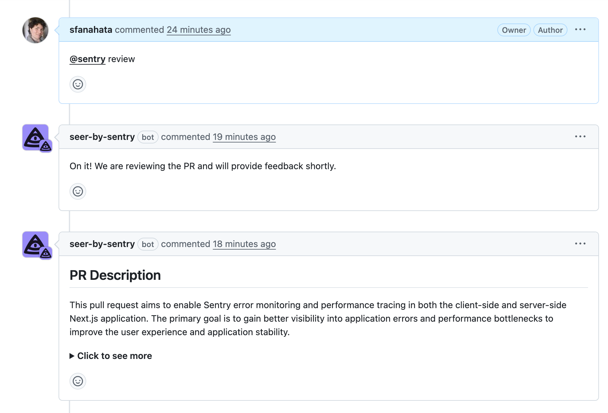

Sentry's AI Code Review is a generative AI assistant developed by Sentry. It helps you generate new tests for uncovered code and reviews your code changes, offering suggestions for improvement before merging pull requests.

<Alert>
  Sentry's AI Code Review is currently in <strong>beta</strong>. Beta features are still a work in progress and may have bugs. Please join the [Discord conversation](https://discord.com/channels/621778831602221064/1385700674557444190) to share your feedback.
</Alert>

## Getting Started

To enable Sentry's AI Code Review in your GitHub organization or on specific repositories, you need to install the [Seer by Sentry app](https://github.com/apps/seer-by-sentry). This allows the assistant to analyze pull requests, provide insights, and write tests.

If you're not an admin, copy the Seer by Sentry GitHub App Integration link and share it with your organization's admin or owner to install it.

## AI Code Review Commands

After installing the app, use these commands in your pull request comments:

-  `@sentry review` - The assistant will review the PR and make suggestions.

- `@sentry generate-test` - The assistant will generate tests for your PR.

Once you have added a comment, the assistant will reply, acknowledging the request. For code reviews, you will then see comments added to your PR. For test generation, you will see a comment with a link to the generated tests.

## Frequently Asked Questions

**What data does Sentry's AI Code Review need access to for the AI system to function, and what information is sent to third-party AI providers?**

Sentry's AI Code Review requires access to your pull requests, including PR metadata, repository information, file names, directory structures, and code diffs. The file names, code diffs, and PR descriptions are sent to the AI provider for analysis.

**Does Sentry's AI Code Review run anywhere outside of GitHub, and does it run in the background?**

Sentry's AI Code Review only runs on GitHub, and only runs when triggered by a comment. 

The [Show Generative AI Features toggle](https://sentry.io/orgredirect/organizations/:orgslug/settings/#hideAiFeatures) does not currently apply to Sentry's AI Code Review. if you don't want Sentry's AI Code Review used on your projects, you can uninstall the [Seer app](https://github.com/apps/seer-by-sentry) at any time.

You can learn more about AI privacy and security [here](/product/ai-in-sentry/ai-privacy-and-security/).

## Feedback & Support

Have feedback? Drop us a line on GitHub Issues or contact Sentry support.

---

For more information, see [Sentry's AI Code Review documentation](https://docs.sentry.io/).