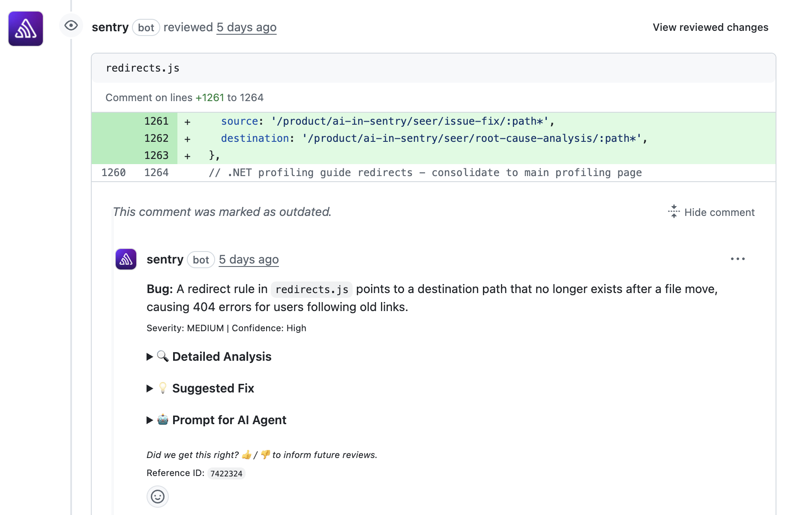

AI Code Review helps you reviews your code changes, predicting errors and offering suggestions for improvement before merging pull requests.

## Getting Started

Set up AI Code Review in your GitHub organization or on specific repositories:
1. Configure [Seer Settings](https://sentry.io/orgredirect/organizations/:orgslug/settings/seer/). **Note:** Enabling Seer starts *active contributor pricing* for this feature. Learn more about [Seer pricing](/pricing/#seer-pricing).

2. You must use the [GitHub integration](/organization/integrations/source-code-mgmt/github/) to enable AI Code Review.

### GitHub Permissions

AI Code Review requires specific GitHub permissions to work. When you install or update the Sentry GitHub integration, you'll need to accept the following permissions:

- **Pull Requests (Read & Write)**: To read PR content and write code review comments
- **Checks (Read & Write)**: To create status checks that show the AI Code Review results on your PRs

If you have previously installed the GitHub integration, you may need to update your permissions to include these. GitHub will prompt you to accept updated permissions when Sentry requests them.

<Alert level="info">
  Denying or ignoring permission update requests won't affect your current Sentry usage, but will prevent AI Code Review and other features from working.
</Alert>

## AI Code Review Commands

Ways AI Code Review can help you:

1. **Error Prediction** - When you create a pull request and set it to `Ready for Review`, AI Code Review will check for errors in your code on every commit. Once the check is complete, you will see a 🎉 emoji as a reaction to your PR description. If errors are found, AI Code Review will add comments to your PR. **Note:** We skip reviews if you set your PR to `draft` at any time.

2. **`@sentry review`** - Use this command in a PR comment, and the assistant will review the PR and predict errors, as well as make suggestions. Head to [Seer settings](https://sentry.io/orgredirect/organizations/:orgslug/settings/seer/) to enable it.

## GitHub Status Checks

AI Code Review creates GitHub status checks (also called "checks") on your pull requests to indicate whether the code review passed or found potential issues. These status checks appear in the PR's checks section and can be integrated with GitHub's branch protection rules.

### Status Check Behavior

- **Success**: If AI Code Review completes and no errors are found in the code, the status check will show as successful (green checkmark). 
- **Neutral**: If AI Code Review runs and finds errors in the code, the status check will show as neutral (yellow checkmark).
- **Error**: If AI Code Review runs and there is an issue completing the check, for example, there is a service issue or timeout, the status check will show as error (red X).
- **Cancelled**: If the review was cancelled, typically because a new commit was pushed and the previous review was superseded.

### Visibility

Status checks from AI Code Review are visible to:
- All users with read access to the repository
- Anyone viewing the pull request on GitHub
- GitHub Actions and other CI/CD tools that check PR status

The detailed code review comments are also visible to all users with repository access, appearing as review comments on the pull request. 

<Alert level="warning">
 While you can add AI Code Review as a part of your branch protection, we recommend making the AI Code Review status check an **optional** check. Requiring it will block PR merges if the check fails due to service disruptions, and may conflict with future personal configuration options that allow users to opt out of code review.
</Alert>

## Frequently Asked Questions

- **What data does AI Code Review need access to for the AI system to function, and what information is sent to third-party AI providers?**

  AI Code Review requires access to your pull requests, including PR metadata, repository information, file names, directory structures, and code diffs. Only file names, code diffs, and PR descriptions are sent to the AI provider for analysis.

- **Does AI Code run anywhere outside of GitHub, and does it run in the background?**

  AI Code Review only runs on GitHub. It will run when a PR is marked `ready for review` (either when creating the PR, or after taking it out of draft), on every commit while in `ready for review` mode, and when triggered by a comment.

  You can learn more about AI privacy and security [here](/product/ai-in-sentry/ai-privacy-and-security/).

- **When does Error Prediction run?**

Error Prediction is automatically triggered by the following GitHub pull_request webhook events:
  - `opened`: when you open a new pull request (we skip those opened in `draft` state)
  - `ready_for_review`: when a draft pull request is marked as "Ready for review"
  - On every commit while in `ready for review` mode

  To manually run error prediction and get a general review, comment `@sentry review` in the PR.

- **Why is the AI Code Review status check showing as neutral?**

  The status check shows as neutral if there's a temporary service issue or the review timed out. We use neutral status (rather than error) so users don't assume there's something wrong with their code when the issue is on our end. The status check does not fail based on code quality issues found during review - those appear as review comments on your PR.
  
  If you don't see a status check at all, ensure that the `Show Generative AI Features` and `Enable AI Code Review` settings are enabled in your [organization settings](https://sentry.io/orgredirect/settings/:orgslug/), and that your GitHub integration has the required Checks permission.

- **Can I disable status checks while keeping AI Code Review comments?**

  Status checks are automatically created whenever AI Code Review runs. If you don't want them to appear or affect your workflow, simply don't add them as a required check in your branch protection rules. The checks will still appear on PRs but won't block merging.
