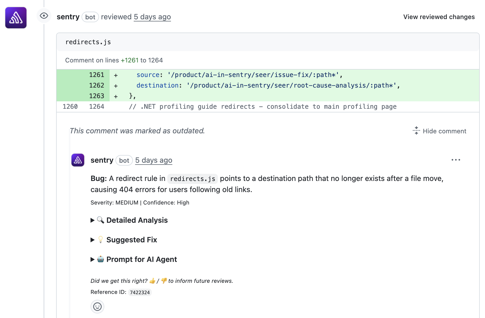

**Code Review** helps you review your code changes, predicting errors and offering suggestions for improvement before merging pull requests or merge requests.

## Getting Started

Set up Code Review in your Github or GitLab organization or on specific repositories:

1. Connect to GitHub through the [Sentry GitHub integration](/integrations/source-code-mgmt/github/) or Gitlab through the [Sentry GitLab integration](/integrations/source-code-mgmt/gitlab/). You can follow the steps in [Seer settings](https://sentry.io/orgredirect/organizations/:orgslug/settings/seer/) to get started. **Note:** Seer supports GitHub.com and GitLab.com (cloud versions only).

2. Select which repositories you want to connect to Sentry, go to [Seer SCM Settings](https://sentry.io/orgredirect/organizations/:orgslug/settings/seer/scm/) to make sure your repositories are connected.

3. Turn on [Code Review](https://sentry.io/orgredirect/organizations/:orgslug/settings/seer/repos/) for your repositories and configure the [default setting for new repos](https://sentry.io/orgredirect/organizations/:orgslug/settings/seer/#autoEnableCodeReview).

**Note:** Enabling Code Review for one a repository starts *active contributor pricing*. Learn more about [Seer pricing](/pricing/#seer-pricing).

<Alert level="info">
Seer supports the [GitHub integration](/integrations/source-code-mgmt/github/) and the [GitLab integration](/integrations/source-code-mgmt/gitlab/) (GitLab.com only). Self-hosted instances and other SCM providers are not currently supported.
</Alert>

### GitHub Permissions

Code Review requires specific GitHub permissions to work. These permissions are granted through the *Sentry app in your GitHub installed apps settings* (not inside Sentry itself).

When you install or update the Sentry GitHub integration, GitHub will prompt you to accept the following permissions:

- **Pull Requests (Read & Write)**: To read PR content and write code review comments
- **Checks (Read & Write)**: To create status checks that show Code Review results on your PRs

If you've already installed the GitHub integration, you may need to update your permissions. Go to *GitHub → Settings → Installed GitHub Apps → Sentry* and accept any pending permission updates.

<Alert level="info">
  Denying or ignoring permission update requests won't affect your current Sentry usage, but will prevent Code Review and other features from working.
</Alert>

### GitLab Permissions

For GitLab, Code Review uses the permissions granted during the [GitLab integration setup](/integrations/source-code-mgmt/gitlab/#install). The service account used for installation needs at least Maintainer access to the repositories you want Code Review to run on.

## Code Review Commands

Ways Code Review can help you:

1. **Error Prediction** - When you create a pull request on Github, or a merge request on GitLab and set it to `Ready for Review`, Code Review will check for errors in your code on every commit. Once the check is complete, you will see a 🎉 emoji as a reaction to your PR or merge request (MR) description. If errors are found, Code Review will add comments. **Note:** We skip reviews if you set your PR/MR to `draft` at any time.

2. **`@sentry review`** - Use this command in a PR or MR comment, and the assistant will review the changes and predict errors, as well as make suggestions. Head to [Seer settings](https://sentry.io/orgredirect/organizations/:orgslug/settings/seer/) to enable it.

## GitHub Status Checks

Code Review creates GitHub status checks (also called "checks") on your pull requests to indicate whether the code review passed or found potential issues. These status checks appear in the PR's checks section and can be integrated with GitHub's branch protection rules.

### Status Check Behavior

- **Success**: If Code Review completes and no errors are found in the code, the status check will show as successful (green checkmark). 
- **Neutral**: If Code Review runs and finds errors in the code, the status check will show as neutral (yellow checkmark).
- **Error**: If Code Review runs and there is an issue completing the check, for example, there is a service issue or timeout, the status check will show as error (red X).
- **Cancelled**: If the review was cancelled, typically because a new commit was pushed and the previous review was superseded.

### Visibility

Status checks from Code Review are visible to:
- All users with read access to the repository
- Anyone viewing the pull request on GitHub
- GitHub Actions and other CI/CD tools that check PR status

The detailed code review comments are also visible to all users with repository access, appearing as review comments on the pull request. 

<Alert level="warning">
 While you can add Code Review as a part of your branch protection, we recommend making the Code Review status check an **optional** check. Requiring it will block PR merges if the check fails due to service disruptions, and may conflict with future personal configuration options that allow users to opt out of code review.
</Alert>

### GitLab: No Status Checks

GitLab does not have an equivalent to the GitHub Checks API. On GitLab, Code Review results appear as MR comments only — not as a pipeline status check. You cannot use Code Review as a required check in GitLab CI/CD merge request approvals.

## Frequently Asked Questions

- **What data does AI Code Review need access to for the AI system to function, and what information is sent to third-party AI providers?**

  AI Code Review requires access to your pull requests, including PR metadata, repository information, file names, directory structures, and code diffs. Only file names, code diffs, and PR descriptions are sent to the AI provider for analysis.

- **Which SCM providers does Code Review support?**

  Code Review runs on GitHub.com and GitLab.com (cloud versions only). Self-hosted instances and other SCM providers are not currently supported. On GitHub, it runs when a PR is marked `ready for review`, on every commit while in that mode, and when triggered by a comment. On GitLab, it runs when a merge request is opened or updated, and when triggered by commenting `@sentry review` on the MR.

  You can learn more about AI privacy and security [here](/product/ai-in-sentry/ai-privacy-and-security/).

- **When does Error Prediction run?**

  Error Prediction is automatically triggered by the following GitHub pull_request webhook events:
  - `opened`: when you open a new pull request (we skip those opened in `draft` state)
  - `ready_for_review`: when a draft pull request is marked as "Ready for review"
  - On every commit while in `ready for review` mode

  To manually run error prediction and get a general review, comment `@sentry review` in the PR.

- **Why is the AI Code Review status check showing as neutral?**

  The status check shows as neutral if there's a temporary service issue or the review timed out. We use neutral status (rather than error) so users don't assume there's something wrong with their code when the issue is on our end. The status check does not fail based on code quality issues found during review - those appear as review comments on your PR.
  
  If you don't see a status check at all, ensure that your GitHub integration has the required [Checks permission](/integrations/source-code-mgmt/github/#github-permissions), and that [Code Review is enabled](https://sentry.io/orgredirect/organizations/:orgslug/settings/seer/repos/) for that repo.

- **Can I disable status checks while keeping AI Code Review comments?**

  Status checks are automatically created whenever AI Code Review runs. If you don't want them to appear or affect your workflow, simply don't add them as a required check in your branch protection rules. The checks will still appear on PRs but won't block merging.
