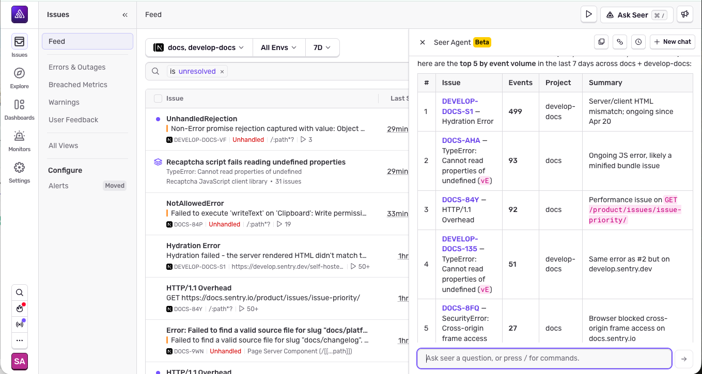

Seer is Sentry's AI debugging agent. It uses Sentry's rich context (issue details, tracing data, logs, and profiles) to help you troubleshoot and fix errors and performance issues faster.

## Seer Summary

Seer provides end-to-end debugging tools to help you troubleshoot and fix errors and performance issues faster, often before they are even merged:

- [**Autofix**](#autofix): Automatically scan issues as they come into Sentry, finding root causes, and automating triage.
  - **PR Creation**: Use Autofix to generate a code fix and create a PR.
  - **External Coding Agents**: Delegate Seer's analysis to an external coding agent for debugging and fixes.
- [**Seer Agent**](#seer-agent): Ask any question about your application and Seer Agent finds the right telemetry to answer it.
- [**Code Review**](#code-review): Have Seer review your code changes in GitHub, catching bugs before merging pull requests.

<Arcade src="https://demo.arcade.software/Qv2KLty5r2aC6jCXkyWN?embed" />

## Getting Started with Seer

To start using Seer's capabilities follow these steps:

1. Connect to GitHub through the [Sentry GitHub integration](/integrations/source-code-mgmt/github/). You can follow the steps in [Seer settings](https://sentry.io/orgredirect/organizations/:orgslug/settings/seer/) to get started. **Note:** Seer can only be integrated with the cloud version of GitHub.

2. Select which repositories you want to connect to Sentry.

3. Turn on Seer features for your projects and repos - Enable Issue Autofix, delegate to Coding Agents, and enable Code Review.

<Alert level="warning">

Seer is an add-on to your Sentry subscription. By enabling it, you are signing up for active contributor pricing for this feature. Any person who creates 2 or more PRs in a month in a Seer-Enabled project will be billed. A repo is considered Seer-Enabled when it is connected to Sentry and has one or more Seer features turned on. You can learn more about Seer pricing [here](/pricing/#seer-pricing).

</Alert>

## Seer Capabilities

### Autofix

Seer is able to automatically analyze issues as they are ingested by Sentry by combining all of the relevant context from your code with Sentry's telemetry data to provide a best-in-class issue debugging experience. [Autofix](/product/ai-in-sentry/seer/autofix/) includes:

**A Root Cause Analysis step used to:**

- Determine if the issue can be automatically analyzed and fixed using Seer's Autofix
- Add an initial guess for what the potential problem is to the issue details page

Once Autofix has run, Seer will provide remediation recommendations.

**PR Creation**

You can prompt Seer to generate PRs to fix your issue, and push it to GitHub. You can add more context in natural language, or any external supporting information, to help Seer generate a better PR. **Note:** You must install the [Seer GitHub app](/integrations/source-code-mgmt/github/#installing-the-seer-github-app) to use this feature.

**External Coding Agents**

Seer always performs root cause analysis and solution planning using its own internal tools and Sentry context. At the final code generation step of Autofix, instead of having Seer generate the code fix directly, you can hand off to an external coding agent for implementation.

Supported coding agents for handoff are: Claude Code and Cursor Cloud Agents. Learn more about how to set up each coding agent [here](/integrations/coding-agents/). [Read more](/product/ai-in-sentry/seer/autofix/#handoff-to-claude-code-or-cursor-cloud-agents) about using them with Autofix.

### Seer Agent

<Alert>

This feature is currently in open beta. Please reach out on [GitHub](https://github.com/getsentry/sentry/discussions) if you have feedback or questions. Features in beta are still in-progress and may have bugs. We recognize the irony.

</Alert>

Seer Agent connects the dots across Sentry's complete telemetry to help you debug and get to the root cause of issues. It uses everything you have connected to Sentry, errors, spans, logs, traces, code context, and other data you might never have found manually.

Ask any question about your application and Seer Agent will use all data in Sentry to answer it. Walk through complex production problems with Seer Agent reasoning through evidence in real time.

Share your conversations with team members, copy your conversation to share with other agents, or revisit previous conversations to continue your investigation.

To get started, click **Ask Seer** on any page in Sentry.

<Alert level="info">

If your organization has [Open Team Membership](/organization/membership/#open-membership) disabled, Seer Agent will not be available. Seer Agent makes org-wide queries on your data, and does not have finer-grained access controls yet.

</Alert>

**Seer Agent in Slack**

You can also use Seer Agent in Slack as a part of the [Slack integration](/integrations/notification-incidents/slack/#seer-agent).

### Code Review

[AI Code Review](/product/ai-in-sentry/seer/code-review/) helps you reviews your code changes, predicting errors and offering suggestions for improvement before merging pull requests. This feature is only available on GitHub.

## What Seer Uses

Seer is a powerful debugging agent, with access to a wide variety of data sources and tools. While debugging issues, it may examine:

- **Issue Context**: Error messages, stack traces, and event metadata from your [Issues](/product/issues/)
- **Tracing Data**: Distributed [traces](/concepts/key-terms/tracing/#whats-a-trace) and span information
- **Logs**: Structured [Logs](/product/explore/logs/) from your application (beta)
- **Your Codebase**: Relevant code from linked GitHub repositories, with support for multiple repos for distributed services
- **Performance Data**: Profiles and performance metrics
- **Interactive Feedback**: Your input and guidance during the process
- **Sentry Docs**: Sentry's documentation site

## Privacy and security

Sentry includes strong guarantees for privacy and security of your data. At a glance:

- Sentry does not train generative AI models using your data by default and without your permission.
- AI-generated output is shown only to you and other authorized users in your account.

You can learn more about our data privacy practices [in the security and legal docs](/security-legal-pii/security/ai-ml-policy/#use-of-identifying-data-for-generative-ai-features).

## Turn Seer Off or On Globally

- If you would not like to show generative AI Features at all in your Sentry account, go to [organization settings](https://sentry.io/orgredirect/organizations/:orgslug/settings/) and turn off the `Show Generative AI Features` toggle.

- If you want to use some generative AI features, while disabling others, you can bulk manage these settings by going to [Seer settings](https://sentry.io/orgredirect/organizations/:orgslug/settings/seer/) and selecting from the dropdown at the top of the table in each tab.

- For organizations that need to prevent Seer from creating PRs, you can manage this in [Advanced Settings](https://sentry.io/orgredirect/organizations/:orgslug/settings/seer/advanced/#enableSeerCoding) in Seer settings.

**Note:** Disabling the setting removes the **Create PR** button from the Autofix flow and prevents anyone from enabling **Allow Root Cause Analysis to create PRs by Default**. Sentry will not create PRs or push code to your codebase. This setting does
not impact AI chat sessions, where you can potentially prompt our AI chat to emit code
snippets and examples, and does not affect workflows involving your own coding agent.
