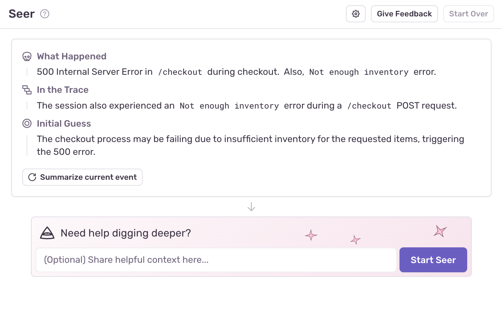
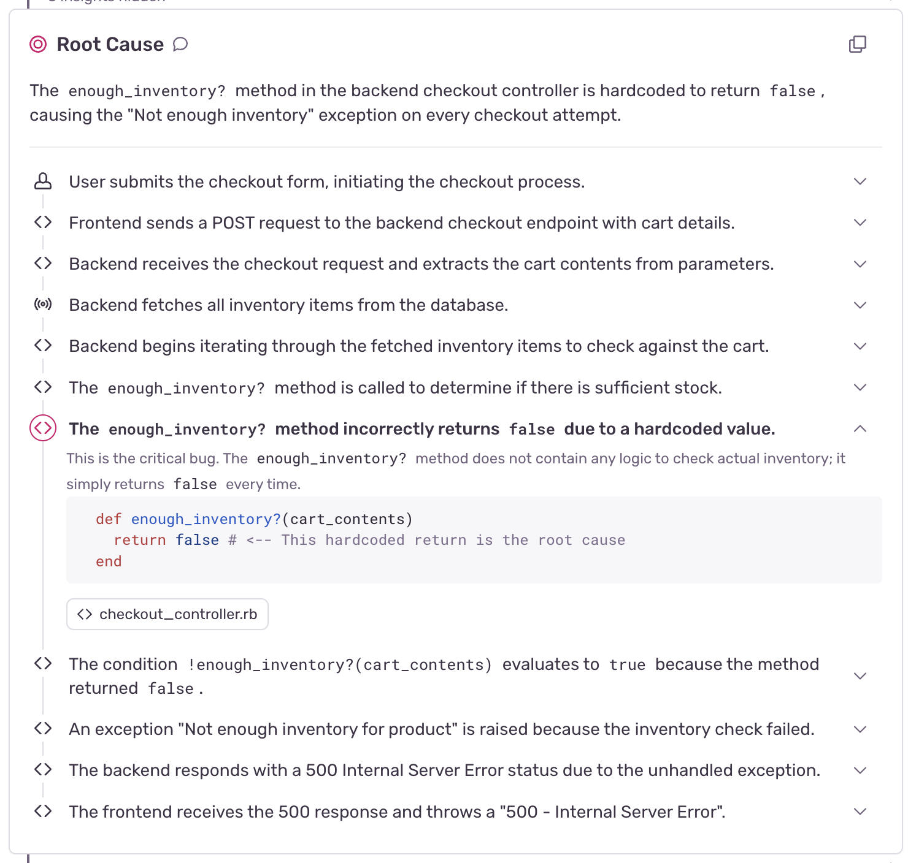
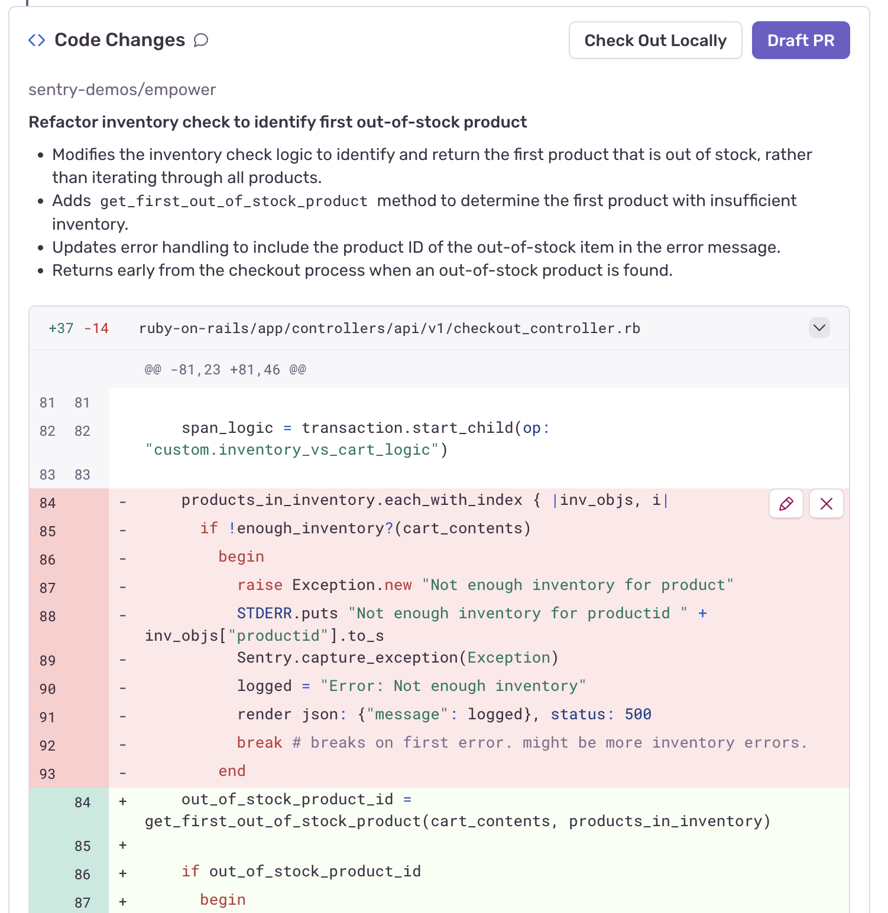
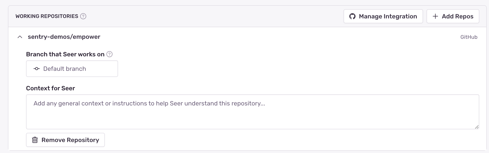

**Issue Fix** is Seer's collaborative workflow to find the root cause of and solution to issues. It uses Sentry's context (issue details, tracing data, logs, and profiles), your codebases (integrated through GitHub), and its interactions with you to identify and reason through problems in your code.

This tool can be automated, which enables it to populate root cause analysis, solutions, and even Pull Requests in real time. 

<Alert>
Issue Fix replace Suggested Fix (an earlier feature that has been sunset) and builds upon the capabilities previously known as Autofix.
</Alert>

## How Issue Fix Works

Seer's issue fix flow follows a three step process:

1. [Root Cause Analysis](#root-cause-analysis) - Analyze the issue using Sentry's context and your codebase
2. [Solution Identification](#solution-identification) - Identify a solution based on the analysis
3. [Code Generation](#code-generation) - Generate a code patch and open a PR

When you begun debugging an issue you Seer, you will see a screen like this:

### Root Cause Analysis {#root-cause-analysis}

Seer will then analyze the issue and relevant code to help identify the root cause and a solution. You'll see a live stream of Seer's thought process in real time as it works through the problem. Seer will share key insights as they come up and you'll have the option to expand each. You'll see the event data and code that support Seer's conclusions, building a clear chain of reasoning back to the root cause.

While Seer is reasoning through your problem, you can step in to add context or feedback; collaboration tends to lead to the best results. If Seer encounters gaps in its understanding, it will ask for your input.

The final root cause analysis will show you the sequence of events that led to the issue, and a detailed analysis of the most likely culprit. This analysis includes helpful annotations, such as links back to the exact lines of code or sentry telemetry that are relevant to the analysis. 

### Solution Identification {#solution-identification}

Once Seer has completed its root cause analysis, it will begin searching for a solution. The process will be familiar - you will see a chain of reasoning appear as it begins working through the problem, and you are free to collaborate with Seer at any point.

When it's finished, you will see the recommended solution. From here, you can:

1. Remove any steps or actions that you disagree with
2. Add any additional steps or instructions, for example unit tests to reproduce the original error

Once you are ready to proceed, you can select "Code It Up" to generate code resolving the bug. 

### Code Generation {#code-generation}

During the coding step, Seer will identify the code patch(es) needed to implement the solution. When it's done, you'll see a preview showing the suggested diffs across your codebase. If the fix involves service dependencies, you may see edits spanning across multiple repositories. 

From here, you can choose to draft a PR, or checkout the code changes locally for further iteration. If you choose to checkout the code locally, Seer will make a new branch for you. 

## What Issue Fix Uses

Seer is a powerful debugging agent, with access to a wide variety of data sources and tools. While debugging issues, it may examine:

- **Issue Context**: Error messages, stack traces, and event metadata from your [Issues](/product/issues/)
- **Tracing Data**: Distributed [traces](/concepts/key-terms/tracing/#whats-a-trace) and span information
- **Logs**: Structured [Logs](/product/explore/logs/) from your application (beta)
- **Your Codebase**: Relevant code from linked GitHub repositories, with support for multiple repos for distributed services
- **Performance Data**: Profiles and performance metrics
- **Interactive Feedback**: Your input and guidance during the process

This context is crucial to Seer's capabilities, and it allows it to do things like investigate a backend service that may be the true root cause for a frontend bug you are trying to troubleshoot. 

## Settings

Issue Fix's default behavior can be customized in several ways:

1. You can manually customize the repositories it has access to. 
2. You can define the default branch it should use in each repository
3. You can add any additional custom context that that may be useful within the scope of each individual repository
<Alert>
Seer already automatically parses rules files from [Cursor](https://docs.cursor.com/context/rules), [Windsurf](https://windsurf.com/editor/directory), [Cline](https://docs.cline.bot/features/cline-rules) 
</Alert>

## Prerequisites

To use Issue Fix, you'll need to have the following:

1. A Sentry project with issues. The more context you have (stacktrace, tracing data, logs, and profiles), the better equipped Seer will be to help. 
2. Working knowledge of the issue you want to fix. Seer will help you identify the root cause and suggest a solution, but you should have a general understanding of the problem you're trying to solve.

You will need a GitHub integration set up in your Sentry project in order for Seer to access your codebase and generate code fixes. While Seer will work without this, enabling the GitHub integration will make Seer much smarter and more capable. See the [Sentry GitHub integration](/organization/integrations/source-code-mgmt/github/) to learn more about this process. 
