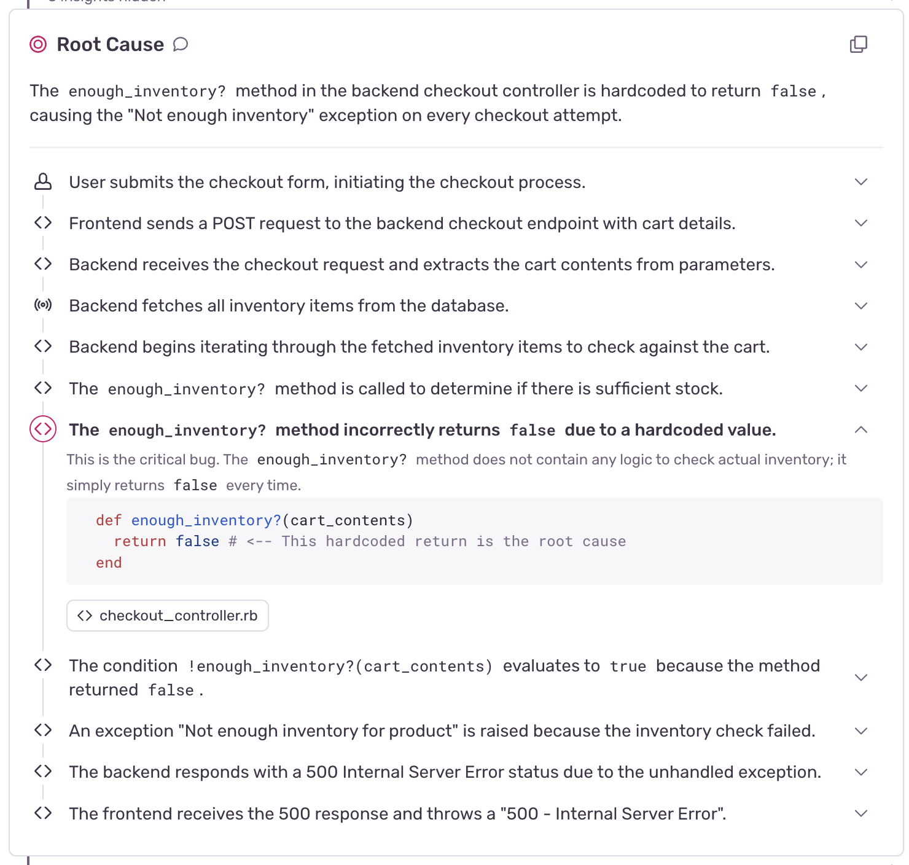
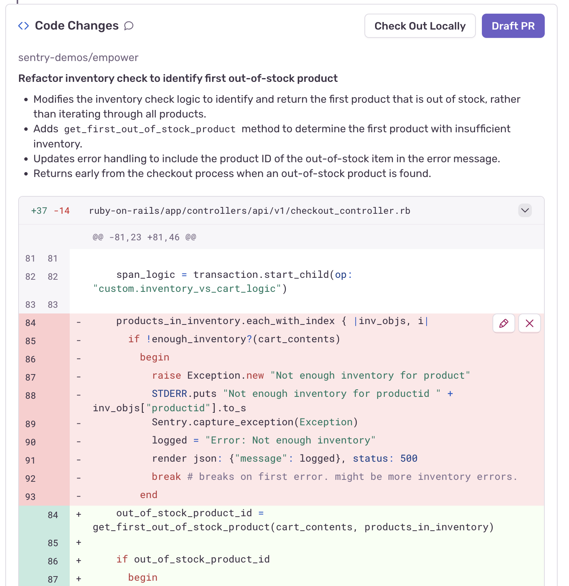
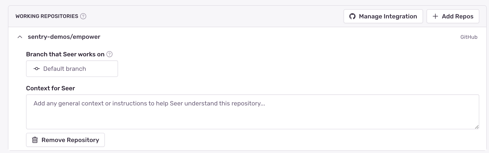

**Root Cause Analysis** is Seer's collaborative workflow to find the root cause of, and solution to, issues. It uses Sentry's context (issue details, tracing data, logs, and profiles), your codebases (integrated through GitHub), and its interactions with you to identify and reason through problems in your code.

## How Root Cause Analysis Works

Seer's Root Cause Analysis flow follows a three step process:

1. [Issue Fix](#issue-fix): Analyze the issue using Sentry's context and your codebases and determine the root cause
2. [Solution Identification](#solution-identification): Identify a solution based on the analysis
3. [Code Generation](#code-generation): Generate a code fix and (optionally) open a PR

Issues where a solution has high confidence for a fix will automatically run Seer's Root Cause Analysis flow. You can also manually trigger it from the Issue Details page.

### Issue Fix

Once Root Cause Analysis has been triggered, Seer will review the issue and relevant code to help identify the root cause and propose a solution. You'll see a live stream of Seer's thought process in real time as it works through the problem. You can expand key insights to see supporting event data and code, tracing a clear path back to the root cause.

At any time, you can step in to add context or feedback; collaboration usually leads to the best results. If Seer encounters gaps in its understanding, it will ask for your input.

The final root cause analysis will show you the sequence of events that led to the issue, and a detailed analysis of the most likely culprit. This includes helpful annotations, such as links back to the exact lines of code and/or Sentry telemetry that are relevant to the analysis.

### Solution Identification

Once Seer has completed its root cause analysis, it will begin searching for a solution. It will look similar to the root cause analysis process, where Seer shows its work, but with a focus on finding a solution.

When it's finished, you will see the recommended solution. From here, you can:

1. Remove any steps or actions that you disagree with
2. Add any additional steps or instructions, for example request additional unit tests to prevent regressions of the original error

Once you are ready to proceed, you can select "Code It Up" to generate code resolving the bug.

### Code Generation

During the coding step, Seer will identify the code patch (or patches) needed to implement the solution. When it's done, you'll see a preview showing the suggested diffs across your codebase. If the fix involves service dependencies, you may see edits spanning across multiple repositories.

From here, you can choose to draft a PR, or checkout the code changes locally for further iteration. If you choose to checkout the code locally, Seer will make a new branch for you.

<Alert>
You can disable code generation for your organization under **Advanced Settings** in [Seer settings](https://sentry.io/orgredirect/organizations/:orgslug/settings/seer/#enableSeerCoding).
</Alert>

## What Root Cause Analysis Uses

Seer handles access to a wide variety of data sources and tools. While debugging issues, it may examine:

- **Issue details**: Error messages, stack traces, and event metadata from your [Issues](/product/issues/)
- **Tracing data**: Distributed [traces](/concepts/key-terms/tracing/#whats-a-trace) and span information
- **Logs**: Structured [Logs](/product/explore/logs/) from your application (beta)
- **Your codebases**: Relevant code from linked GitHub repositories, with support for multiple repos for distributed services
- **Performance data**: Profiles and performance metrics
- **Interactive feedback**: Your input and guidance during the process

This context is crucial to Seer's capabilities, and it allows it to do things like investigate a backend service that may be the true root cause for a frontend bug you are trying to troubleshoot.

## Settings

Root Cause Analysis's default behavior can be customized in several ways:

1. You can manually customize the repositories it has access to
2. You can define the default branch it should use in each repository
3. You can add any additional custom context that that may be useful within the scope of each individual repository
4. You can disable code generation for your organization (under **Advanced Settings** in [Seer settings](https://sentry.io/orgredirect/organizations/:orgslug/settings/seer/#enableSeerCoding))

<Alert>
Seer already automatically parses rules files from [Cursor](https://docs.cursor.com/context/rules), [Windsurf](https://windsurf.com/editor/directory), [Cline](https://docs.cline.bot/features/cline-rules), and [Claude Code](https://docs.anthropic.com/en/docs/claude-code/tutorials#create-an-effective-claude-md-file)
</Alert>

## Best Practices

- The more Sentry context you have, the better equipped Seer will be to help: consider instrumenting your application to collect traces, profiles and logs, and send them to Sentry.
- For JavaScript / TypeScript projects that are minified in production, upload [source maps](/platforms/javascript/sourcemaps/) to Sentry for the best results

<Alert>
Currently, the cloud version of GitHub is the only SCM supported by Seer.
</Alert>
