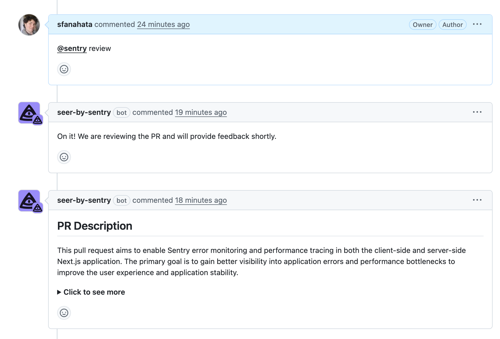

Sentry Prevent AI is a generative AI assistant developed by Sentry that reviews your pull requests, suggests improvements, and generates tests for uncovered code before you merge.

<Alert>
  Sentry Prevent AI is currently in <strong>beta</strong>. Beta features are
  still a work in progress and may have bugs. Please join the [Discord
  conversation](https://discord.com/channels/621778831602221064/1385700674557444190)
  to share your feedback.
</Alert>

## Getting Started

1. Install the [Seer by Sentry app](https://github.com/apps/seer-by-sentry) in your GitHub organization or specific repositories.
2. Enable these required settings in your Sentry [organization settings](https://sentry.io/orgredirect/settings/:orgslug/):
   - `Show Generative AI Features`
   - `Enable PR Review and Test Generation`

If you're not an admin, share the Sentry Prevent AI GitHub App Integration link with your organization's admin or owner to install.

## Sentry Prevent AI Commands

After installing the app, use these commands in your pull request comments:

- `@sentry review` - The assistant will review the PR and make suggestions.

- `@sentry generate-test` - The assistant will generate tests for your PR.

Once you have added a comment, the assistant will reply, acknowledging the request. For code reviews, you will then see comments added to your PR. For test generation, you will see a comment with a link to the generated tests.

## Frequently Asked Questions

- **What data does Sentry Prevent need access to for the AI system to function, and what information is sent to third-party AI providers?**

  Sentry Prevent AI works by analyzing pull request details, such as metadata, file names, directory structure, and code changes. Only file names, code diffs, and PR descriptions are shared with the AI provider for analysis.

- **Does Sentry Prevent run anywhere outside of GitHub, and does it run in the background?**

  Sentry Prevent AI only runs on GitHub, and only runs when triggered by a comment.

  You can learn more about AI privacy and security [here](/product/ai-in-sentry/ai-privacy-and-security/).

- **Why aren't `@sentry` commands working?**

  Sentry Prevent AI will respond with a message to enable the `Show Generative AI Features` and `Enable PR Review and Test Generation` settings in your [organization settings](https://sentry.io/orgredirect/settings/:orgslug/), if you have not already enabled them. Once enabled, try `@sentry review` or `@sentry generate-test` again to run Prevent AI.
