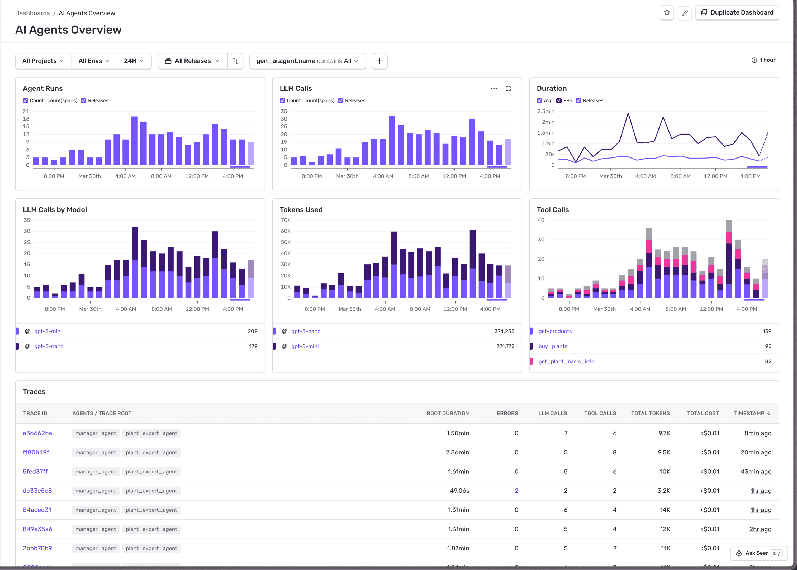

Sentry helps you understand what's going on with your AI agent workflows. It automatically collects information about agent runs, tool calls, model interactions, and errors across your entire AI pipeline—from user interaction to final response. You can also monitor MCP servers and replay past agent activity.

## Get Started

To use AI Observability, you must have an existing Sentry account and project set up. If you don't have one, [create an account here](https://sentry.io/signup/).

Learn how to [set up agent tracing](/product/ai-observability/getting-started/) and [name your agents](/product/ai-observability/naming/) so they're identifiable in the dashboard.

## Example Use Cases

- Your AI agent is failing silently during tool execution, and you want to trace the complete agent flow to identify where it's breaking.
- Users report that your AI agent is returning unexpected or malformed responses, and you need to explore the full context of prompts, model calls, and outputs.
- Your AI agent workflows are experiencing performance issues, and you want to identify which steps (model calls, tool usage, or custom logic) are causing bottlenecks.

## Related Features

<LinkCardGrid>
  <LinkCard
    href="/product/ai-observability/agents/"
    iconSrc="/ai/img/IconCompass.svg"
    title="Agents"
    description="Explore past agent activity. See every message and tool call in a chat-like view."
    className="w-full md:w-[calc(50%-12px)]"
  />
  <LinkCard
    href="/product/ai-observability/mcp/"
    iconSrc="/ai/img/IconCode.svg"
    title="MCP Server Monitoring"
    description="Trace and monitor your MCP server implementations. Monitor tool executions, resource access, and client connections."
    className="w-full md:w-[calc(50%-12px)]"
  />
</LinkCardGrid>
