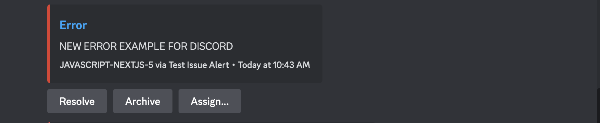

By customizing [alert](/product/alerts/) rules and integrating the tools you already use, you can receive alerts when, where (and if) you want them, without disruption. Alert notifications can be routed to [Slack](/organization/integrations/notification-incidents/slack/), multiple [supported integrations](/organization/integrations/), and custom integrations through [webhooks](/organization/integrations/integration-platform/webhooks/). When creating alert rules, you can use these integrations to configure who to notify and how.

## Integrations

Sentry’s integrations provide you with the option to route your alerts through commonly-used applications like Slack, Discord, PagerDuty, and Microsoft Teams. You can find these integrations in **Settings > Integrations** and [install](https://sentry.io/settings/integrations/) them for your entire organization.

### Slack Alerts

A Sentry organization owner, manager, or admin can install and configure the [Slack integration](/organization/integrations/notification-incidents/slack/) in their Sentry account. Once the integration is configured, the following action will be available in issue alert rules: `Send a notification to the \{workspace\} Slack workspace to \{channel\} and show tags \{tags\} in notification`. In metric alerts, your Slack teams will be available in one of the action dropdown lists.

This alert action allows you to route alert notifications to selected channels (using the `#` prefix), or to a specific user in a direct message (using the `@` prefix) in your Slack workspaces.

Then, once you receive a Slack notification, you can use the "Resolve", "Archive", or "Assign" buttons to update the issue in [sentry.io](https://sentry.io) directly from Slack.

### Discord Alerts

A Sentry organization owner, manager, or admin can install and configure the [Discord integration](/organization/integrations/notification-incidents/discord/) in their Sentry account. Once the integration is configured, the `Send a notification to the \{server\} Discord server with ID: \{channel-id\} and show tags \{tags\} in notification` action will become available in issue alert rules. To be notified about metric alerts via Discord, look for and add your Discord teams in the action dropdown lists.

This alert action will allow you to route alert notifications to selected channels in your Discord server.

You'll be able to "Resolve", "Archive", or "Assign" Sentry issues directly from your Discord notifications.

### PagerDuty Alerts

A Sentry organization owner, manager, or admin can install and configure the [PagerDuty integration](/organization/integrations/notification-incidents/pagerduty/) in their Sentry account. Once the integration is configured, the following action will be available in issue alert rules: `Send a notification to PagerDuty account \{account\} and service \{service\}`. In metric alerts, your PagerDuty accounts will be available in one of the action dropdown lists.

### Microsoft Teams Alerts

A Sentry organization owner, manager, or admin can install and configure the [Microsoft Teams](/organization/integrations/notification-incidents/msteams/) in their Sentry account. Once the integration is configured, the following action will be available in issue alert rules: `Send a notification to \{team\} Team to \{channel(s)\}`. In metric alerts, your Microsoft teams will be made available in one of the action dropdown lists.

## Build Your Own Integration

If you would like to route alert notifications to other solutions that Sentry doesn't have an out-of-the-box integration with, you can use our [integration platform](/organization/integrations/integration-platform/#alerts). The integration platform provides a way for external services to interact with the Sentry SaaS service using the REST API and webhooks.

Sending alerts to webhooks can also be helpful if you want to do things like aggregate alerts from your different monitoring systems or write custom rules to route alerts more intelligently.

When you create a new integration and enable the "Alert Rule Action" option on it, your integration will show up as a service when you select the `Send a notification via an integration` action during issue alert rule creation. In metric alerts, your integrations are available in one of the action dropdown lists.

The gif below shows how to set up an integration that can receive Sentry alerts.

  <iframe
    src="https://demo.arcade.software/v7uhzmdV6Q5PDzoVPAE6?embed&show_copy_link=true"
    frameborder="0"
    loading="lazy"
    webkitallowfullscreen
    mozallowfullscreen
    allowfullscreen
    style={{"colorScheme":"light","height":"100%","left":"0px","position":"absolute","top":"0px","width":"100%"}}
    title="Create Internal Integration &amp; Alert Rule"
  ></iframe>

## Legacy Integrations

Legacy integrations (also known as plugins) are extensions of Sentry packaged as Python libraries and configured at the project level. To send an alert to a legacy integration, select the `Send a notification via an integration` or `Send a notification to all legacy integrations` action in an issue alert. You cannot route metric alerts to legacy integrations.
