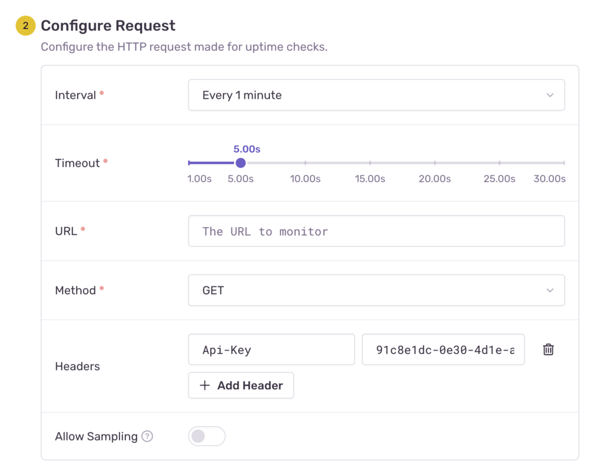
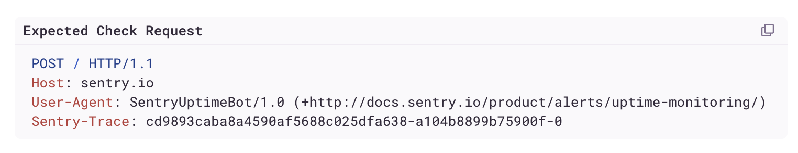

Sentry provides several configuration options for creating an uptime alert based on your organization's needs as explained below.

## 1. Environment

First, specify which <PlatformLink to="/configuration/environments/">environment</PlatformLink> this alert rule belongs to. Any [uptime issues](/product/issues/issue-details/uptime-issues/) that will be created from this alert rule will then be set to your specified environment.

The “Environment” dropdown lists the same environments available in your project, excluding hidden ones.

## 2. Project

Specify the project associated with your alert rule. Any [uptime issues](/product/issues/issue-details/uptime-issues/) created will appear under this project.

## 3. Request Configuration

Configure how Sentry performs HTTP uptime checks by setting the following options:

- **Interval**: The time between each uptime check. Options: `1 minute`, `5 minutes`, `10 minutes`, `20 minutes`, `30 minutes`, and `1 hour`.
- **Timeout**: The maximum time Sentry waits for a response before considering the request a failure (up to 30 seconds).
- **URL**: The target URL for the uptime check.
- **Method**: The HTTP method used (`GET`, `POST`, `HEAD`, `PUT`, `DELETE`, `PATCH`, or `OPTIONS`).
- **Headers**: Custom headers included in the request.
- **Body**: The request payload, available for `POST`, `PUT`, and `PATCH` methods.
- **Allow Sampling**: Enables span sampling for requests via the Sentry SDK. See [distributed tracing with uptime](/product/alerts/uptime-monitoring/uptime-tracing/) for details.

<Alert level="warning">

When adding HTTP headers, be cautious of including sensitive data, such as API tokens or personal information, to prevent unintended exposure or storage.

</Alert>

Below the request configuration, you'll find an example of the expected request that Sentry will send to the specified URL, including the method, headers, and body. Sentry automatically adds `User-Agent` and `Sentry-Trace` headers.

Additional notes:

- Include a `Content-Type` header if required by the target URL. For example, a JSON payload should have `Content-Type: application/json`.
- The selected interval affects downtime detection speed. Sentry triggers an uptime issue after three consecutive failures. For instance, with a 5-minute interval, downtime is detected at least 15 minutes after the first failure. Learn more about the [uptime check criteria](/product/alerts/uptime-monitoring/#uptime-check-criteria).
- In case the specified URL is behind a firewall, make sure Sentry's Uptime Bot can execute requests to it. Learn more about [firewall configuration with uptime monitoring](/product/alerts/uptime-monitoring/troubleshooting/#verify-firewall-configuration).
- Sentry Uptime Tracing automatically appends a sentry-trace header to outgoing requests for distributed tracing. [Learn more](/product/alerts/uptime-monitoring/uptime-tracing/).

## 4. Alert Name

Give your alert a descriptive name, for example, "Landing Page" or "Contact Page".

## 5. Ownership

Assign a team or team member to manage the alert. If no team is assigned, any user can modify the alert. [Uptime issues](/product/issues/issue-details/uptime-issues/) created from this alert rule will be set to the specified team or team member.
