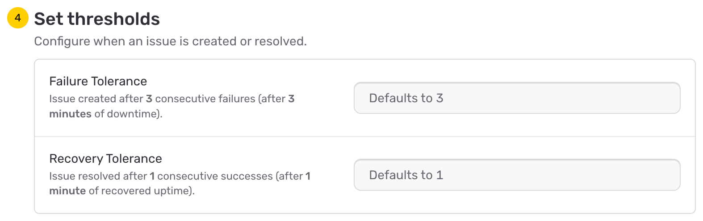
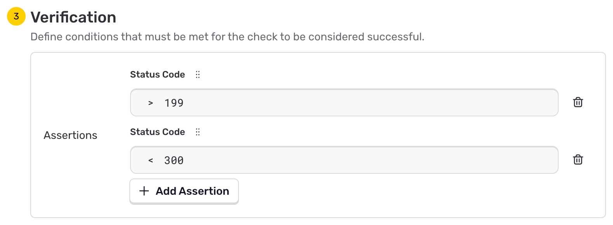
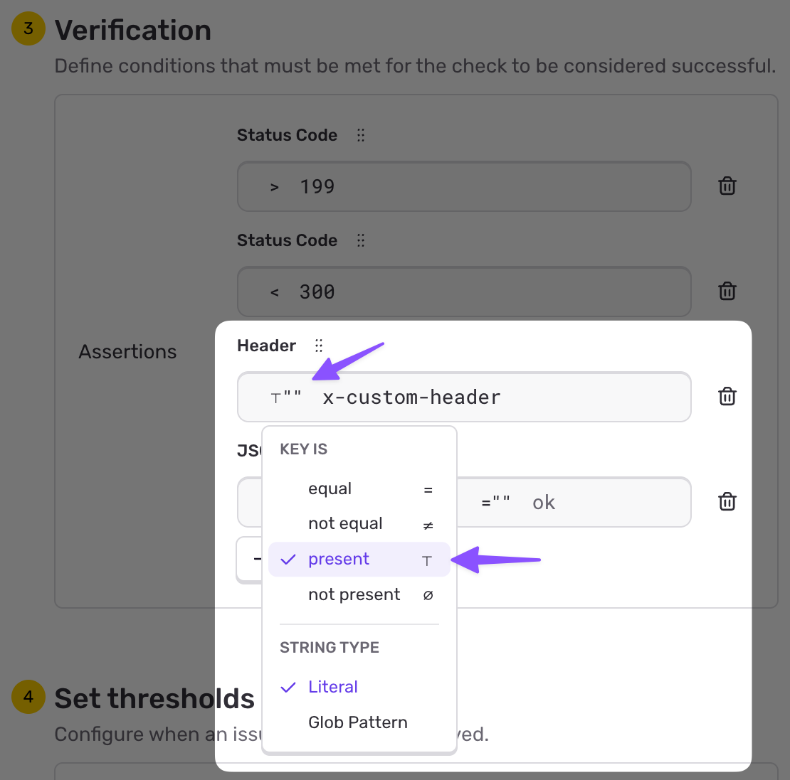

Configure your uptime alerts with the following options.

## 1. Environment

First, specify which <PlatformLink to="/configuration/environments/">environment</PlatformLink> this alert rule belongs to. Any [uptime issues](/product/issues/issue-details/uptime-issues/) that will be created from this alert rule will then be set to your specified environment.

The “Environment” dropdown lists the same environments available in your project, excluding hidden ones.

## 2. Project

Specify the project associated with your alert rule. Any [uptime issues](/product/issues/issue-details/uptime-issues/) created will appear under this project.

## 3. Request Configuration

<div style={{width: '600px'}}>

</div>

Configure how Sentry performs HTTP uptime checks by setting the following options:

- **Interval**: The time between each uptime check. Options: `1 minute`, `5 minutes`, `10 minutes`, `20 minutes`, `30 minutes`, and `1 hour`.
- **Timeout**: The maximum time Sentry waits for a response before considering the request a failure (up to 30 seconds).
- **URL**: The target URL for the uptime check.
- **Method**: The HTTP method used (`GET`, `POST`, `HEAD`, `PUT`, `DELETE`, `PATCH`, or `OPTIONS`).
- **Headers**: Custom headers included in the request.
- **Body**: The request payload, available for `POST`, `PUT`, and `PATCH` methods.
- **Allow Sampling**: Enables span sampling for requests via the Sentry SDK. See [distributed tracing with uptime](/product/uptime-monitoring/uptime-tracing/) for details.

<Alert level="warning">

When adding HTTP headers, be cautious of including sensitive data, such as API tokens or personal information, to prevent unintended exposure or storage.

</Alert>

<div style={{width: '600px'}}>

</div>

Below the request configuration, you'll find an example of the expected request that Sentry will send to the specified URL, including the method, headers, and body. Sentry automatically adds `User-Agent` and `Sentry-Trace` headers.

Additional notes:

- Include a `Content-Type` header if required by the target URL. For example, a JSON payload should have `Content-Type: application/json`.
- The selected interval affects downtime detection speed. By default, Sentry triggers an uptime issue after three consecutive failures (configurable in [Thresholds](#4-thresholds)). For example, a 5-minute interval with the default failure tolerance means downtime is detected after at least 15 minutes. Learn more about the [uptime check criteria](/product/uptime-monitoring/#uptime-check-criteria).
- In case the specified URL is behind a firewall, make sure Sentry's Uptime Bot can execute requests to it. Learn more about [firewall configuration with uptime monitoring](/product/uptime-monitoring/troubleshooting/#verify-firewall-configuration).
- Sentry Uptime Tracing automatically appends a sentry-trace header to outgoing requests for distributed tracing. [Learn more](/product/uptime-monitoring/uptime-tracing/).

## 4. Thresholds

<div style={{width: '600px'}}>

</div>

Set when issues are created and resolved based on consecutive check results.

### Failure Tolerance

Set how many consecutive failures trigger an issue. Defaults to **3 consecutive failures**.

For example, with a 5-minute interval and a failure tolerance of 3, an issue will be created after 15 minutes of consecutive downtime (3 failed checks × 5 minutes).

### Recovery Tolerance

Set how many consecutive successes resolve an issue. Defaults to **1 consecutive success**.

With a recovery tolerance of 1, the issue will be resolved as soon as the first successful check occurs after the downtime period.

These thresholds help reduce noise from transient failures while ensuring you're notified of sustained downtime.

## 5. Verification

<Include name="feature-available-for-user-group-early-adopter.mdx" />

Add custom verification to your uptime check to validate various parts of the HTTP response from your service. With custom verification, you can check HTTP status codes, header keys and values, and the response body to ensure they conform to your expected values.

If no verification is configured, uptime checks will use the [default criteria](/product/uptime-monitoring/#uptime-check-criteria), which requires a 2xx status code for the check to be considered successful.

### How Verification Works

A verification consists of multiple **assertions**. Each assertion evaluates to true or false. The verification passes only if all assertions evaluate to true.

Assertions can be combined into **"any"** and **"all"** groupings, requiring any or all of the assertions in that group to pass for the whole group to pass. This allows you to create complex verification logic.

**Redirects:** If your URL returns a redirect (3xx status code), Sentry will automatically follow the redirect chain. Verification is only applied to the final response after all redirects have been processed.

### Testing Your Verification

<div style={{width: '600px'}}>

</div>

At any time, you can test your uptime monitor by clicking the **"Test Monitor"** button at the bottom of the configuration screen. This performs a complete uptime check at the specified endpoint, allowing you to quickly iterate on complex verifications until they work as expected.

### Assertion Types

<Expandable title="Status Code">

The HTTP response status code can be compared using `=`, `>`, `<`, and `!=` operators. To test for a range of values, use two status code assertions with appropriate inequalities.

For example, to check for any 2xx status code, you could use:
- Status code `>=` `200`
- Status code `<` `300`

By default, all uptime verifications include a check for a 200-class status code, which you can delete if needed. If a custom verification doesn't contain a status code check, the uptime monitor will not inspect the response status code.

</Expandable>

<Expandable title="Header Keys and Values">

Header assertions check if matching header keys and/or values are present in the response.

**Check for a specific header key and value:**
- Set the header key to `content-type`
- Select "equal" as the comparison
- Select "Literal" as the string type
- Set the value to `application/json`

**Check if a header key exists:**
- Set the header key to `x-custom-header`
- Select "present" from the "KEY IS" dropdown

Example:

<div style={{width: '600px'}}>

</div>

**Check if a header key does not exist:**
- Set the header key to `x-unwanted-header`
- Select "not present" from the "KEY IS" dropdown

**Use glob patterns for matching:**

You can use [glob patterns](https://en.wikipedia.org/wiki/Glob_(programming)) for flexible matching:
- Set the header key to `x-*`
- Select "Glob Pattern" as the string type
- Set the value to `*production*`

</Expandable>

<Expandable title="Response Body (JSON)">

If your service returns a JSON object or array as the response body, you can check various properties using JSONPath assertions.

A JSONPath assertion consists of:
1. The **JSONPath query** that selects elements from your JSON
2. The **comparison operator** (equal or not equal)
3. The **string operand type** (Literal or Glob Pattern)
4. The **expected value** to compare against

**Example 1: Check a simple field**

- JSONPath: `$.status`
- Comparison: "equal"
- String type: "Literal"
- Value: `operational`

This checks that the JSON contains a `status` field equal to `"operational"`.

Example response that passes:
```json
{
  "code": 200,
  "status": "operational"
}
```

**Example 2: Check all items in an array**

- JSONPath: `$.components[*].status`
- Comparison: "equal"
- String type: "Literal"
- Value: `operational`

This checks that all `status` fields in the `components` array equal `"operational"`.

Example response that passes:
```json
{
  "code": 200,
  "components": [
    {
      "id": "service_one",
      "status": "operational"
    },
    {
      "id": "service_two",
      "status": "operational"
    }
  ]
}
```

Note that all matching elements must satisfy the comparison for the assertion to pass.

</Expandable>

### Limitations

For practical reasons, Sentry constrains verification complexity:

- **Glob complexity**: Limited to prevent performance issues
- **JSONPath execution time**: Constrained to ensure timely checks
- **Number of assertions**: Limited per verification
- **Response body size**: Maximum size limit for downloaded responses

If you encounter errors, you may need to reduce the complexity of your assertions or limit the size of the response body.

## 6. Alert Name

Give your alert a descriptive name, for example, "Landing Page" or "Contact Page".

## 7. Ownership

Assign a team or team member to manage the alert. If no team is assigned, any user can modify the alert. [Uptime issues](/product/issues/issue-details/uptime-issues/) created from this alert rule will be set to the specified team or team member.
