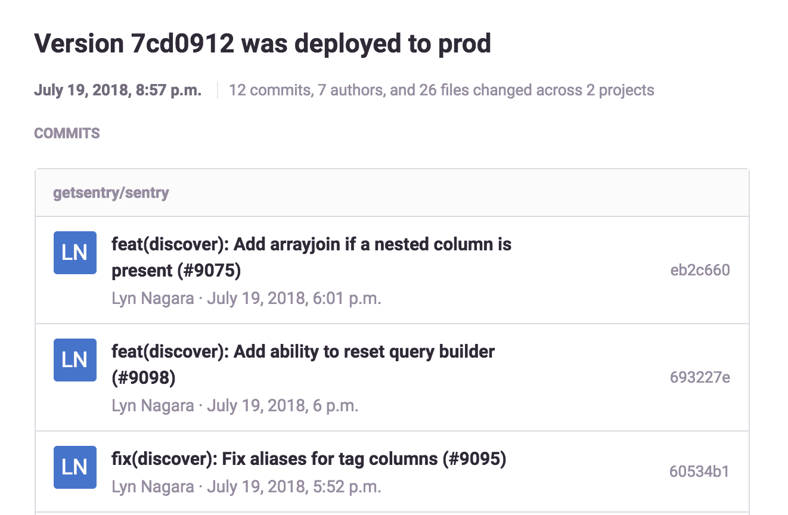
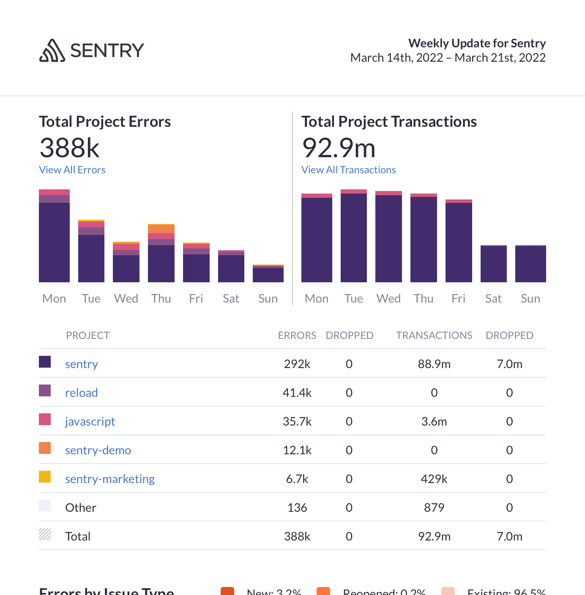

Sentry sends you notifications regarding workflow activities, [release deploys](/product/releases/), and [quota usage](/pricing/quotas/), as well as weekly reports. These notifications let you know about:

- [Workflow](#workflow-notifications): Activity involving user actions and state changes on issues. This includes activities such as issue resolution, assignment, comments, and regressions.
- [Deploy](#deploy-notifications): When a release you have commits on is deployed.
- [Spend](#spend-notifications): When you're getting close to spending your reserved volume, your quotas are depleted, and/or your on-demand budget is being put to use.
- [Weekly Reports](#weekly-reports): A summary of your organization's Sentry activity.

You can manage these notifications in **User Settings > Notifications**.

## Workflow Notifications

Sentry sends workflow notifications to let you know about [issue state](/product/issues/states-triage/) changes. Workflow relates to actions that help you manage your issues, such as changing an issue’s state or commenting on it. By default, Sentry sends these notifications by email to members who are subscribed to the issue (see below for how subscription is determined). Workflow notifications are sent for:

- **Issue Resolved**: When a new issue is spotted in your code, it's in the Unresolved state. The issue state changes to Resolved when a project team member resolves it, either by manually changing its state in [sentry.io](https://sentry.io)) or by submitting a fix, or because of the project’s auto-resolve feature (if configured).
- **Regressions**: A regression happens when the state of an issue changes from Resolved back to Unresolved. An email is sent to all project team members.
- **Comments**: When a team member adds a new comment in the “Activity” tab of the detail page for the issue.
- **Assignment**: When an issue is assigned or unassigned.
- **User Feedback**: When an issue has new <PlatformLink to="/user-feedback/">user feedback</PlatformLink>.
- **Event Processing Problems**: When there's a problem with processing error events you've sent to Sentry.

You receive workflow notifications when you subscribe to an issue in one of the following ways by:

- You or your team being assigned to the issue
- Clicking the bell icon to subscribe to an issue
- Commenting on an issue
- Bookmarking an issue
- Resolving, unresolving, or archiving an issue
- Resolving an unassigned issue with the ["Claim Unassigned Issues I've Resolved"](/product/alerts/notifications/notification-settings/#my-activity) option turned on

You or your team will become participants once you're subscribed to an issue. Participants can be viewed from the right hand sidebar at the bottom of the issue details page. Note that participant notifications may have some overlap with alerts that are configured on a per-project basis.

You'll be unsubscribed from an issue if you:

- Are unassigned from the issue
- Delete the only comment you left on an issue
- Remove a bookmark from an issue

## Deploy Notifications

Sentry sends deploy notifications to users who have committed to the release that was deployed. Learn more in the [deploy documentation](/product/releases/setup/#notify-sentry).

## Spend Notifications

By default, Sentry sends spend notifications to all owners of an organization when:

- 80% of the organization's reserved volume (for errors, transactions, and/or attachments) has been depleted.
- The entire reserved volume and any on-demand budget for a category (such as errors, transactions, and/or attachments) has been depleted.
- 80% of the organization's on-demand budget has been used.

Learn more in the [full Quotas documentation](/pricing/quotas/).

## Weekly Reports

Sentry sends weekly reports every Monday, by email. Reports contain a summary of your organization's Sentry activity over the last week.

