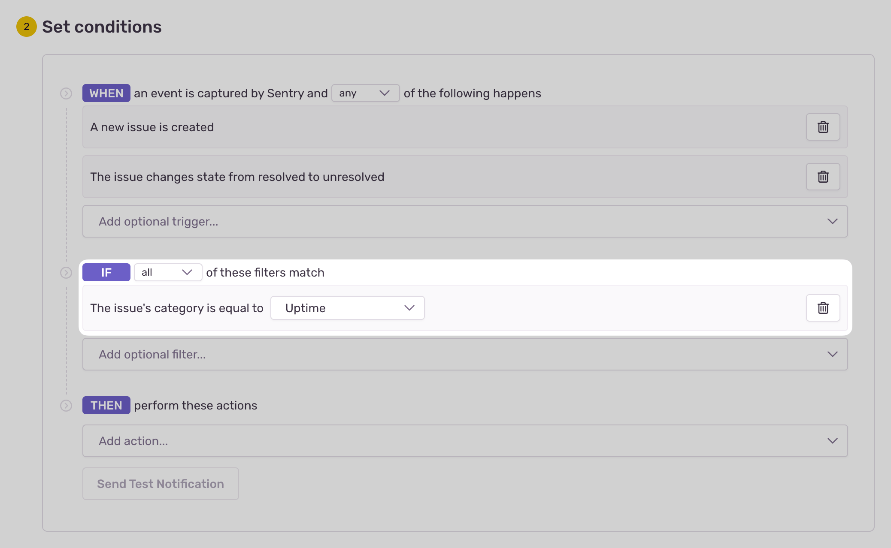

Sentry's Uptime Monitoring lets you monitor the availability and reliability of your web services effortlessly. Once enabled, it continuously tracks configured URLs, delivering instant alerts and insights to quickly identify downtime and troubleshoot issues.

By leveraging [distributed tracing](/concepts/key-terms/tracing/distributed-tracing/), Sentry enables you to pinpoint any errors that occur during an uptime check, simplifying triage and accelerating root cause analysis. This helps you enhance both the reliability and uptime of your web services.

## Set Up

Uptime is [automatically configured](/product/alerts/uptime-monitoring/automatic-detection/) as a new alert for the most frequently encountered hostname in all URLs of your error data, ensuring continuous monitoring of your most critical hostname right out of the box.

You can also [create uptime monitoring alerts](/product/alerts/create-alerts/) for specific URLs. They're fully customizable with request details such as the HTTP method, headers, and body.

## Uptime Check Criteria

Our uptime monitoring system verifies the availability of your URLs by performing HTTP requests at regular, pre-configured intervals. For a URL to be considered up and running, the response must meet the following criteria:

1. **Successful Response (2xx Status Codes):**
   The URL must return an HTTP status code in the 200–299 range, indicating a successful request.
2. **Automatic Handling of Redirects (3xx Status Codes):** Sentry will follow redirects for URLs returning an HTTP status code in the 300–399 range and verify that the final destination URL returns a successful response. This ensures that redirects won't falsely trigger downtime alerts.
3. **Timeout Setting:** Each request has a timeout threshold of 10 seconds.
   If the server doesn't respond within this period, the check will be marked as a failure,
   indicating a potential downtime or performance issues.
4. **DNS Issue Detection:** Our monitoring also includes the detection of DNS resolution issues.
   If a DNS issue is detected, the check will be marked as a failure,
   allowing you to address the underlying connectivity problems.

### Uptime Check Failures

An uptime alert continuously monitors the configured URL with the criteria defined above. If a failure occurs,
a new [uptime issue](/product/issues/issue-details/uptime-issues/) is created, including details about the failed check and related errors.

To prevent false alerts caused by temporary network issues, **an issue is only generated after three consecutive failures** following the initial detection of downtime. Additionally, uptime checks are performed from a variety of geographical locations in a round-robin fashion. This ensures that each failed check comes from a different region, reducing the likelihood of false positives due to localized network failures.

_In rare cases where Sentry is unable to perform a scheduled uptime check—such as during outages—the check status will be marked as "Unknown"._

## Notifications

To start getting notifications for a new downtime issue, [configure an issue alert](/product/alerts/create-alerts/issue-alert-config/) and choose the issue category "uptime". Then choose how you'd like to be notified (via email, Slack, and so on).

## Learn More About Uptime Monitoring

<PageGrid />
