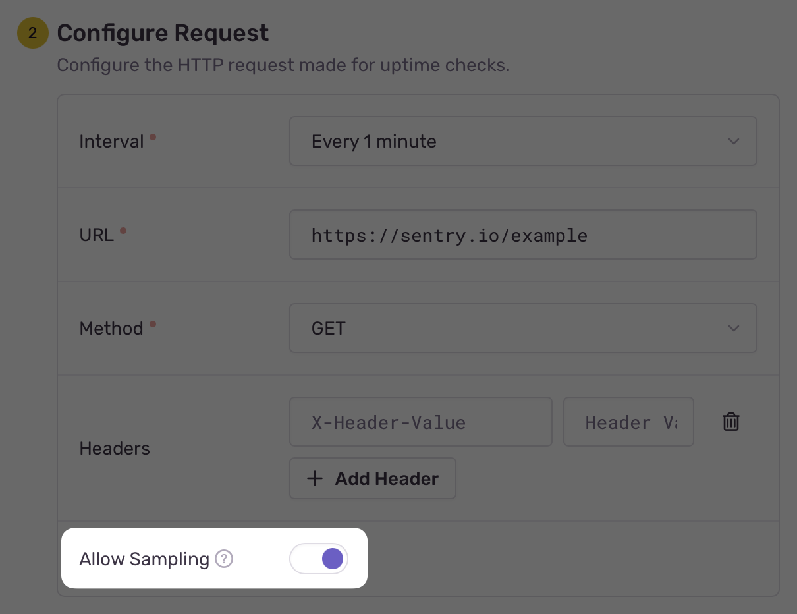

Sentry's Uptime Monitoring uses [distributed tracing](/product/tracing/#whats-distributed-tracing) to track the flow and timing of requests and operations during uptime checks. This helps you quickly find the root cause of downtime by connecting related errors and performance data.

You can trace errors to identify and diagnose issues like crashes or exceptions. This is automatically enabled for all Uptime Alerts. You can also trace spans to monitor the performance and flow of operations, such as API calls or database queries. Span tracing is disabled by default, but can be enabled by allowing sampling in your Uptime Alert settings. Errors focus on problems, while spans focus on performance.

## How Uptime Tracing Works

Sentry Uptime Tracing automatically appends a `sentry-trace` header to every outgoing request made to the configured URL in your Uptime Alert settings. This header propagates a trace identifier.

If one of Sentry's supported backend SDKs is configured for the application handling the incoming uptime check request, the trace will continue through your application. Learn more about [how distributed tracing works](/product/tracing/).

Example Uptime check request:

```HTTP
GET /example-uptime-endpoint HTTP/1.1
Host: sentry.io
User-Agent: SentryUptimeBot/1.0 (+http://docs.sentry.io/product/alerts/uptime-monitoring/)
Sentry-Trace: 32d4011600324838afcd666edadc1d09-8d5ca7419a02ca36
```

## Tracing Errors

Error tracing is enabled by default for uptime checks. When downtime is detected, an [Uptime Issue](/product/issues/issue-details/uptime-issues/) is created. You can then go to Sentry's [**Trace Explorer**](/product/explore/traces/) page to view any related errors.

Because uptime requests won't override your SDK’s error sampling rate, some errors may not appear in traces if that rate is set to below 1.

<Expandable permalink title="Disabling Uptime Error Tracing">
  To disable error tracing for uptime checks, configure a [before send](/platform-redirect/?next=/configuration/filtering/) filter in your SDK to ignore errors from Sentry's `User-Agent`. Here's an example:

```typescript {tabTitle: Node.js Express} {filename: instrument.mjs}
import * as Sentry from "@sentry/node";

Sentry.init({
  dsn: "___PUBLIC_DSN___",
  // Filtering example for a Node.js Express app
  beforeSend(event) {
    const userAgent = event.request?.headers?.["user-agent"];

    // Ignore events captured in a request from SentryUptimeBot
    if (userAgent && userAgent.includes("SentryUptimeBot")) {
      return null;
    }

    // Process other events
    return event;
  },
});
```

</Expandable>

## Tracing Spans

Unlike error tracing, span tracing is **disabled** by default for uptime checks, but can be enabled by allowing sampling in your Uptime Alert settings. Enabling span tracing can be helpful because it provides a detailed view of the timing and flow of requests and operations during uptime checks, which is especially useful for diagnosing timeouts or performance issues.

### Enabling Uptime Tracing for Spans

To enable span tracing, modify your Uptime Alert settings with the "Allow Sampling" option. This will ensure that Sentry defers the sampling decision to your SDK, which will follow the trace sample rate you've configured.

Because uptime requests won't override your SDK’s error sampling rate, some errors may not appear in traces if that rate is set to below 1.



### Custom Sampling

To ensure that all spans from uptime checks are sampled, even if your SDK's trace sampling rate is below 1, you can configure a [sampling function](/platform-redirect/?next=/configuration/sampling/). Here's an example:

```typescript {tabTitle: Node.js Express} {filename: instrument.mjs}
import * as Sentry from "@sentry/node";

Sentry.init({
  dsn: "___PUBLIC_DSN___",
  // Custom tracer function for a Node.js Express app
  tracesSampler: ({ name, attributes, parentSampled }) => {
    const userAgent = attributes?.["http.user_agent"];

    if (
      typeof userAgent === "string" &&
      userAgent.includes("SentryUptimeBot")
    ) {
      // Sample 100% of spans from SentryUptimeBot
      return 1;
    }

    // Sample 50% of other spans
    return 0.5;
  },
});
```

## Billing Considerations

Errors and spans captured during uptime checks are [billed as regular events](https://sentry.io/pricing/) in Sentry. Configure sampling thoughtfully to manage costs.
