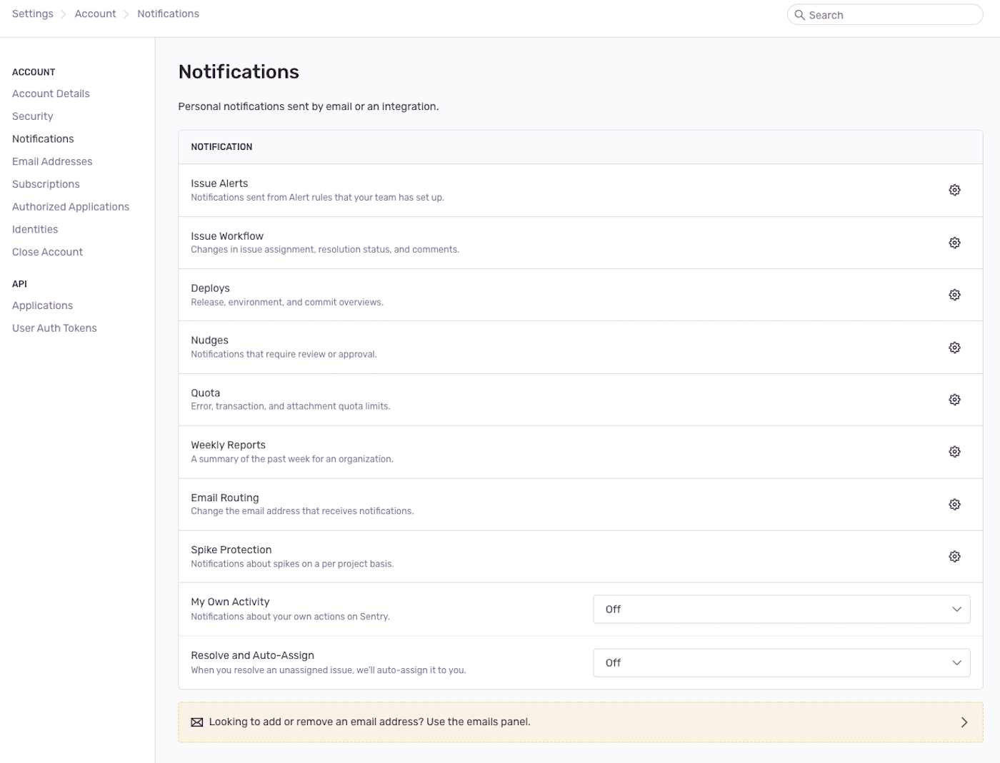

You can update your personal notification settings for things like [workflow](/product/alerts/notifications/), deploy, issue alert, and [spike protection](/pricing/quotas/spike-protection/) by turning them on or off, specifying how you'd like to be notified (via email, Slack, or both), and more. Users who **aren't** on an [Enterprise](https://sentry.io/pricing/) plan can also configure their quota notifications.

To make updates, go to your [user settings](https://sentry.io/settings/account/notifications/), select "Notifications", then click on the notification type you want to update.

## How to Subscribe to an Issue

You receive workflow notifications once you’ve subscribed to an issue in one of the ways described below:

- By clicking the subscribe "bell icon" on an issue
- By taking part in a commit that's related to the issue
- By commenting on or bookmarking the issue
- By archiving an issue until it escalates
- If you or your team is mentioned in the issue
- If you or your team is assigned to the issue

These notifications may have some overlap with [alerts](/product/alerts/) that are configured for a project.

## Notification Types

Here's a list of all the personal notification types you can update:

- **Issue Alerts:** Notifications sent from alert rules that your team's set up. (You'll still get any notifications that have been set up to be sent directly to you.)
- **Issue Workflow:** Changes in issue assignment, resolution status, and comments.
- **Deploys:** Release, environment, and commit overviews.
- **Nudges:** Notifications that require review or approval.
- **Spend:** Notifications alerting you about your organization's spend and billing quota. 
- **Weekly Reports:** A summary of the past week for an organization.
- **Email Routing:** Changes to the email address that receives notifications.
- **Spike Protection:** Notifications about spikes on a per project basis.
- **My Own Activity:** Notifications about your own actions on Sentry.
- **Resolve and Auto-Assign:** When you resolve an unassigned issue, we'll auto-assign it to you.
