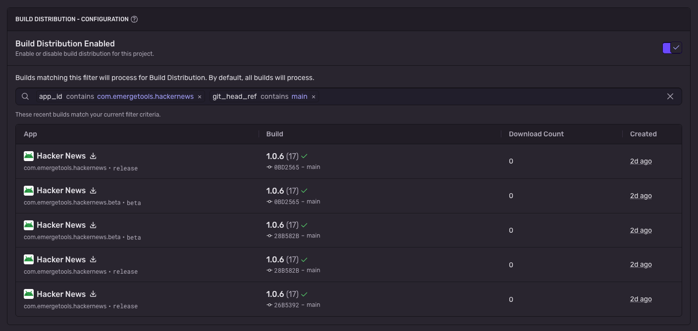

<Include name="feature-available-for-user-group-early-adopter" />

Build Distribution enables you to securely distribute app builds to your internal teams and beta testers. Upload builds from CI to streamline your distribution workflow, manage access control, and track installation analytics.

### CI Integration

Integrate Build Distribution into your CI pipeline to automatically distribute builds to your teams.

### Configuring Processing Filters in Sentry Settings

You can control which uploaded builds are processed for Build Distribution in Sentry Settings. Go to your project's [Mobile Builds](https://sentry.io/orgredirect/organizations/:orgslug/settings/projects/:projectId/mobile-builds/) settings.

By default, Build Distribution processes all uploaded builds. You can configure filters to only distribute builds matching specific criteria, such as `git_head_ref: main`, `build_configuration_name: Release`, or `app_id: com.example.app`.

## Upload Guides

You can follow the platform guides to learn how to upload builds for distribution:

- [iOS](/platforms/apple/guides/ios/build-distribution/)
- [Android](/platforms/android/build-distribution/)

### Upload Metadata

Below is the metadata included in your build, regardless of the platform.

<Include name="size-analysis/upload-metadata" />

## Install Groups

Install groups let you tag builds with one or more group names to control update visibility. When a device checks for updates, you can provide a list of install groups — only builds that share at least one install group with this list will be returned as available updates.

This is useful when you have multiple distribution channels (for example, separate branches, teams, or rollout stages) and want to prevent builds from one channel from being offered as updates to another.

### How It Works

When you upload a build, you can assign one or more install groups to it. If the Auto-Update SDK is provided install groups, it only returns builds that have overlapping groups.

Matching requires two builds to have a non-empty intersection of their install groups. For example, a build tagged `["alpha", "staging"]` will see updates from a build tagged `["alpha", "beta"]` because both share `alpha`.

### Use Cases

- **Branch-based testing**: Tag CI builds with the branch name so developers only receive updates from their own branch.
- **Staged rollouts**: Use groups like `"alpha"`, `"beta"`, and `"internal"` to control which teams receive which builds.
- **Team separation**: Give each team its own install group so they only see builds relevant to them.

For platform-specific setup instructions, see:

- [Android Install Groups](/platforms/android/build-distribution/install-groups/)
- [iOS Install Groups](/platforms/apple/guides/ios/build-distribution/install-groups/)

## Downloading Builds

<Include name="build-distribution/download" />

<PageGrid />
