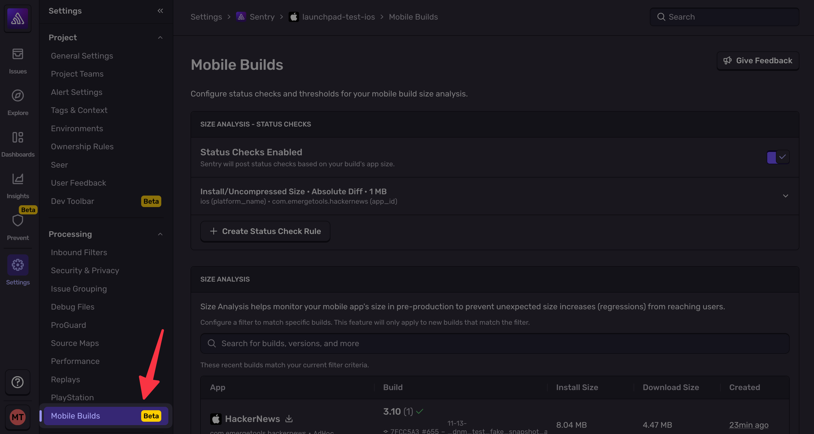
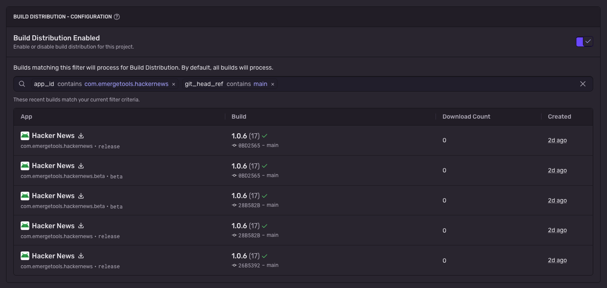

<Include name="feature-available-for-user-group-early-adopter" />

Build Distribution enables you to securely distribute app builds to your internal teams and beta testers. Upload builds from CI to streamline your distribution workflow, manage access control, and track installation analytics.

### CI Integration

Integrate Build Distribution into your CI pipeline to automatically distribute builds to your teams.

## Upload Guides

You can follow the platform guides to learn how to upload builds for distribution:

- [iOS](/platforms/apple/guides/ios/build-distribution/)
- [Android](/platforms/android/build-distribution/)

### Upload Metadata

Below is the metadata included in your build, regardless of the platform.

<Include name="size-analysis/upload-metadata" />

### Configuring Processing Filters in Sentry Settings

You can control which uploaded builds are processed for Build Distribution in Sentry Settings. Go to your project's [Mobile Builds](https://sentry.io/orgredirect/organizations/:orgslug/settings/projects/:projectId/mobile-builds/) settings.

By default, Build Distribution processes all uploaded builds. You can configure filters to only distribute builds matching specific criteria, such as `git_head_ref: main`, `build_configuration_name: Release`, or `app_id: com.example.app`.

## Install Groups

Install groups let you tag builds with one or more group names to control update visibility. When the Auto-Update SDK checks for updates, the API returns the single latest build (by semver version, then build number) that shares at least one install group with the request.

This is useful when you have multiple distribution channels (for example, separate branches, teams, or rollout stages) and want to prevent builds from one channel from being offered as updates to another.

### How It Works

Install groups are configured in two places, which can be set independently:

1. **At upload time**: Tag each build with one or more group names (for example, `"alpha"`, `"staging"`).
2. **At runtime (optional)**: The Auto-Update SDK can explicitly send install groups when checking for updates to override the default filtering.

When the SDK checks for updates, the API returns the single latest build (highest semver version, with build number as tiebreaker) whose install groups overlap with the filter. Install groups for the filter are determined as follows:

- If the SDK **sends groups explicitly**, the API uses those.
- If the SDK **doesn't send groups**, the API looks up the uploaded build matching the device's current version and uses that build's upload groups. On iOS, the lookup uses the Mach-O UUID of the app binary, which is unique per binary. On Android, it uses `buildVersion` and `buildNumber` — if multiple builds share the same values, the API picks the most recently uploaded one, which may lead to unexpected results.

We recommend configuring the SDK to send install groups explicitly rather than relying on API-side inheritance. On Android, the [Gradle plugin](/platforms/android/build-distribution/install-groups/#gradle-plugin) `installGroups` config handles this automatically — it tags the upload **and** embeds the groups in the app so the SDK sends them with every update check.

Matching uses OR logic: a build matches if it shares **at least one** group with the filter. For example, filtering with `["alpha", "staging"]` will match a build tagged `["alpha", "beta"]` because both share `alpha`. Builds with no install groups will not match any filtered request.

### Use Cases

- **Branch-based testing**: Tag CI builds with the branch name so developers only receive updates from their own branch.
- **Staged rollouts**: Use groups like `"alpha"`, `"beta"`, and `"internal"` to control which teams receive which builds.
- **Team separation**: Give each team its own install group so they only see builds relevant to them.

For platform-specific setup instructions, see:

- [Android Install Groups](/platforms/android/build-distribution/install-groups/)
- [iOS Install Groups](/platforms/apple/guides/ios/build-distribution/install-groups/)

## Downloading Builds

<Include name="build-distribution/download" />

<PageGrid />
