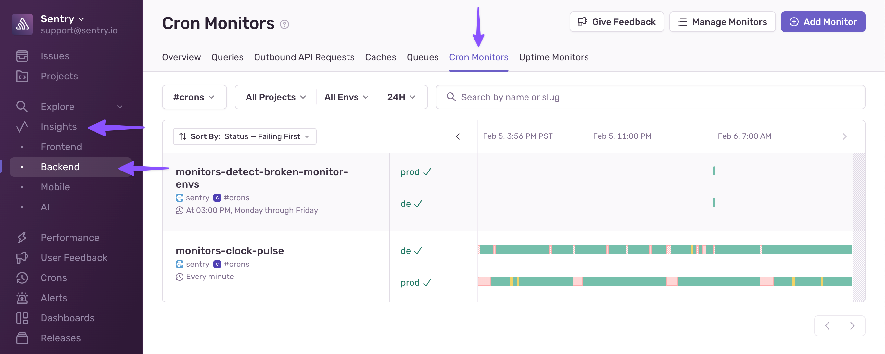
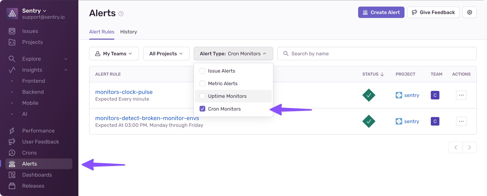

The **Cron Monitoring** feature has been relocated and restructured to improve accessibility and functionality. Previously, it was found in the sidebar under **"Crons"**, but it has now been split into two different locations:

## Timeline View (Overview of Cron Jobs)

- The timeline view that provided an overview of all cron jobs has moved.
- You can now find it under **Insights > Backend > Cron Monitors (Tab)**.
  

## Managing Cron Monitors

- The section for managing all of your cron monitors is now under **Alerts**.
- **Cron Monitors are now a new type of Sentry Alert**, allowing for better integration and management within the Alerts system.
- To filter and view all cron monitors easily, use the **Alert Type** filter for "Cron Monitors".
  
