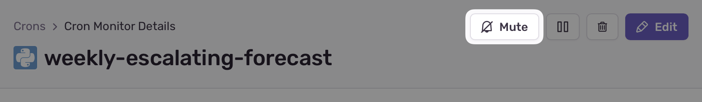
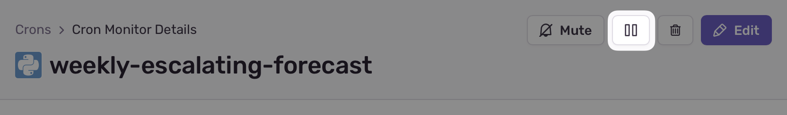
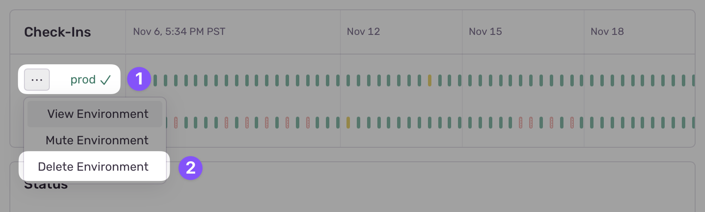

Clicking on a recurring job from the [**Cron Monitors**](https://sentry.io/orgredirect/organizations/:orgslug/crons/) page takes you to the **Cron Monitor Details** page. Here you'll be able to see:
- Daily historical bar chart: Displays the number of successful, failed, and missed check-ins for the selected job.
- Runtime line chart: Shows the average execution time for the job over time.

If you scroll down to the "ISSUE" section, you'll see any issues created when a job execution missed or failed. If you've configured the Sentry SDK for your job, any errors thrown during the job runtime will be shown here as well.

Just below, you'll find the table of "Recent Check-Ins" which lists previously scheduled jobs and their statuses.

<Arcade src="https://demo.arcade.software/7XmPfL0l2pp6KmBUXwMc?embed" />

## Check-in Status

Sentry's Cron Monitoring can notify you and store a timeline of the following check-in events:

- **Missed check-in:** The job didn't execute within the expected timeframe or frequency because:
  - The job scheduler is misconfigured and skipped or failed to initiate your job.
  -  A job sent an initial check-in, but failed to send a final check-in due to a timeout failure event.
  - There were network issues, such as an outbound firewall or an unstable connection.
  - An invalid request format.
  
- **Failed check-in:** The job reported its execution as unsuccessful.
- **Successful check-in:** The job reported its execution as successful.
- **Unknown check-in:** In rare cases, Sentry may be unable to identify a check-in status due to an outages or maintenance period.

## Monitor States

A monitor can have three states: active, muted, and disabled. Only disabled monitors do not count towards your plan's monitor limit.

- **Active:** The monitor is accepting and processing check-ins. If a check-in fails or is missed, new Cron Monitor issues will be created based on your monitor's configuration.
- **Muted:** The monitor and its environments accept check-ins, but won't create Cron Monitor issues for failed or missed check-ins. This is useful if you want to temporarily pause alerts without stopping check-ins.
- **Disabled:** The monitor and it's environments are not accepting check-ins, with any check-ins sent to a disabled monitor will be dropped. Disabled monitors do not count towards your plan's monitor limit.

<Alert level="info" title="Note">
  The monitor state supercedes the [environment state](#environment-state). If a
  monitor is disabled or muted, so will all environments of it's environments,
  regardless of their individual state.
</Alert>

### Muting Monitors

You can mute job monitoring in the header of your cron monitor:

### Disabling Monitors

You can disable job monitoring in the header of your cron monitor:

### Deleting Monitors

You can delete a monitor from the monitor details page.

<Alert level="danger" title="Caution">
  Deleting a monitor will remove all of its environments and check-in history.
  This action is irreversible.
</Alert>

## Multiple Environments

A monitor can be configured to run across multiple environments, all following the same schedule. However, only environments with at least one check-in will appear and be available for alerting and filtering.

Although the check-in schedule is the same across all environments, each environment operates independently. This ensures that a missed or failed check-in in one environment won't impact the state of other environments.

If you're using [an SDK that supports Crons](/product/crons/getting-started/), the check-in environment will be automatically set to the environment configured in the SDK. If you're using the API, you can set the environment in the check-in payload.

## Environment State

Each environment can have one of the following states independent of the monitor state:

- **Healthy:** The environment's latest check-in was successful.
- **Unhealthy:** The environment's latest check-in was a failure or miss.
- **Waiting for check-in:** The environment hasn't had any check-ins.
- **Muted:** The environment is muted and won't create any Cron Monitor issues.
- **Broken:** The environment has had multiple failed or missed check-ins in a row.

### Broken Environments

Monitored environments that remain consistently unhealthy for 14 days will be marked as broken. If the issue persists and no action is taken, Sentry will automatically mute the environment after it's been broken for 30 days. To recover a broken environment, you'll need send a new healthy check-in.

### Muting Environments

You can mute an environment from the monitor list or monitor details page. To do this:

1. Hover over the environment state.
2. Select "Mute Environment".

### Deleting Environments

You can delete an environment from the monitor list or monitor details page. To do this:

1. Hover over the environment state.
2. Select "Delete Environment".

<Alert level="danger" title="Caution">
  Deleting an environment will remove all of its check-in history.
</Alert>
