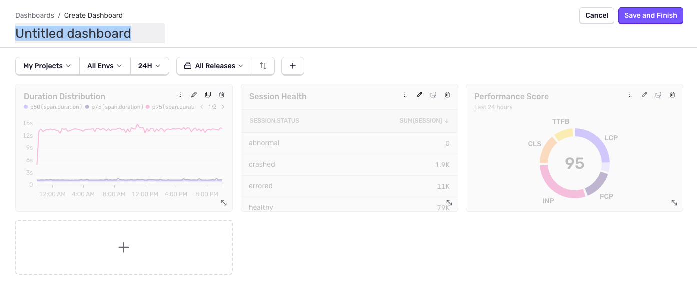

Custom dashboards are shared across your organization, and users can view each other’s custom dashboards on the [Dashboards home page](https://sentry.io/orgredirect/organizations/:orgslug/dashboards/). Note that any changes you make and **save** become global, and will appear for users across the entire organization.

## Manage Dashboards

On the Dashboards home page, you can:

- Create a dashboard
- Duplicate a dashboard
- Delete a dashboard
- Categorize dashboards

### Create Dashboards

Clicking **Create Dashboard** takes you to a new dashboard where you can immediately begin adding widgets from a blank page. When you're creating a new dashboard or editing an existing one, the widgets are slightly grayed out. From here, you can:

- Name the dashboard
- Add and remove widgets
- Rearrange existing widgets
- Resize existing widgets
- Create a custom widget

### Duplicate Dashboards

You can duplicate a dashboard by clicking the ellipsis on a dashboard card and selecting **Duplicate**, or by clicking the **Duplicate** button on a dashboard page. 

### Dashboard Filters

Dashboard filters are applied to all the widgets in your dashboard. By default, they consist of page filters that allow you to narrow down the widget results to certain projects, environments, date ranges, and releases. You can also add custom filters to your dashboard by pressing the _plus_ button. Each filter begins with selecting a dataset, and then adding a filter condition. You can add multiple filters to your dashboard, and they will be applied to all widgets in the dashboard. Changing a dashboard filter will prompt you to "Save" or "Cancel". To persist filter changes to your dashboard, click "Save", or click "Cancel" to discard the changes.

### Dashboard Edit Access

To restrict who can edit or delete your dashboard, go to the "Edit Access" selector. As the dashboard creator, you can limit access to specific teams by selecting the checkboxes in the Edit Access Selector and clicking Save Changes to apply the updates. Dashboard creators and organization owners always retain edit access.

## Widget Builder

When adding a widget or editing an existing one, you will be presented with a side panel where you can see the dashboard widget builder. The widget builder has several configuration options that you can use to shape data and add information to your dashboard. Learn more in the [Widget Builder documentation](/product/dashboards/widget-builder/).

## Widget Library

The widget library contains a collection of prebuilt widgets you can add to your custom dashboards. Learn more by reading our [Widget Library docs](/product/dashboards/widget-library/).
