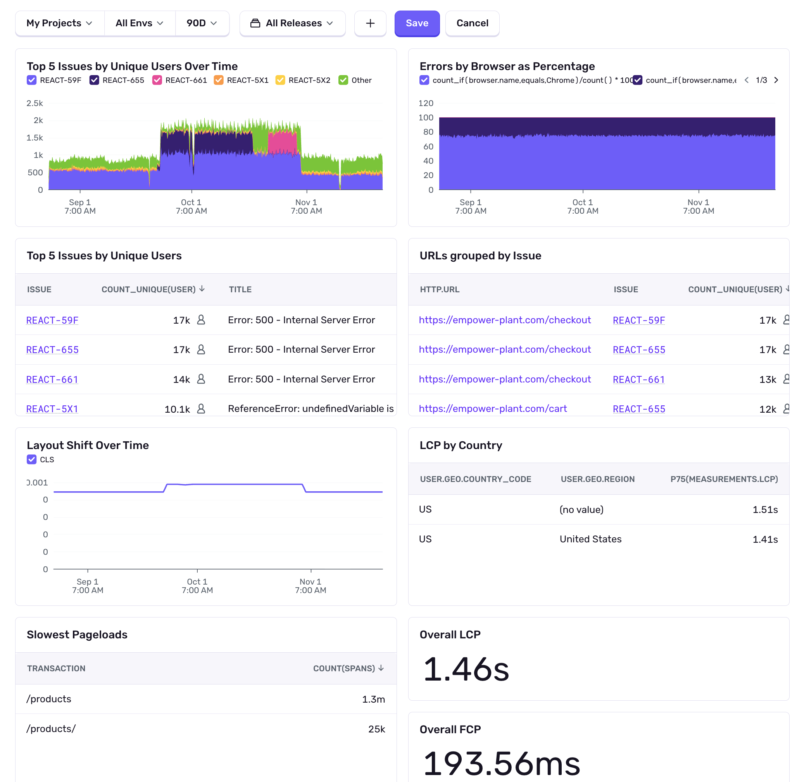

Sentry's <SandboxLink scenario="dashboards" projectSlug="react">Dashboards</SandboxLink> provide you with a broad overview of your application’s health by allowing you to navigate through error and performance data across multiple projects. Dashboards are made up of one or more widgets, and each widget visualizes one or more [dataset](/product/dashboards/widget-builder/#choose-your-dataset).

## Global Filters

All widgets in the same view reflect the results of the global filters set at the top of the dashboard. 

By default, projects, environments, date range, and release must be set, and will apply to all widgets in the dashboard. You can also zoom in on any time series visualizations you may want to investigate, and all of the widgets will reflect the time period that you’ve zoomed in on.

### Custom Filters

You can also add custom global filters to your dashboard by pressing the _plus_ button. Each filter begins with selecting a dataset, and then adding a filter condition. You can add multiple filters to your dashboard, and they will be applied to all widgets _relating to that dataset_ in the dashboard.

### Dashboard Edit Access

To restrict who can edit or delete your dashboard, go to the "Edit Access" selector. As the dashboard creator, you can limit access to specific teams by selecting the checkboxes in the Edit Access Selector and clicking Save Changes to apply the updates. Dashboard creators and organization owners always retain edit access.

## Custom Dashboards

Every organization has a general template dashboard that is shared across all users. If you’d like to edit the default dashboard or build out new ones, each with its own set of unique widgets, you may want to consider the [Custom Dashboards](/product/dashboards/custom-dashboards/) feature which enables you to create more robust or customized views for example, to track performance of a specific feature or to track errors by a specific team's ownership.

## Open Dashboard Widgets in Discover and Issues

Each <SandboxLink scenario="dashboards" projectSlug="react">Dashboard</SandboxLink> widget has an ellipsis that opens a context menu. From here, depending on the type of data the widget shows, you can open the widget in [Discover](/product/explore/discover-queries/) or [Issues](/product/issues/) to get more information.

## Widget Viewer

Dashboard widgets can be opened in an expanded widget viewer mode for further exploration. The widget viewer allows enhanced filtering, sorting, and navigation features that are not available in the basic widget card view:

- Widget tables display more rows per page, can be paginated and sorted, and allow column width adjustment
- Widget charts can be zoomed in without affecting the rest of the dashboard
- Chart visualizations display an additional table of results grouped by `title` for further insights
- Widget viewer URLs can be copied and shared for easy revisiting

Click the expand icon on the top right of any widget card to open the viewer.
