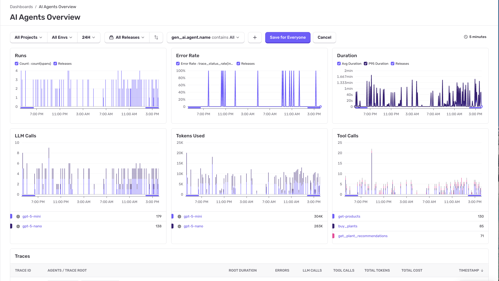
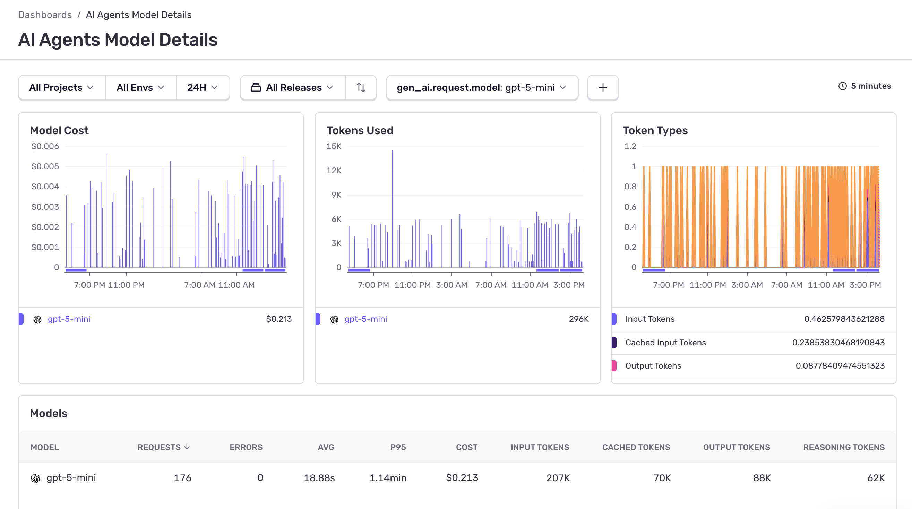
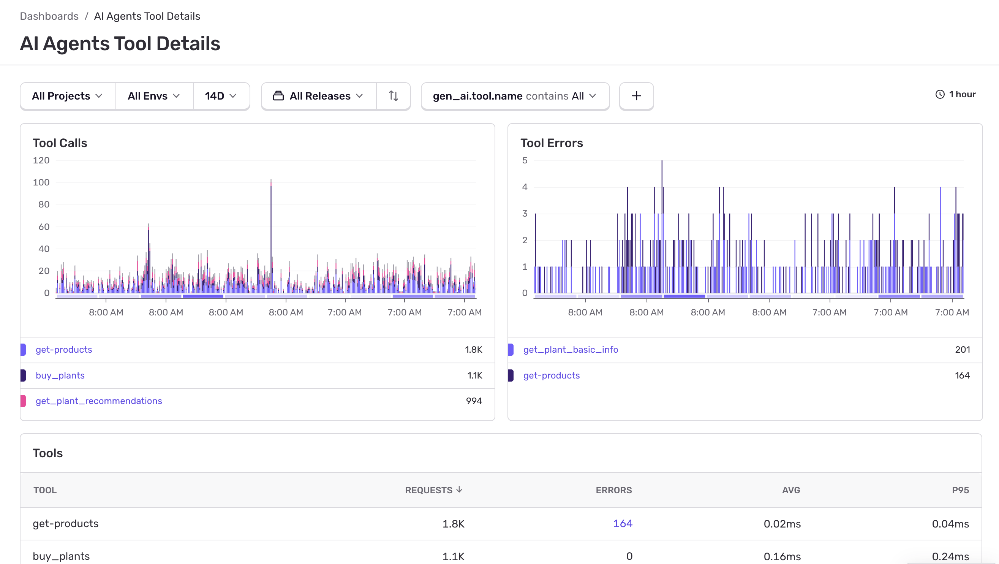
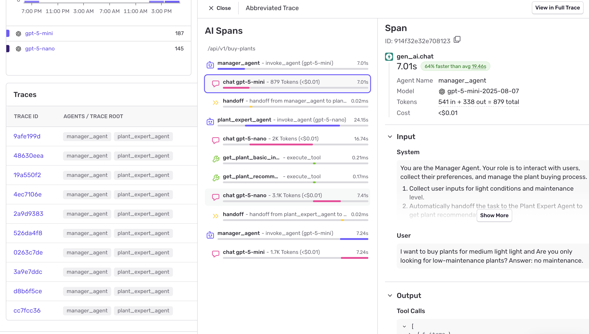
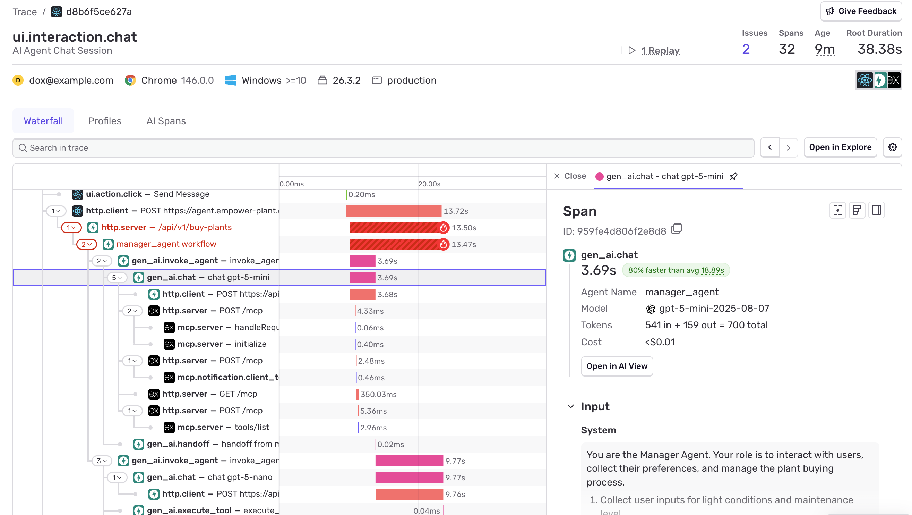

<Alert title="Beta">

This feature is currently in beta. Features in beta are still in-progress and may have bugs. We recognize the irony. Learn more about enabling Early Adopter Features [here](/organization/early-adopter-features/).

</Alert>

AI Agents Dashboards, found in [Sentry Dashboards](https://sentry.io/orgredirect/organizations/:orgslug/dashboards/) provide a comprehensive view of your AI workflows, including executions, model costs and token usage, tool calls, and recent errors. Once you've [configured the Sentry SDK](/ai/monitoring/agents/getting-started/) for your AI agent project, telemetry data is collected and displayed in the dashboard to support analysis of system behavior and performance.

AI Agent monitoring have three dashboards: 

- [Overview](#overview)
- [Models](#models)
- [Tools](#tools)

## Overview

The Overview dashboard is the landing page for monitoring your AI workflows:

The dashboard displays the following key widgets:

- **Runs**: Shows agent runs over time, error rates, and releases to track overall activity and health
- **Error Rate**: Shows the error rate for your agent executions
- **Duration**: Displays response times for your agent executions to monitor performance
- **LLM Calls**: Count of LLM generations over time
- **Tokens Used**: Token usage by top models
- **Tool Calls**: Tool call volume and trends

Click into any model listed under widgets to get to the Models dashboard. Click into any tool listed under widgets to get to the Tools dashboard.

Below these widgets is a traces table with detailed distribution information:

Click on any trace to open the [abbreviated trace view](#abbreviated-trace-view) in a drawer, or click the **View in full trace** button to see the complete trace.

## Models

The Models dashboard displays Model Cost, Tokens Used, and Token Types widgets, as well as all used models with durations and token usage:

The Model Cost widget shows estimated costs based on token usage and model pricing. For details on how costs are calculated, where pricing data comes from, and what's not covered, see [Model Costs](/ai/monitoring/agents/costs/).

## Tools

The Tools tab displays Tool Calls and Tool Errors widgets, as well as all used tools with durations and errors:

## Abbreviated Trace View

Opens as a drawer when clicking any trace, showing essential details:

- **Agent Invocations**: Each agent execution and nested calls
- **LLM Generations**: Language model interactions with token breakdown
- **Tool Calls**: External API calls with inputs and outputs
- **Handoffs**: Agent-to-agent transitions and human handoffs
- **Critical Timing**: Duration metrics for each step
- **Errors**: Any failures that occurred

Click **"View in full trace"** for comprehensive debugging details.

## Detailed Trace View

Shows complete agent workflow with full context:

This detailed view reveals:

- **Complete Agent Flow**: Every step from initial request to final response
- **Tool Calls**: When and how the agent used external tools or APIs
- **Model Interactions**: All LLM calls with prompts and responses (if PII is enabled)
- **Timing Breakdown**: Duration of each step in the agent workflow
- **Error Context**: Detailed information about any failures or issues

When your AI agents are part of larger applications (like web servers or APIs), the trace view will include context from other Sentry integrations, giving you a complete picture of how your agents fit into your overall application architecture.

