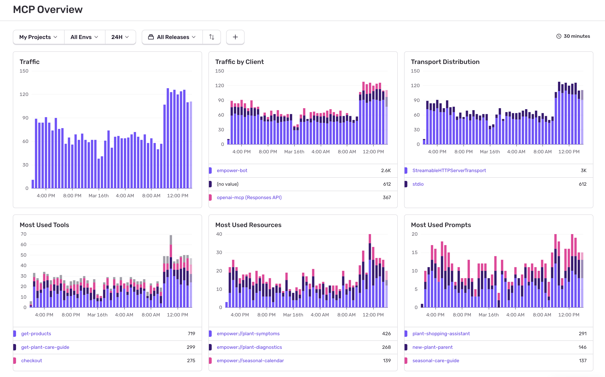
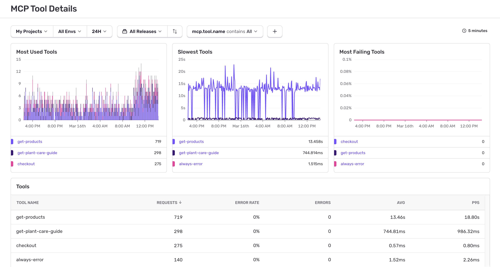
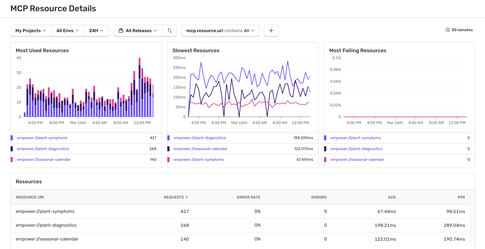
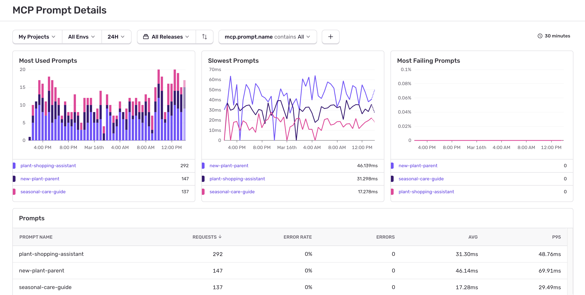

<Alert title="Beta">

This feature is currently in beta. Features in beta are still in-progress and may have bugs. We recognize the irony. Learn more about enabling Early Adopter Features [here](/organization/early-adopter-features/).

</Alert>

MCP Dashboards, found in [Sentry Dashboards](https://sentry.io/orgredirect/organizations/:orgslug/dashboards/), provide a comprehensive view of your MCP server activities, including requests, tool executions, resource access, and prompt usage. Once you've [configured the Sentry SDK](/ai/monitoring/mcp/getting-started/) for your MCP project, telemetry data is collected and displayed in the dashboard to support analysis of system behavior and performance.

MCP monitoring has four dashboards:

- [Overview](#overview)
- [Tools](#tools)
- [Resources](#resources)
- [Prompts](#prompts)

## Overview

The Overview dashboard is the landing page for monitoring your MCP servers:

The dashboard displays the following key widgets:

- **Traffic**: Shows MCP requests over time, error rates, and releases to track overall server activity and health
- **Traffic by Client**: Displays which MCP clients are connecting to your server (cursor-vscode, CustomMCPClient, etc.)
- **Transport Distribution**: Shows the distribution of transport protocols used (http, sse, custom transports)
- **Most Used Tools**: Shows which MCP tools are called most frequently by clients
- **Most Used Resources**: Shows which MCP resources are accessed most frequently by clients
- **Most Used Prompts**: Shows which MCP prompt templates are used most frequently by clients

Click into any tool, resource, or prompt listed under widgets to get to the respective details dashboard.

Below these widgets is a table showing the most common operations sorted by number of requests.

## Tools

The Tools dashboard displays Tool Calls and Tool Errors widgets, as well as all used tools with request counts, error rates, average durations, and P95 latency:

## Resources

The Resources dashboard displays Resource Access and Resource Errors widgets, as well as all accessed resources by URI with request counts, error rates, average durations, and P95 latency:

## Prompts

The Prompts dashboard displays Prompt Usage and Prompt Errors widgets, as well as all prompt templates by name with request counts, error rates, average durations, and P95 latency:

