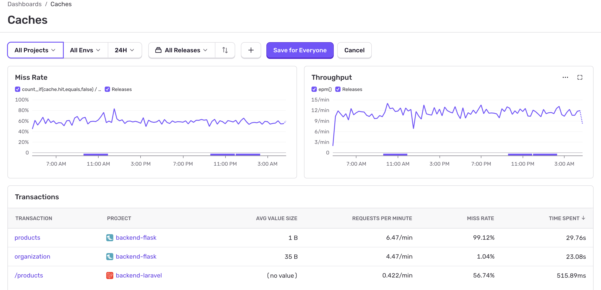

A cache can be used to speed up data retrieval, improving application performance. It temporarily stores data to speed up subsequent access to that data, allowing your application to get data from cached memory (if it is available) instead having to repeatedly fetch the data from a potentially slow data layer. Caching can speed up read-heavy workloads for applications like Q&A portals, gaming, media sharing, and social networking.

A successful cache results in a high hit rate which means the data was present when fetched. A cache miss occurs when the data fetched was not present in the cache. If you have [performance monitoring](/product/sentry-basics/performance-monitoring/#how-to-set-up-performance-monitoring) enabled and your application uses caching, you can see how your caches are performing with Sentry.

Sentry's cache monitoring provides insights into cache utilization and latency to help you improve performance on endpoints that interact with caches.

With the Cache dashboard found in [Sentry Dashboards](https://sentry.io/orgredirect/organizations/:orgslug/dashboards/), you get an overview of the transactions within your application that are making at least one lookup against a cache. From there, you can dig into specific cache span operations by clicking a transaction and viewing its sample list.

{/* <Arcade src="https://demo.arcade.software/ZXXfmVEBIjlwk83pUSfs?embed&show_copy_link=true" /> */}

## Instrumentation

Cache monitoring currently supports [auto instrumentation](/platform-redirect/?next=%2Ftracing%2Finstrumentation%2Fautomatic-instrumentation) for [Django's cache framework](https://docs.djangoproject.com/en/5.0/topics/cache/) when the [cache_spans option](/platforms/python/integrations/django/#options) is set to `True`. Other frameworks require custom instrumentation.

### Custom instrumentation

If available, custom instrumentation is documented on an environment-by-environment basis as listed below:

- [Python SDK](/platforms/python/tracing/instrumentation/custom-instrumentation/caches-module/)
- [JavaScript SDKs](/platforms/javascript/guides/node/tracing/instrumentation/custom-instrumentation/caches-module/)
- [PHP SDK](/platforms/php/tracing/instrumentation/caches-module/)
- [Java SDK](/platforms/java/tracing/instrumentation/custom-instrumentation/caches-module/)
- [Ruby SDK](/platforms/ruby/tracing/instrumentation/custom-instrumentation/caches-module/)
- [.NET SDK](/platforms/dotnet/tracing/instrumentation/custom-instrumentation/caches-module/)

To see what cache data can be set on spans, see the [Cache Module Developer Specification](https://develop.sentry.dev/sdk/performance/modules/caches/).

## Caches Dashboard

The **Caches** dashboard gives an overview of cache performance across all endpoints for currently selected backend projects with summary graphs for **Miss Rate** and **Requests Per Minute** (throughput). You can use these as a starting point to see if there are any potential cache performance issues, for example, a higher than expected Miss Rate percentage.

If you see an anomaly or want to investigate a time range further, click and drag to select a range directly in the graph and data will be filtered for that specific time range only.

The transaction table shows a list of endpoints that contain at least one `cache.get` span along with:

- Its average value size (the bytes being fetched from cache)
- Requests per minute 
- Miss rate percentage (how often did a lookup did not return a value)
- Time spent (total time your application spent on a given transaction)

By default, this table is sorted by most time spent. This means that endpoints at the top are usually really slow, requested very frequently, or both. 

Click on a transaction to go to the Transaction Summary page, or explore span samples on the Traces page. 

## Sample List

To help you compare the performances of cache hits (where a value was found in the cache) versus misses (where no value corresponding to the key was found in the cache) over time, Sentry automatically surfaces a distribution of both samples for the timeframe selected from the **Caches** dashboard by clicking on a transaction and selecting to **View span samples**. Drill into any span on the Traces page to see a waterfall view. 
