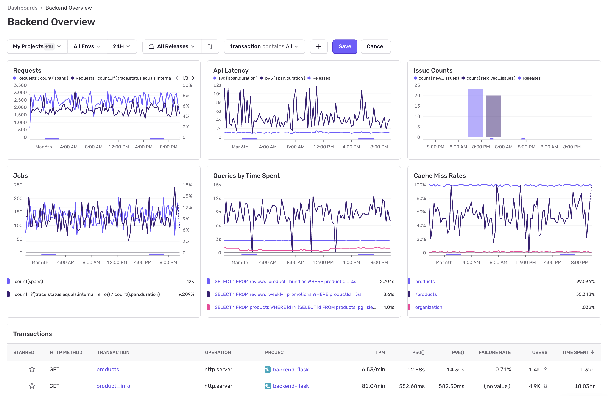

Sentry's [**Backend dashboards**](https://sentry.io/orgredirect/organizations/:orgslug/dashboards/) page gives you an overview of the health of your application.

## Backend Overview Dashboard

Start with the **Backend Overview** dashboard to get a quick overview of your application. See things like **Most Time-Consuming Queries**, **Most Time-Consuming Domains**, **p50** and **p75 Duration**, and so on.

You can also dive deeper into Queries, Outbound API Requests, Caches, and Queues to get detailed information about potential issues affecting your application's health. 

## Learn More

<PageGrid />
