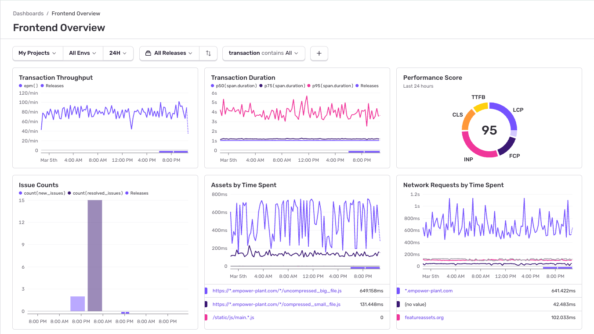

Sentry's Frontend dashboards give you an overview of the health of your application. 

## Frontend Overview

Start with the **Frontend Overview** dashboard to get a quick overview of the health of your application. See things like **Best Page Opportunities** (the improvements that would most help increase your performance score), your **Most Time-Consuming Assets**, **p50** and **p75 Duration**, and so on.

You can also dive deeper into Web Vitals, Network Requests, and Assets to get detailed information about potential issues affecting your application's health. 

## Learn More

<PageGrid />
