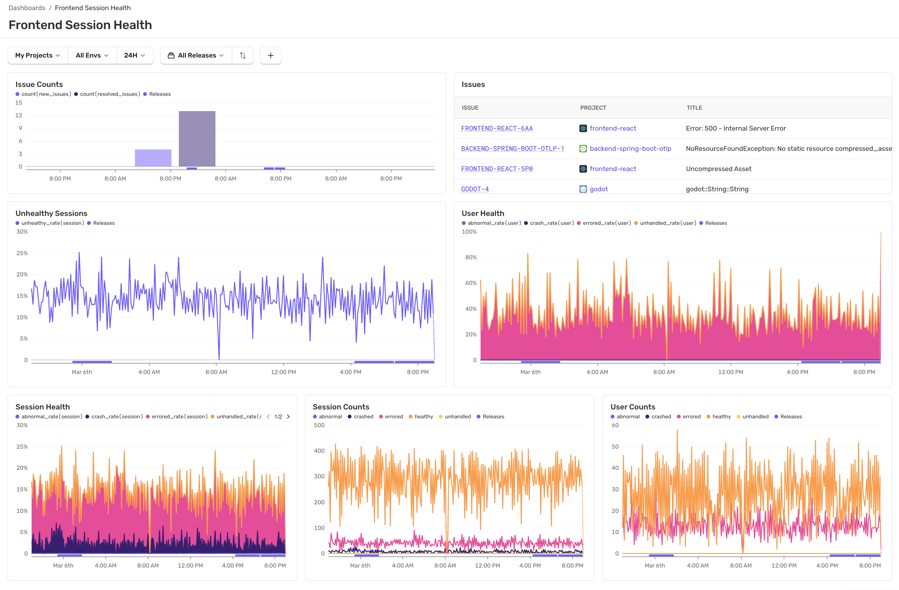

If you have [sessions and releases](/product/releases/setup/) enabled on Sentry, you can take advantage of the Frontend Session Health dashboard. The Session Health dashboard contains a variety of data visualizations to help you discover insights about how your sessions are performing. A session on most web or mobile applications is created for every page (or view) load and on every navigation change. Read more [here](/product/releases/health/#sessions).

The charts help you understand trends for your sessions over time, and the customized chart views and toggleable legends allow you to drill down into the metrics you care about most.

## Prerequisites

You must have [sessions and releases](/product/releases/setup/) enabled in order to view these insights. Session Health on Insights is available only for the Frontend and Mobile modules.

## Charts

The following charts are available:

- Unhealthy Sessions
- Session Health
- Session Counts
- User Health
- User Counts
- [Issues](/product/issues/)

Most of these charts, with the exception of the Issues chart, are based on sessions-backed data.

The Session Health, Session Counts, User Health, and User Counts charts aim to break down trends in how your sessions are performing status-wise. The status options are healthy, crashed, errored, or abnormal. For frontend sessions, the "errored" status refers to handled errors, and "crashed" refers to unhandled errors. Note that these are mutually exclusive groups. [Learn more about session statuses](/product/releases/health/#session-status).

The **Unhealthy Sessions** chart combines the total rate of errored, crashed, and abnormal sessions into one line.

The **Issues** chart shows the number of new and resolved issues for the selected projects over time. It also gives a preview of the two most recently seen issues for the selected projects. The chart header, when hovered, has a button to view all issues for the selected projects.

Click on any series option in the graph legend to hide it. In some charts, including the Session Health chart, the healthy series is hidden by default to allow you to automatically see the errored, abnormal, and crashed series at a better scale.

The overall chart view can be customized, so that you can display the visualizations and metrics you care about most. Simply click the toggle near the chart title to see other charts that can be displayed.

You can customize this dashboard by updating filters or duplicating it to create a new dashboard.
