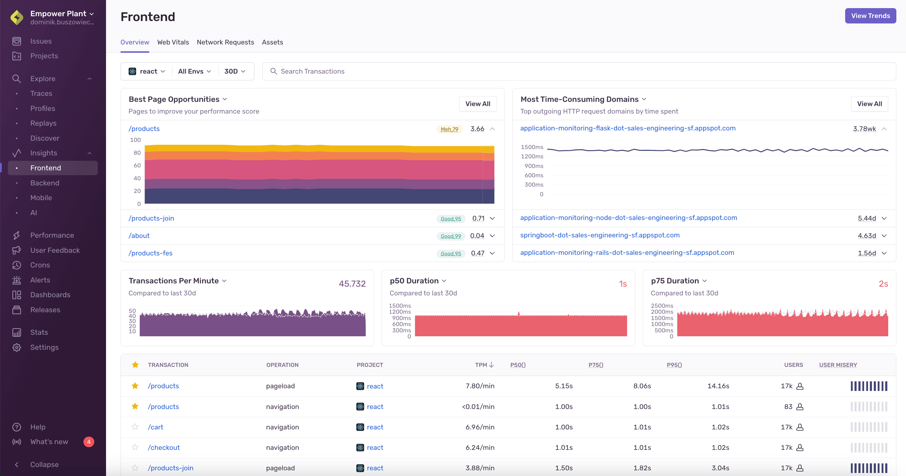

Spot trends, fix issues, and boost application performance with Sentry's frontend, backend, mobile, and AI performance dashboards in [**Sentry Dashboards**](https://sentry.io/orgredirect/organizations/:orgslug/dashboards/) give you a clear summary of the telemetry and events impacting the performance of individual parts of your application through dashboards like web vitals, crash rate, and performance monitoring. You can also drill deeper into specific workflows to see specific traces, errors, and releases. 

Sentry tracks application performance, measuring metrics like throughput and latency, and displaying the impact of errors across multiple services. Sentry captures [distributed traces](/product/sentry-basics/tracing/distributed-tracing/) consisting of multiple [spans](/product/explore/trace-explorer/#spans) to measure individual services and operations within those services.

<Alert>

Learn more about traces in the [full Tracing documentation](/product/sentry-basics/tracing/).

</Alert>

The **Sentry Dashboards** view is the main place in [sentry.io](https://sentry.io) where you can search or browse for transaction data. A transaction represents a single instance of an activity you want to measure or track, such as a page load, page navigation, or an asynchronous task. The page displays graphs that visualize transactions, as well as a table where you can view relevant transactions and drill down to get more information about them.

Using the information on this page, you can trace issues back through services (for instance, frontend to backend) to identify poorly performing code. You'll be able to determine whether your application performance is getting better or worse, see if your last release is running more slowly than previous ones, and identify specific services that are slow. Once you've found the cause of the problem, you'll be able to address the specific code that's degrading performance.

## Set Up

Sentry Dashboards surface different kinds of data depending on the view. Performance views (transactions, Web Vitals, queries, outbound API requests, and more) use [tracing](/product/sentry-basics/tracing/) data. Frontend and mobile dashboards also include [session health](/product/dashboards/sentry-dashboards/frontend/session-health/) data, which relies on session and release data from your SDKs.

If you don't already have performance monitoring and tracing enabled, set up the Sentry SDK for your platform and enable tracing. See [Set up tracing for your platform](/platform-redirect/?next=%2Ftracing%2F). For session health on frontend and mobile dashboards, ensure [sessions and releases](/product/releases/setup/) are configured in your SDK.

## Filter Performance Data

Sentry Dashboards provide several filter and display options so that you can focus on the performance data that's most important to you. You can use the project, environment, and date filters to customize the information displayed on the page. You can also search to find and filter for the specific transactions you want to investigate.

## Investigate Transactions

When you find a transaction of interest, you can investigate further by going to its [Transaction Summary page](/product/dashboards/sentry-dashboards/transaction-summary/). Every transaction has a summary view that gives you a better understanding of its overall health. With this view, you'll find graphs, instances of these events, stats, facet maps, related errors, and more.

The summary page for Frontend transactions links out to the web vitals page, where you can see a detailed view of the [Web Vitals](/product/dashboards/sentry-dashboards/frontend/web-vitals/) associated with the transaction. You can also access a **Transaction Summary** page from the transactions table on the **Performance** page.

## Explore Performance Metrics

There are several types of [metrics](/product/dashboards/sentry-dashboards/performance-metrics/) that you can visualize in the graphs, such as Apdex, Transactions Per Minute, P50 Duration, and User Misery to get a full understanding of how your software is performing.

## Triage Performance Issues

<Alert>

**Issue and Event Quotas**

Your quota is consumed by events or traces, not issues. Performance issues are generated from your accepted transactions, which **doesn't** directly impact your quota. Sentry Dashboard transaction events use transactions, which **does** directly impact your quota. Sentry provides tools to control the type and number of error and transaction events that are accepted. Learn more in [Quota Management](/pricing/quotas/manage-transaction-quota).

</Alert>

If your application is configured for Sentry Dashboards and Tracing, Sentry will detect common performance problems, and group them into issues just like it does with errors. Performance issues help to surface performance problems in your application and provide a workflow for resolving them. Learn more about [performance issues](/product/issues/issue-details/performance-issues/).

## Dynamic Sampling

Depending on your plan, the data ingested into Sentry may be affected by [Dynamic Sampling](/organization/dynamic-sampling/).

## Learn More

<PageGrid />
