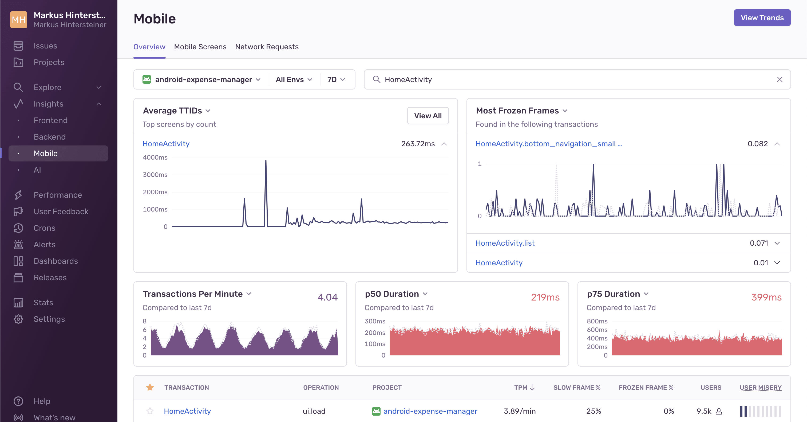

The Mobile Dashboard found on [Sentry Dashboards](https://sentry.io/orgredirect/organizations/:orgslug/dashboards/) gives an overview of the metrics that let you know how fast your app starts, including the number of slow and frozen frames your users may be experiencing. Each metric provides insights into the overall performance health of your mobile application. Digging into the details helps prioritize critical performance issues and allows you to identify and troubleshoot the root cause faster.

{/**/}

## Learn More

<PageGrid />
