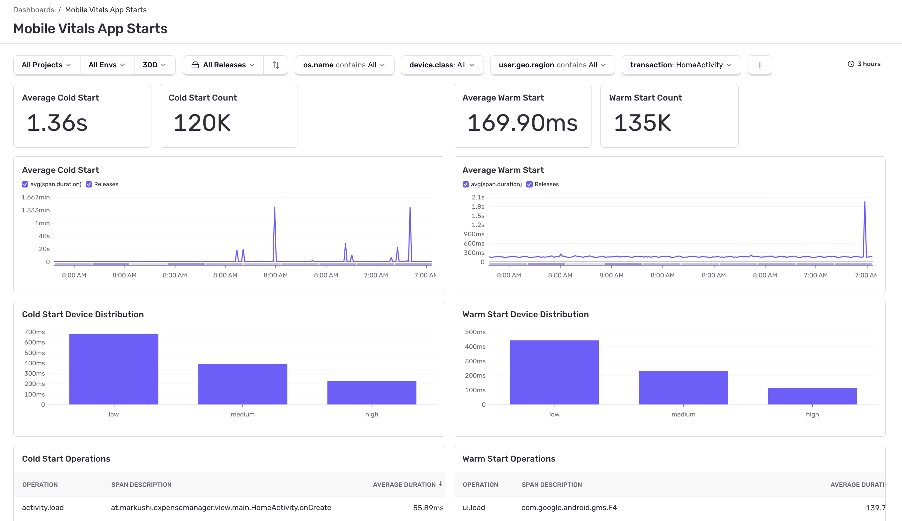
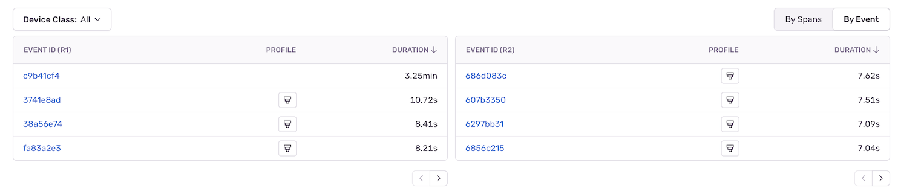
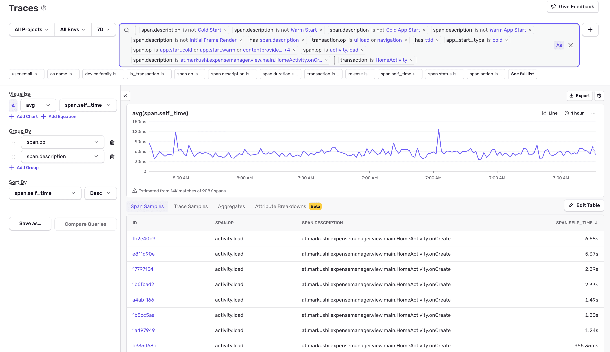

The **App Starts** dashboard in [Sentry Dashboards](https://sentry.io/orgredirect/organizations/:orgslug/dashboards/) shows an overview of the amount of time it takes for your application to complete cold and warm starts. It helps you identify slow or regressed screens and gives additional information so you can better understand the factors contributing to the slowness of your application start times.

### Minimum SDK Requirements:

**For Android:**

- `>=7.4.0` for automatic instrumentation of app start spans and app start profiling
- [Performance-V2](/platforms/android/performance/instrumentation/perf-v2) feature flag (`<8.0.0`) and [App Start Profiling](/platforms/android/profiling/#app-start-profiling) must also be enabled in the SDK, e.g.:

```java {filename:MyApplication.java}
import io.sentry.android.core.SentryAndroid;

SentryAndroid.init(this, options -> {
  options.setEnablePerformanceV2(true);
  options.setEnableAppStartProfiling(true);
});
```

```kotlin {filename:MyApplication.kt}
import io.sentry.android.core.SentryAndroid

SentryAndroid.init(this) { options ->
  options.enablePerformanceV2 = true
  options.enableAppStartProfiling = true;
}
```

```xml {filename:AndroidManifest.xml}
<manifest>
    <application>
        <meta-data android:name="io.sentry.performance-v2.enable" android:value="true" />
        <meta-data android:name="io.sentry.traces.profiling.enable-app-start" android:value="true" />
    </application>
</manifest>
```

**For iOS:**

- `>=7.2.0` for automatic instrumentation of [app start spans](/platforms/apple/guides/ios/tracing/instrumentation/automatic-instrumentation/#app-start-tracing)
- `>=8.21.0` for app start profiling

**For React Native:**

- `>=5.24.0` for automatic instrumentation of [app start spans](/platforms/react-native/tracing/instrumentation/automatic-instrumentation/#app-start-instrumentation)

By default, the **App Starts** dashboard displays metrics for the two releases with the highest screen counts for the time range you've selected. To choose a different set of releases to compare, use the "release selector" at the top of the dashboard. To change the app start type (cold or warm), use the "App Start" selector at the top of the dashboard.

The charts display the following metrics (using cold starts as an example):

- Average Cold Start
  - The overall time it takes your application to start, compared by release.
- Cold Start Device Distribution
  - The average cold start time grouped by [device class](/concepts/search/searchable-properties/#device-classification) (high, medium, low, or unknown).

**Reasons Why You Might Not Be Seeing Any Data:**

- You don't have any transactions with op `ui.load`
- Your SDKs don't meet the minimum SDK requirements

The table at the bottom shows spans that have changed from one release to the next and allows you to filter for specific span operations and device classes. Being able to narrow down to specific event samples helps debug slow starts.

Clicking the "By Event" toggle in the top right corner of this table will show you events split by release and you'll be able to see overall changes in start times between the two releases you've selected.



The following table describes the span operations that are surfaced in the spans table:

| Platform                                                                                                | Span Operations                                                                                                                    |
| ------------------------------------------------------------------------------------------------------- | ---------------------------------------------------------------------------------------------------------------------------------- |
| Common                                                                                                  | <ul> <li>file.write</li> <li>ui.load</li> <li>http.client</li> <li>db</li> <li>db.sql.query</li> <li>db.sql.transaction</li> </ul> |
| [iOS](/platforms/apple/guides/ios/tracing/instrumentation/automatic-instrumentation/#app-start-tracing) | <ul> <li>app.start.cold</li> <li>app.start.warm</li> </ul>                                                                         |
| Android                                                                                                 | <ul> <li>activity.load</li> <li>application.load</li> <li>contentprovider.load</li> <li>process.load</li> </ul>                    |

## Cold and Warm Starts

Both Android and iOS distinguish between cold and warm starts, but the exact definitions and measurement approaches differ between platforms:

| | Android | iOS |
| --- | --- | --- |
| **Cold start** | Process doesn't exist; app starts from scratch | First launch ever, after a reboot or update |
| **Warm start** | Any start that isn't cold — includes background returns, activity recreation, and late launches | Anytime except 3 cases above |
| **Measurement start** | Process fork time (API 24+), with fallback to ContentProvider creation | Process creation |
| **Measurement end** | First frame drawn | <ul> <li>didFinishLaunching notification (Standalone App Starts)</li><li>First frame drawn (Legacy App Starts)</li></ul> |
| **Recommended threshold** | Cold < 5s, Warm < 2s ([Google Play Console](https://developer.android.com/topic/performance/vitals/launch-time#av)) | < 400ms for first frame ([Apple](https://developer.apple.com/videos/play/wwdc2019/423/)) |
| **Prewarming** | N/A | iOS 15+ may prewarm processes, with standalone app starts, check `app.vitals.start.prewarmed` value and for legacy app starts check the reported start types (`cold.prewarmed`, `warm.prewarmed`). |

For full details, see the [Android app start](/platforms/android/tracing/instrumentation/automatic-instrumentation/#app-start-instrumentation) and [iOS app start](/platforms/apple/tracing/instrumentation/automatic-instrumentation/#app-start-tracing) SDK documentation.

## Headless App Starts

<Alert>

Headless app start tracking is only available on Android. It is **not supported** on iOS or hybrid SDKs (React Native, Flutter).

</Alert>

A headless app start occurs when your Android application's process is created without launching a visible `Activity`. This can happen when the app is started by a broadcast receiver, a content provider, or a background service — the process initializes but no UI is displayed to the user.

By default, Sentry only tracks app starts that result in a foreground `Activity` being displayed. With headless app start tracking, Sentry can also capture these non-UI process launches, giving you visibility into background initialization performance.

<Alert>

For headless app starts, the measurement end is determined by the earliest available signal: `Application.onCreate` completion (if instrumented via the Sentry Gradle plugin), `ApplicationStartInfo` timestamps (API 35+), or the SDK class load time as a last resort.

</Alert>

Headless app start tracking requires [standalone app start tracing](/platforms/android/tracing/instrumentation/automatic-instrumentation/#app-start-instrumentation) to be enabled in your Android SDK configuration:

```xml {filename:AndroidManifest.xml}
<application>
    <meta-data android:name="io.sentry.standalone-app-start-tracing.enable" android:value="true" />
</application>
```

## Span Detail View



Clicking on a span description opens up the Traces page, where you can see sampled spans.

In the table, you'll see a list of sampled spans. Click into one to get a waterfall view of the span.
