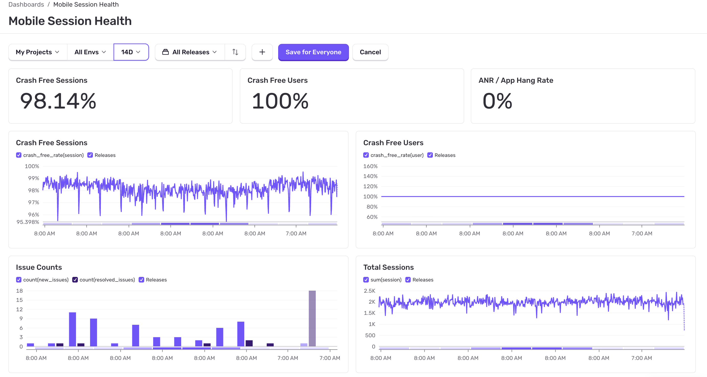

<Include name="dashboards-session-health-body.mdx" />

## Charts

For the Mobile dashboard, found on [Sentry Dashboards](https://sentry.io/orgredirect/organizations/:orgslug/dashboards/), you can see widgets like: 

- [Crash Free Sessions](/product/releases/health/#crash-free-sessionsusers)
- [Total Sessions by Release](/product/releases/health/#session)
- Releases
- Session Health
- User Health (Crash Free Users)

The Crash Free Sessions chart extracts out a single status — "crashed" — to highlight the crash free rate of the 5 most adopted releases in the selected projects. In this case, we define "adoption" as the percent of sessions occurring in that release, out of the total number of sessions in the selected projects. This metric is a key measurement to assess the health of your application.

The Total Sessions by Release shows how many sessions occur in each of the 5 most recent releases. The most recent 5 releases are shown. 

Looking at the Issues Count widget, you can hover over a count of releases at the bottom of the chart, and click to see a list of releases and any issues associated with them. 

You can customize this dashboard by updating filters or duplicating it to create a new dashboard.

## Releases Table

At the bottom of Mobile Session Health dashboard is a table listing releases for selected projects.

The table contains key information about each release, including:

- [Crash free rate](/product/releases/health/#crash-free-sessionsusers)
- [Total session count](/product/releases/health/#sessions)
