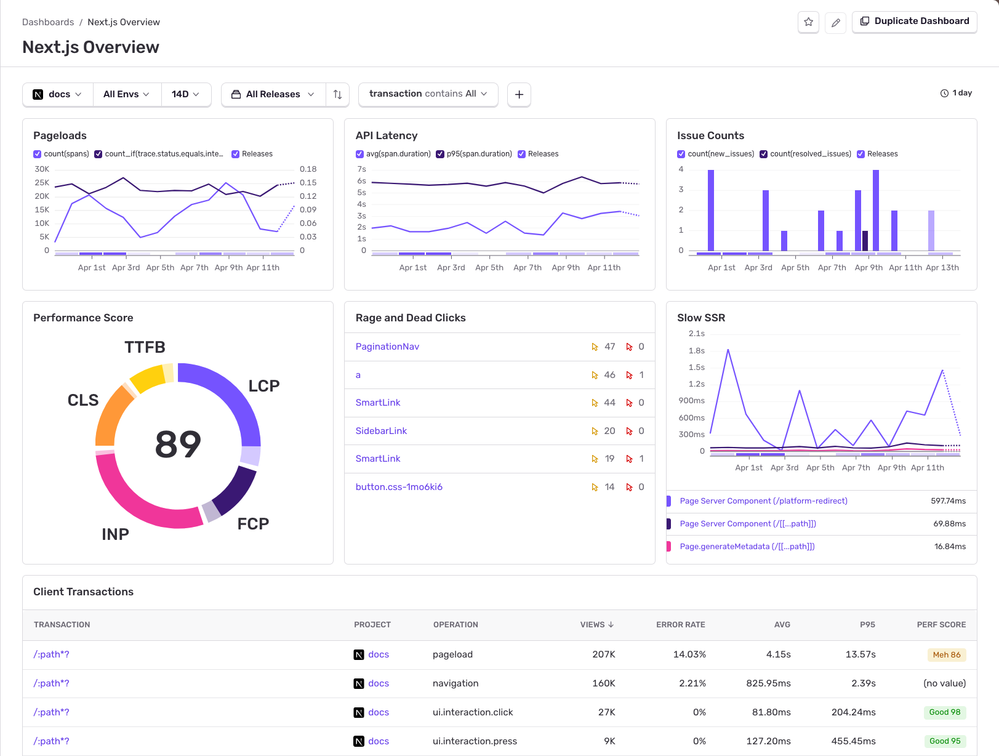
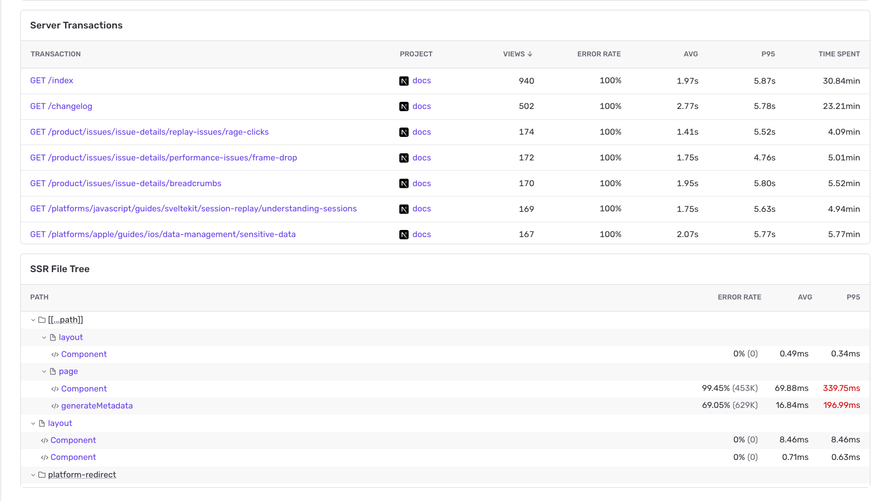

The **Next.js Overview** dashboard gives you a combined view of client-side and server-side performance for your Next.js application. It surfaces Web Vitals, page load and navigation metrics, server transaction performance, and SSR rendering bottlenecks in one place.

## Widgets

The top section of the dashboard includes the following widgets:

- **Pageloads**: Total page loads over time, with release markers.
- **API Latency**: P95 span duration for API routes.
- **Issue Counts**: New and resolved issue counts over time.
- **Performance Score**: Aggregate [Web Vitals](/product/dashboards/sentry-dashboards/frontend/web-vitals/) score (LCP, CLS, INP, FCP, TTFB) displayed as a donut chart.
- **Rage and Dead Clicks**: Pages with the most rage clicks (repeated clicks from user frustration) and dead clicks (clicks that produce no response).
- **Slow SSR**: Server-side rendering durations for the slowest components over time.

## Client Transactions

The **Client Transactions** table lists browser-side transactions grouped by operation type:

| Operation | Description |
|-----------|-------------|
| `pageload` | Full page loads (initial navigation) |
| `navigation` | Client-side route transitions |
| `ui.interaction.click` | Click interactions |
| `ui.interaction.press` | Press interactions |

Each row shows views, error rate, average and P95 duration, and a [performance score](/product/insights/frontend/web-vitals/) where applicable.

## Server Transactions

The **Server Transactions** table lists your server-side routes ranked by traffic. Each row shows views, error rate, average and P95 duration, and total time spent. Use this to identify slow or error-prone routes.

## SSR File Tree

The **SSR File Tree** widget maps your Next.js file-system routes to server-side rendering performance. It shows the component hierarchy (layouts, pages, and their child components) with error rates, average duration, and P95 duration for each node.

Use this to identify which specific layout or page component is contributing to slow server-side renders.

## Getting Started

The Next.js Overview dashboard appears automatically when you have a Next.js project sending data to Sentry. Set up the [Sentry Next.js SDK](/platforms/javascript/guides/nextjs/) to start collecting the required telemetry.
