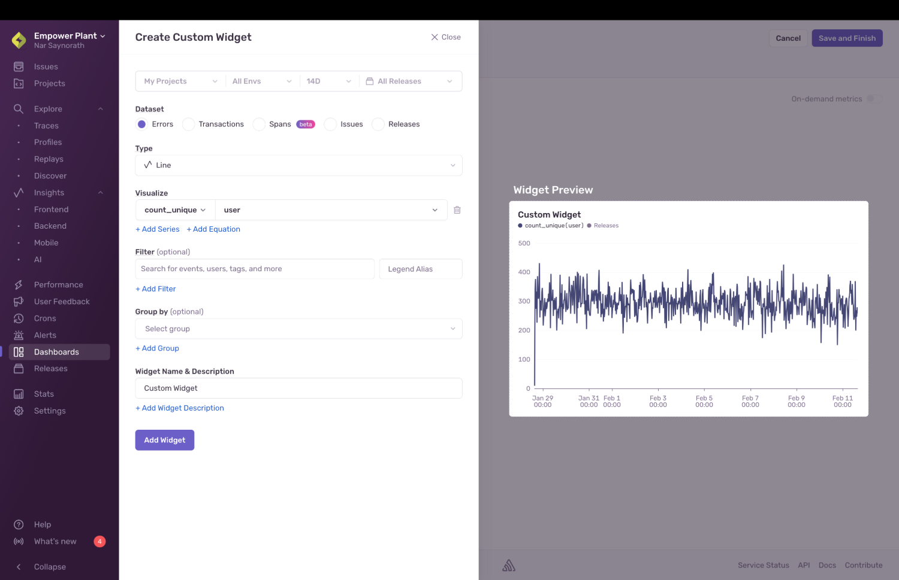
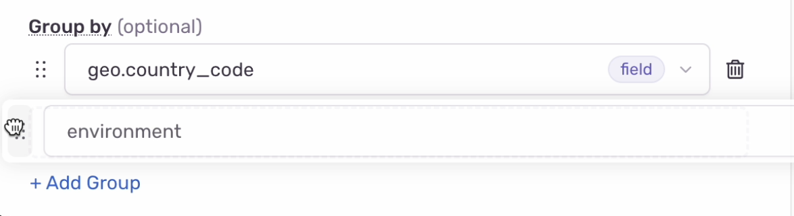
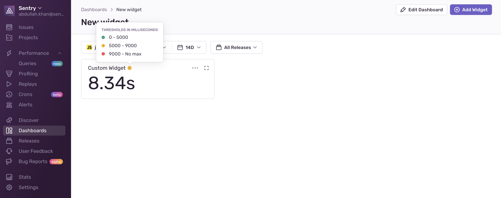

<Include name="feature-available-for-plan-trial-business.mdx" />

When adding a widget or editing an existing one, you will be taken to a new page where you can see the dashboard widget builder:

The widget builder has several configuration options that you can use to shape data and add information to your dashboard. These options are presented as steps in the widget builder, but you don't have to do them in the order they're presented in.

Some of these options are standard and displayed for all widgets, but others are only displayed if you make specific selections. Below is a list of all the options that can be displayed when configuring your widget.

## Widget Title

By default, all new widgets are titled “Custom Widget”, but you can edit the title by clicking on the text. We recommend you update the title.

## Choose Your Visualization

In this step, you can choose from four different visualization types:

- [Area Chart / Bar Chart / Line Chart](#area-chart--bar-chart--line-chart)
- [Table](#table)
- [Big Number](#big-number)

### Area Chart / Bar Chart / Line Chart

Area, bar, and line chart visualizations allow you to plot one or more aggregate functions as a time series.

Each chart type allows you to solve different problems:

- Area charts are ideal for showing results that are cumulative or where you want to show a breakdown. An example would be “count of errors for each major browser”.
- Bar charts will group results by day, making them good for daily roll-ups or as “big picture” summaries. An example would be “count of errors per day”.
- Line charts are a general-purpose visualization. Make sure the Y-Axis units match if you add multiple overlays. Mixing count with duration will not yield useful results.

### Table

Table charts display the results of a [Discover Query](/product/discover-queries/). This visualization is well suited to showing key fields and related aggregates. For example “duration percentiles for the most frequently visited transaction names”. You can also choose to display [issues](/product/issues/) data in a table visualization using the [dataset selector](/product/dashboards/widget-builder/#choose-your-dataset).

### Big Number

A big number visualization displays the current value of a single function. This visualization is well suited for high-level aggregates. An example scenario would be “p95 of all transactions”.

## Choose Your Dataset

In the dataset selection step, choose which type of data you would like to use in your widget. This data is classified into two different datasets: [errors and transactions](#errors--transactions) and [issues](#issues).

### Errors & Transactions

Choosing "Errors and Transactions" allows you to query and aggregate error and transaction events in the same way you would for a [Discover Query](/product/discover-queries/). Some widget examples include:

- Tracking performance of an endpoint
- Throughput by country
- Users most affected by errors

### Issues

Choosing "Issues (States, Assignment, Time, etc.)" allows you to query issue properties, such as `is:unresolved` or event properties such as `error.handled:0`, and to sort by issue fields such as `First Seen`. When searching on event properties, the search will return any issue that has one or more events matching the supplied event filters.
Choose this dataset if you want to customize a list of issues on your dashboard. Some widget examples include:

- Issues assigned to your team
- Most frequently occurring issues
- The "Issues" dataset is only available in table visualization widgets and its disabled if you have other visualizations selected.

### Releases

Choosing "Releases (sessions, crash rates)" allows you to query properties specific to a release of your application, primarily session data. Choose this dataset if you want to display healthy, errored, and crashed sessions and crash rates for your releases or projects on your dashboard. Some example widgets using this dataset include:

- Crash rates for your latest release
- Session count across releases

### Custom Metrics

Choosing "Custom Metrics" allows you to query your custom metrics data in the same way you would in the [Metrics Explorer Page](/product/metrics/metrics-explorer-page/). Some example widgets might include:

- Number of user signups
- API request payloads
- Processing time for a task

To learn more about the types of metrics you can send to Sentry and what you can do with them, see [Metrics](/product/metrics). 

In order to optimize the experience for querying metrics, the widget builder UI is slightly different than it is for other datasets. You can query metrics the same way you would in the [Metrics Explorer Page](/product/metrics/metrics-explorer-page/). With metrics, you can choose how they're aggregated and grouped, as well as define equations with multiple metrics. 

## Choose Your Columns

The option to set columns is only available for [table visualizations](/product/dashboards/widget-builder/#table).

By default, the first column is already configured for you, but you can update it. To add more columns, which stacks events, add [functions](/product/discover-queries/query-builder/#stacking-functions) (`f(x)`) that can take in parameters. [Field and tag columns](/product/sentry-basics/search/searchable-properties/#event-properties) will help you view more details about the events (for example, `title` to see the description of an issue or `users` to see how many users it's affecting).

You can also add equations to your query using the table columns as equation variables, and the results will be displayed in the query results table. Learn more in [Adding Query Equations](/product/discover-queries/query-builder/query-equations/).

Next to each column and equation, you have the option to set an alias that will replace the column name in the table header.

If two or more columns are added, you can change the order in which they're displayed in the table by clicking and dragging them:

## Choose What to Plot in the Y-axis

The option to set a y-axis is available on all visualizations except [table](/product/dashboards/widget-builder/#table). In the case of [time-series visualizations](/product/dashboards/widget-builder/#area-chart--bar-chart--line-chart), you'll be able to plot up to three values that can be functions or equations. If the units of your selections conflict, then the y-axis of the chart will be labeled using the units of the first selection.

You can also choose to construct an equation by clicking “Add an Equation”. Doing this displays a text box where you can enter your equation. Functions that you've added previously in this step will appear for autocompletion, but you can add other functions as well.

## Filter Your Results

Use this field to filter your results by the searchable properties of your [dataset selection](/product/dashboards/widget-builder/#choose-your-dataset). For more information on which properties apply to each dataset, check out our [full Searchable Properties documentation](/product/sentry-basics/search/searchable-properties/#properties-table).

On [time-series visualizations](/product/dashboards/widget-builder/#area-chart--bar-chart--line-chart) you can add up to three queries to filter your results, each with their own search conditions, to compare results. Each query will generate a new series in your chart for each y-axis. To make it easier to differentiate between them in the legend and tooltip, you can add a legend alias that will be added as a prefix to the labels, as in the example below:

## Group Your Results

The option to group results is only available for [time-series visualizations](/product/dashboards/widget-builder/#area-chart--bar-chart--line-chart). You can group your time series results by different fields or tags such as project, environment, or transaction. You can select up to 20 fields to group your data.

If two or more groups are added, a draggable element will be displayed that you can use to sort the fields, but the sort does not impact how your data is displayed in the visualization:

## Sort By a Column

The option to sort by a column is only available for [table visualizations](/product/dashboards/widget-builder/#table). Choose one of the columns of your table to sort by, and set whether you want to sort high-to-low or low-to-high.

## Limit

The option to limit your results is only available for [time-series visualizations](/product/dashboards/widget-builder/#area-chart--bar-chart--line-chart) where you've applied a grouping. Depending on your configuration (for example, multiple y-axes, multiple queries), your chart results could become unmanageable, so a limit is imposed. You can change this limit by selecting it in the dropdown. We intend to show at most 10 series (that is, lines in a line chart or bars in a bar chart) when multiple y-axes or queries are selected.

## Sort By a Y-axis

The option to sort by a y-axis is only available if you've applied a grouping to your data (in [“Group your results”](/product/dashboards/widget-builder/#group-your-results)). The sorting applies to the underlying groups in your results and thus affects the series that appear in your chart. You can select fields that you used for grouping, select equations defined in the y-axes, construct any function similar to how you would select a function for plotting, or construct a custom equation.

If you select “Custom Equation”, an extra field appears where you can enter an equation of your choice that will be applied to the query:

## Set Thresholds

The option for setting thresholds is only available for [big number visualizations](/product/dashboards/widget-builder/#big-number). Thresholds help identify problematic widgets with colored indicators. Hovering over the colored indicators at the dashboard level displays the thresholds associated with a widget. Units can be attached to thresholds for duration or rate metric types. An example metric with units would be “p95 of all transactions”.

## Extracted metrics

<Include name="feature-available-for-user-group-early-adopter.mdx" />

If you are building a widget with transaction data, and would like to use event-like filters (eg. `transaction.duration:>100ms`) or custom tags that you set on your transactions, we will routinely collect metrics to show you accurate counts and rates.

Not all widgets are compatible with metrics extraction. The following cases will cause your widget to continue using event-backed data:
- Equations — Using equations will show you event data instead of metrics.
- Widgets that display data from errors and transactions simultaneously — Extraction only happens for transaction data. You need to use the `event.type:transaction` filter along with your custom tags in order to get extracted metrics.
