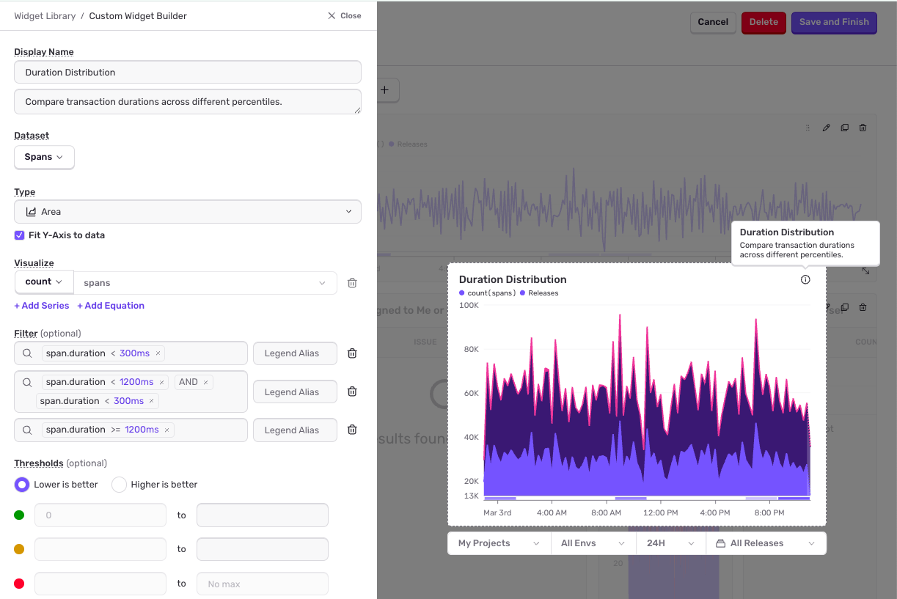

The widget library contains a collection of prebuilt widgets you can add to your [custom dashboards](/product/dashboards/custom-dashboards/). You can access the widget library by clicking the "Add Widget" button and selecting "From Widget Library" on the dashboard.

The library includes the following widgets:

- **Duration Distribution**: Compare transaction durations across different percentiles.
- **High Throughput Transactions**: Top 5 transactions with the largest volume.
- **Crash Rates for Recent Releases**: Percentage of crashed sessions for latest releases.
- **Session Health**: Number of abnormal, crashed, errored, and healthy sessions.
- **LCP by Country**: Table showing page load times by country.
- **Slow vs. Fast Transactions**: Count breakdown of transaction durations over and under 300ms.
- **Performance Score**: Tracks the overall performance rating of the pages in your selected project.
- **SSR File Tree**: Visualizes the file tree of the server-rendered components in your Next.js project.
- **Rage and Dead Clicks**: Visualizes the rage and dead clicks in your frontend project.
- **Issues For Review**: Most recently seen unresolved issues for review.
- **Top Unhandled Error Types**: Most frequently encountered unhandled errors.
- **Users Affected by Errors**: Footprint of unique users affected by errors.
- **Error Count By Transaction**: Compare error volume across your top transactions.

You can change the title, queries, fields, visualization types, sort order, and other fields of these prebuilt widgets to suit your use case by clicking the context menu on the widget and selecting "Edit Widget".

## Example Use Cases

### Performance across release versions

To monitor how your app is performing on a certain release, you can modify the "Duration Distribution" widget by adding the release version to the search condition:

- Search condition 1: `release.version:{version}`

To compare performance with another release version, you can add another query by clicking the "Add Query" button and querying for a different release version:

- Search condition 2: `release.version:{another_version}`

You can also compare performance before and after a certain version with the following conditions:

- Search condition 1: `release.version:<{version}`
- Search condition 2: `release.version:>={version}`

### Response thresholds

The "Duration Distribution" widget shows the spread of transaction duration times. This visualization can be modified to show if transaction durations are within certain target thresholds and present them as "satisfactory", "tolerable", or "frustrating" transactions. To create this type of visualization, change the "Visualization Display" to "Area Chart". Area charts stack results and are more appropriate for results that are cumulative:

- Visualization Display: `Area Chart`

Set one of the y-axis values to `count()` and remove the other two axes:

- Y-Axis: `count() spans`

To the first filter, add the search condition for satisfactory span duration (this example uses 300ms as the satisfactory response threshold):

- Search condition 1: `span.duration:<300`

Add another filter by clicking the "Add Query" button. In this example, we're using the [Apdex](/product/dashboards/sentry-dashboards/transaction-summary/#apdex) definition where tolerable response times are between the satisfactory threshold and four times the satisfactory threshold:

- Search condition 2: `span.duration:<1200 AND span.duration:>=300`

Finally, add a third filter for the duration:

- Search condition 3: `span.duration:>=1200`

The chart now shows cumulative counts at different response time thresholds.

### My top issues

You can track the impact of issues assigned to you or your team by counting the error events associated with each unique issue. Modify the "Issues For Review" widget by updating the search condition to filter for issue assignment:

- Search condition: `is:unresolved is:for_review assigned_or_suggested:me`

Update "Columns" to add `project` so you can see the associated project with each issue, and change the "Sort by" to `Events` so the widget displays issues with the most error events in descending order:

- Columns: `issue, assignee, events, title, project`
- Sort by: `Events`

### Priority issues

The [issues dataset](/product/dashboards/widget-builder/#issues) is unique in that you can add a free form [token](/concepts/search/#syntax) to your search condition that will filter by issue titles containing the token. For example, you can search `integrity` to filter by all issue titles containing `integrity`. Update the search condition with a token of your choice:

- Search condition: `is:unresolved is:for_review {token}`

Update "Columns" to add `links` so you can see seen any external links related to the issue, such as GitHub or Jira issues. Update the "Sort by" to `Priority` so the widget displays issues that have been trending upward recently:

- Columns: `issue, assignee, events, title, links`
- Sort by: `Priority`

### Release health

To monitor the health of your releases over time, you can modify the "Session Health" widget as follows:

- Visualization Display: `Area Chart`

Add search filters to narrow the data down to a particular release:

- Search condition 1: `release:{version}`
