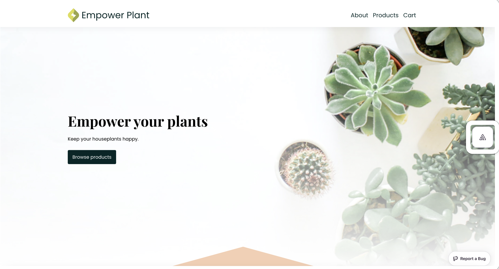
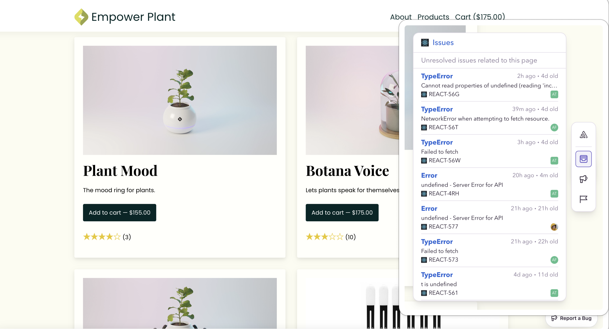
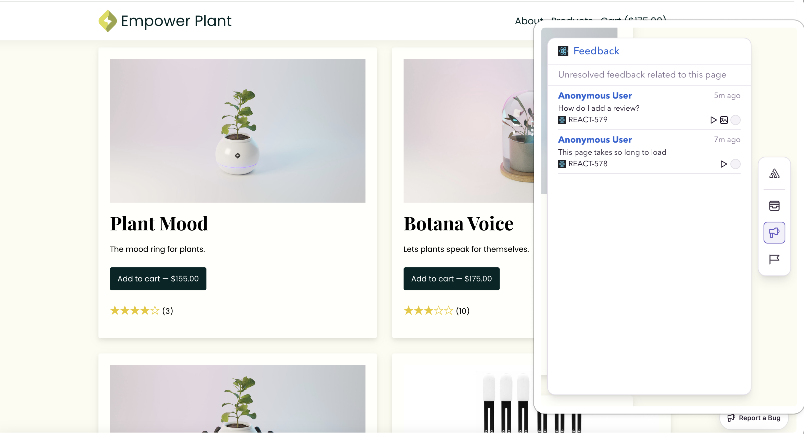
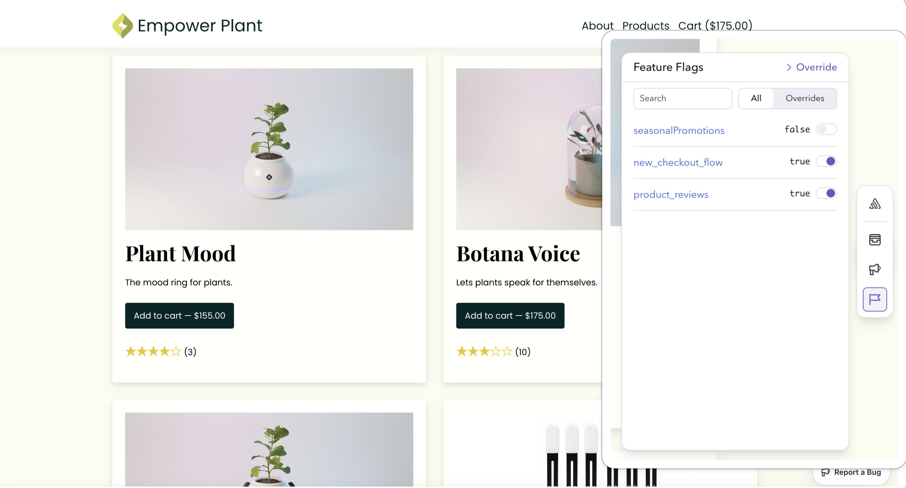
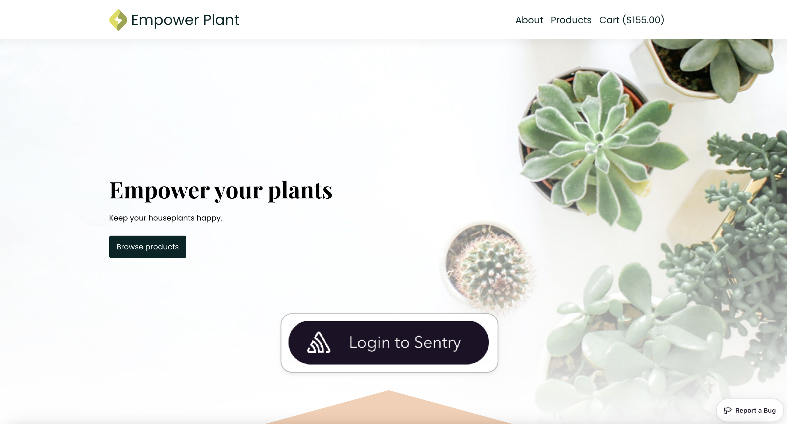
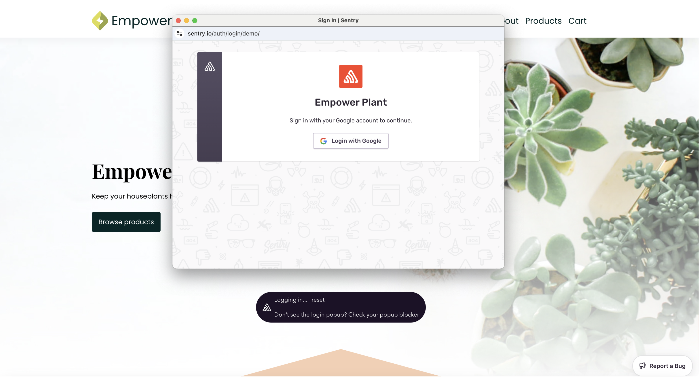
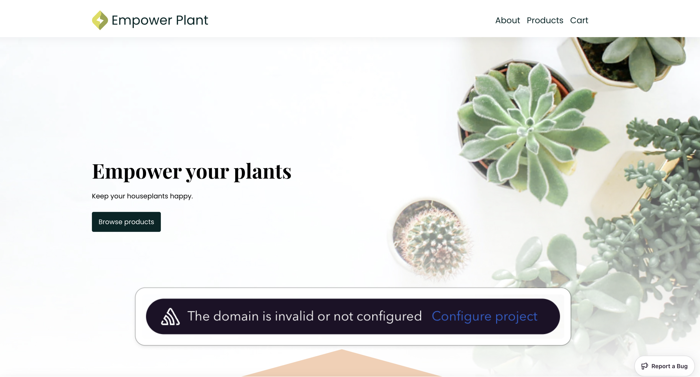

<Alert>
  The Dev Toolbar is currently in **beta**. Beta features are still in progress and may have bugs. Please reach out on
  [GitHub](https://github.com/getsentry/sentry-toolbar/issues) if you have any feedback or concerns.
</Alert>

Developers spend a lot of time troubleshooting their web apps on local, staging, and production environments. The Sentry Dev Toolbar pulls data from [sentry.io](http://sentry.io) and surfaces relevant, actionable issues to you when you have the most context for understanding it: as you browse your own site. The Dev Toolbar is a floating widget in your web app, offering meaningful Sentry insights for the specific page being viewed through three different **page-aware** panels: Issues, Feedback, and Feature Flags.

## Issues Panel

The issues panel shows you your highest priority frontend [issues](https://docs.sentry.io/product/issues/) for the page you are currently viewing. From the Dev Toolbar, you can quickly jump into specific issues in Sentry to get more detailed information (examples: Sentry project, issue title, description, and when the issue was first and last seen) and take action (examples: assign to a team member or mark as resolved). With the issues panel, you can browse the pages that are most important to your business and understand the top issues impacting your user base.

## Feedback Panel

The feedback panel shows you the most recent user feedback messages for the page you are on, so you can more easily contextualize it. The feedback often describes suboptimal experiences that are not strictly code-thrown errors, such as misleading UX, broken links, and typos. The feedback panel works by pulling feedback messages from [Sentry’s User Feedback Widget](https://docs.sentry.io/product/user-feedback/#user-feedback-widget). Just like with the Issues panel, clicking on a particular user feedback will take you to the full detailed User Feedback page within Sentry.

## Feature Flags Panel

Feature flags are a powerful tool that allow you to control the visibility of features in your app, enabling you to ship, test, and experiment with confidence. The feature flag panel allows you to quickly view and override feature flags locally. You can override any feature flag to be `true` or `false` for your browser session, so you can verify its behavior and observe the impact it might have on errors. Learn more about how to [configure the feature flag panel](/product/dev-toolbar/setup/#implement-feature-flag-adapter) and [what data Sentry can track](/product/explore/feature-flags/) related to your feature flagging system.

## Login Flow

After setting up the Dev Toolbar you’ll see a “Login to Sentry” button floating in the center of the page. To access any information from your Sentry organization, you have to click this button and login to Sentry.

After clicking the button, you will see a pop-up window for logging in to Sentry.

If it's your first time [setting up the Dev Toolbar](/product/dev-toolbar/setup) , there will be a button with a link to Sentry's Dev Toolbar settings page to configure your domain.

Learn more about setting up the toolbar, including configuring a feature flag provider and integrating the toolbar in different environments, on the next page.
