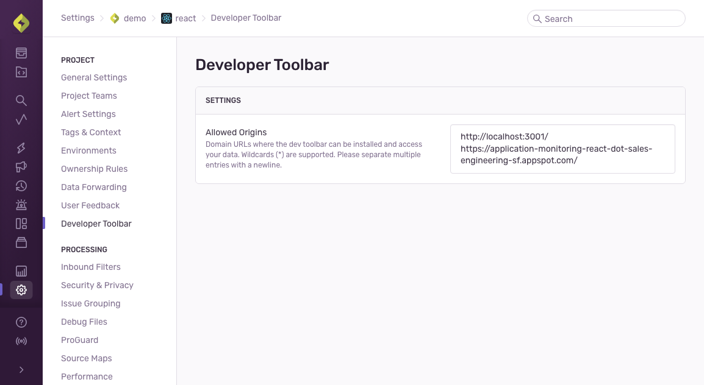

<Alert>
  The Dev Toolbar is currently in **beta**. Beta features are still in progress and may have bugs. Please reach out on
  [GitHub](https://github.com/getsentry/sentry-toolbar/issues) if you have any feedback or concerns.
</Alert>

## Pre-Requisites

For the Sentry Dev Toolbar to work best, [enable tracing](/platforms/javascript/tracing/) in your app. With tracing enabled, the Dev Toolbar will be able to associate issues and feedback with the current URL in the browser location.

## 1. Choose Deploy Environments

Since the Dev Toolbar will be visible to users within your app, it's important to consider which environments should render it.

In dev and staging environments, include the Toolbar so that all developers and testers can use it and quickly go from the page they're looking at back to Sentry for further debugging.

In production environments, the Dev Toolbar can make it easier to reproduce real issues your users are having. However the Toolbar should not be rendered for all users of the site -- only when an employee/engineer/etc visits.

Once you decide where and when you want the Toolbar to appear, you'll write those conditions into your codebase. The specific implementation is something you'll need to write based on how your app works and how your dev team is set up.

For example, the conditions to show show the Toolbar in dev and staging might look like this:

```typescript
const env = process.env.SENTRY_ENVIRONMENT || 'development';

const isDev = env === 'development' || env === 'staging';
if (isDev) {
  // Enable the Dev Toolbar here...
}
```

Or if your web application requires authentication to access, you could add a conditional where the Dev Toolbar is shown always when deployed to development **and** staging, but in production only show the Toolbar **if** an employee is logged in.

## 2. Allow Domains

You will need to edit the [Project Settings](https://sentry.io/orgredirect/organizations/:orgslug/settings/projects/) page to allow the Toolbar to connect to Sentry by configuring your dev, staging, and production domains. Only add domains that you trust and control to this list.



## 3. Install

Next you must include the Toolbar code in your app:

```html {tabTitle: CDN}
<!--
Put this at the bottom of your page
so it doesn’t block other critical JavaScript.
-->
<script src="https://browser.sentry-cdn.com/sentry-toolbar/latest/toolbar.min.js"></script>
```
```typescript {tabTitle: React}
// An NPM package is under development
// In the meantime, go here for instructions to create a React hook manually:
//   https://github.com/getsentry/sentry-toolbar/blob/main/docs/conditional-script.md
```

Remember to conditionally include the Toolbar code only in environments that need it. This will help reduce network traffic for your users who do not have the credentials needed to login.

## 4. Configure

Finally, call `SentryToolbar.init(initConfig)` to render a Toolbar instance on each page where you want to see the Dev Toolbar. This will prompt any visitor to the page to login to your Sentry organization.

```html {tabTitle: CDN}
<html>
<head>...</head>
<body>
    ...
    <script src="https://browser.sentry-cdn.com/sentry-toolbar/latest/toolbar.min.js"></script>
    <script>
    window.SentryToolbar.init({ ... });
    </script>
</body>
</html>
```
```typescript {tabTitle:React}
// An NPM package is under development
// In the meantime, go here for instructions to create a React hook manually:
//   https://github.com/getsentry/sentry-toolbar/blob/main/docs/conditional-script.md
```

If the toolbar `<script>` is included on your site, and `SentryToolbar.init()` is called, then a "Login to Sentry" button will be visible to the public. This is not ideal, but your data in Sentry will still be safe as users outside of your Sentry organization will not be able to login.


### Init Configuration Options

At minimum, you should be calling `.init()` with these two options:
```javascript
window.SentryToolbar.init({
  organizationSlug: 'acme',
  projectIdOrSlug: 'website',
});
```

And you can also include any additional options from this list:

| Option | Type | Description | Default Value |
| ----- | ----- | ----- | ----- |
| `organizationSlug` | `string` | The organization that users should login to. For example \'acme\' | *Required Value* |
| `projectIdOrSlug` | `string \| number` | The project for which this website/webapp is associated. | *Required Value* |
| `environment (optional)` | `string \| string[] \| undefined` | The environment of this deployment. Used to narrow search results in the Toolbar UI. Set to `undefined` or `""` or `[]` if you want to see results from all environments. | `undefined` |
| `placement (optional)` | `'right-edge' \| 'bottom-right-corner'` | Where to render the Toolbar on the screen. | `'right-edge'` |
| `theme (optional)` | `'system' \| 'dark' \| 'light'` | Whether to use dark or light mode. | `'system'` |
| `featureFlags (optional)` | `FeatureFlagAdapter \| undefined` | See [Feature Flag Panel](/product/dev-toolbar/setup//#feature-flag-Panel) below | `undefined` |
| `sentryOrigin (optional)` | `string \| undefined` | The origin where Sentry can be found. Used for loading the connection to Sentry, and generating links to the website. For example: `'https://acme.sentry.io'` | `'https://sentry.io'` |
| `domId (optional)` | `string \| undefined` | The `id` given to the \<div\> that is created to contain the Toolbar html. | `'sentry-toolbar'` |
| `debug (optional)` | `string \| undefined` | A comma separated string of debug targets to enable. Example: `'logging,state'`. If the list contains 'all' or 'true' then all targets will be enabled. Valid targets: `'logging' 'login-success' 'settings' 'state'` | `undefined` |
| `mountPoint (optional)` | `HTMLElement \| () => HTMLElement \| undefined` | Where to mount the Toolbar in the DOM. | `document.body` |

### Unmounting the Toolbar

If you have called `SentryToolbar.init({...})` to render the Toolbar, but now want to manually remove or unmount it from the page, you can call the cleanup function that is returned from `init()`. This will unmount all the injected HTML and CSS. Login credentials will not be removed, so you can re-insert the toolbar and still be authenticated.
```javascript
const unmountToolbar = window.SentryToolbar.init({ ... });

// sometime later...
unmountToolbar();
```

## Feature Flag Panel

<Alert>
  If you're using feature flags inside your product then also setup [Feature Flag Evaluation and Change Tracking](/platforms/javascript/feature-flags/) within your SDK.
</Alert>

In order to integrate your feature flagging platform with the Dev Toolbar, you will need an adapter that can read flag data from your provider. It will also store and retrieve a list of overrides to apply to your local browser session.

There is a built-in `OpenFeatureAdapter` that is compatible with the [open-feature/js-sdk-contrib](https://github.com/open-feature/js-sdk-contrib). To use it, call the `SentryToolbar.OpenFeatureAdapter` implementation.

```html {tabTitle: CDN}
<script>
// Define your provider
const provider = new FlagdWebProvider({...});

// Set the provider into the OpenFeature SDK
OpenFeature.setProvider(provider);

window.SentryToolbar.init({
  ...
  // Set the provider into the OpenFeatureAdapter
  featureFlags: window.SentryToolbar.OpenFeatureAdapter({provider})
});
</script>
```
```typescript {tabTitle: React}
import {OpenFeature} from '@openfeature/web-sdk';
import {FlagdWebProvider} from '@openfeature/flagd-web-provider';

// Define your provider
const provider = new FlagdWebProvider({...});

// Set the provider into the OpenFeature SDK
OpenFeature.setProvider(provider);

window.SentryToolbar.init({
  ...
  // Set the provider into the OpenFeatureAdapter
  featureFlags: window.SentryToolbar.OpenFeatureAdapter({provider})
});
```

You can also create your own adapter by implementing the [`FeatureFlagAdapter` interface](https://github.com/getsentry/sentry-toolbar/blob/main/src/lib/types/featureFlags.ts).

The adapter interface is:
```typescript
type FlagValue = boolean | string | number | undefined;
type FlagMap = Record<string, FlagValue>;
interface FeatureFlagAdapter {
  /**
   * All known flag names and their evaluated values.
   */
  getFlagMap: () => Promise<FlagMap>;

  /**
   * Any overridden or manually set flags and values.
   */
  getOverrides: () => Promise<FlagMap>;

  /**
   * Manually set a flag to be a specific value, overriding the evaluated value.
   */
  setOverride: (name: string, override: FlagValue) => void;

  /**
   * A callback to clear all overrides from this browser.
   */
  clearOverrides: () => void;

  /**
   * Deeplink into your external feature-flag provider and find out more about
   * this specific flag.
   */
    urlTemplate?: undefined | ((name: string) => string | URL | undefined);
}
```

[MockFeatureFlagAdapter.tsx](https://github.com/getsentry/sentry-toolbar/blob/main/src/env/demo/MockFeatureFlagAdapter.tsx) is an example adapter to use as a reference.
