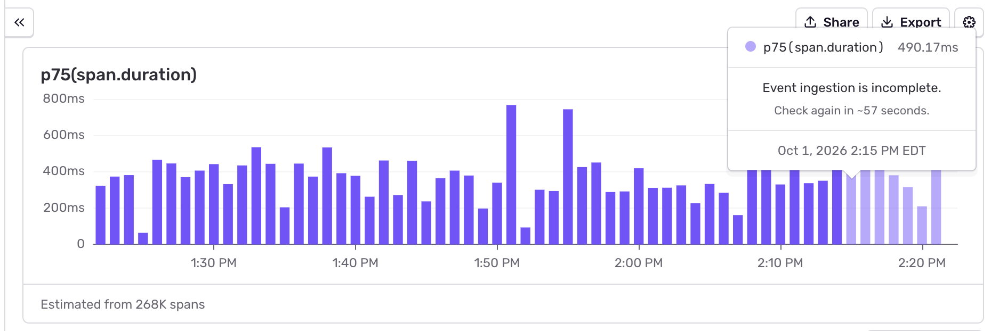

[Explore](https://sentry.io/orgredirect/organizations/:orgslug/explore/) is where you query and browse  data in Sentry. [Issues](/product/issues/) group related errors so you can proactively triage and solve them. In Explore, filter a dataset, chart the results, and save queries in order to track trends in your application, and turn them into [dashboards](/product/dashboards/), [monitors](/product/monitors-and-alerts/monitors/), and [alerts](/product/monitors-and-alerts/alerts/).

## Get Started in Explore

Pick a [dataset](#data-types) from the sidebar. **Starred Queries** can also be found in the sidebar.

You can query each dataset separately, using the same query language and controls. Or, if you select [Traces](https://sentry.io/orgredirect/organizations/:orgslug/explore/traces), you can add Logs and Application Metrics to your query builder.

### Page Filters

The **Project**, **Environment**, and **Time Range** filters at the top of the page scope every query on that dataset.

### Search

The search bar filters the current dataset. [Search syntax](/concepts/search/) is the same across search in Sentry. Attribute names depend on the dataset, and any customizations you've set through your platform SDK. See [Searchable Properties](/concepts/search/searchable-properties/) for more details on properties for each dataset.

### Charts

**Traces**, **Logs**, and **Metrics** have a visualization section to configure an aggregate (such as `count()`, `avg()`, or `p95()`), a **Group By**, and a **Sorty By** to split the chart's data representation. 

On **Errors**, set the **Interval**, **Display**, and **Y-Axis** on the chart.

You will also see a representation of dropped data at the bottom of the chart for Traces, Logs, Metrics, and Errors. Click on the line to explore more details and troubleshoot. 

### Table

**Traces**, **Logs**, and **Errors** have table views that can be customized to show different columns. All tables represent the data that is being queried, and is being displayed in the chart.

Switch between a samples table and an aggregates table to move between the chart and individual events.

### Save a Query

**Save as** stores the current query. Saved queries are listed under **All Queries** in the Explore sidebar. Star a query to pin it under **Starred Queries**. Anyone in the organization with Explore access can open a saved query.

From the *Save as* menu you can, add the query to a [dashboard](/product/dashboards/) as a widget, or create a [monitor](/product/monitors-and-alerts/monitors/) to turn the query parameters into [Issues](/product/issues/). The exact menu items depend on the dataset. On Errors, you can also set a query as the default view for the Errors page.

Exporting data downloads the rows in the current results table. File format and row limits depend on the dataset.

### Query Window

Your plan limits how far back a query can look: Developer, 7 days | Team, 14 days | Business, 30 days. 

### Ingestion Delay

Newly sent spans, logs, and metrics can take a short time to show up. Sentry estimates this delay for your organization, so the most recent part of a chart may be marked incomplete. Hover an incomplete bucket to see roughly when its data should settle. Counts there can go up as the rest of the data arrives.

This estimate is not a guarantee. Data sent late from your application is not included in the estimate, so events can still arrive after a bucket is marked settled.

## Data Types

### Traces

Use [Traces](/product/trace-explorer/) to follow a request across services and query span attributes. Search span or trace samples, aggregate duration, and compare a time range to the baseline. Traces can also join logs and metrics from the same trace.

Open [Explore → Traces](https://sentry.io/orgredirect/organizations/:orgslug/explore/traces/).

### Logs

Use [Logs](/product/logs/) for structured log lines. Search the message, filter on severity or custom attributes, and open related traces from a log line.

Open [Explore → Logs](https://sentry.io/orgredirect/organizations/:orgslug/explore/logs/).

### Metrics

Use [Application Metrics](/product/metrics/) for counters, gauges, and distributions you send from code, such as `checkout.failed` or `queue.depth`. Chart a metric, group it, and open a sample to see the related traces.

Open [Explore → Metrics](https://sentry.io/orgredirect/organizations/:orgslug/explore/metrics/).

### Errors

Use [Errors](/product/errors/) to query error events across projects. This is separate from Issues. Issues group events for triaging and solving known problems. Errors lets you count, group, and chart the underlying events, discovering patterns and trends in your application.

Open [Explore → Errors](https://sentry.io/orgredirect/organizations/:orgslug/explore/errors/).

## Also in Explore

Profiles, Replays, Releases, and Agents also have Explore pages. They each have more unique functionalities for exploring the data.

- [Profiles](/product/profiling/) shows the slowest functions and aggregate flame graphs. Open [Explore → Profiles](https://sentry.io/orgredirect/organizations/:orgslug/explore/profiles/).
- [Session Replay](/product/session-replay/) lists user sessions you can filter and watch. Open [Explore → Replays](https://sentry.io/orgredirect/organizations/:orgslug/explore/replays/).
- [Releases](/product/releases/) shows adoption, crash-free sessions, and the commits in a deploy. Open [Explore → Releases](https://sentry.io/orgredirect/organizations/:orgslug/explore/releases/).
- [Agents](/product/agents/) shows conversations, agent traces, and LLM calls. Open [Explore → Agents](https://sentry.io/orgredirect/organizations/:orgslug/explore/agents/).

