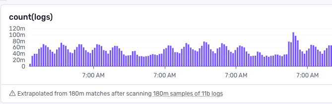
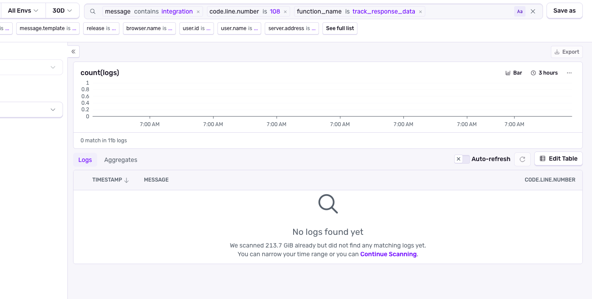

## Overview

With Structured Logs, you can send text-based log information from your applications, whether frontend or backend, to Sentry.

<Arcade src="https://demo.arcade.software/PalOCHofpcO3DqvA4Rzr?embed" />

Sentry's structured logs are searchable, **trace-connected**, and viewable alongside your errors. 

**What does trace-connected mean?** Every log entry is automatically linked to the active trace when it was recorded. This means you can click directly from any log entry to see the full trace waterfall, including all related spans, errors, and other logs from the same request. This connection makes it easy to understand the complete context of what happened—not just what was logged, but the entire execution path that led to that log entry.

When investigating an issue, you can search your logs by message content or attributes, then click into any log entry to see the exact trace, spans, and errors that occurred at that moment. Learn more about [Trace View](/concepts/key-terms/tracing/trace-view/) to understand how to navigate from logs to traces.

Not everything in your application generates an error or requires full tracing. Logs are perfect for tracking:

- **Debugging information**: Cache misses, database connections, query results, and performance metrics
- **User behavior**: Login events, checkout flows, feature usage, and preference changes
- **Application state**: Configuration loading, service initialization, and connection status
- **Business events**: Order placements, payment processing, and notification delivery

Learn how to [send structured logs](/product/explore/logs/getting-started/) with custom attributes that you can search and filter in Sentry.

## Set up Logs

To get started with Logs, navigate to the [Getting Started](/product/explore/logs/getting-started/) page and select your SDK from the list.

If you're using a platform where you can't install the Sentry SDK directly, or if you want to forward logs from platform-native logging systems, you can use [log drains](/product/drains/) to send logs to Sentry.

## Viewing and Searching Logs

**Raw Text Search**  
Raw text search is case sensitive and allows you to search for specific strings within the *message* attribute of the Log. **Raw text search over the entire log's JSON is not supported.** Learn more about [search syntax](/concepts/search/).

**Default Properties Search**  
You can also search using the default properties (like `severity`) or [additional custom properties](/concepts/search/searchable-properties/) that you've added to your log entries.

**Search Examples**  
Here are some practical examples of log searches you can use:

- `severity:error` - Find all error-level logs
- `severity:error payment.failed` - Find error logs containing "payment.failed" in the message
- `user.id:12345` - Find all logs for a specific user
- `trace_id:abc123def456` - Find all logs associated with a specific trace
- `severity:error environment:production` - Find production errors
- `order.id:order_123` - Find logs related to a specific order
- `severity:warn OR severity:error` - Find warnings or errors
- `database:"users" query.duration_ms:>1000` - Find slow database queries on the users database

Learn more about [search syntax](/concepts/search/) for advanced querying.

**Expand Logs**  
Log entries can be expanded to view all properties of a log entry. Individual properties can be added as columns to the results view, allowing you to quickly view properties that matter specifically to you alongside your search results.

**Auto-Refresh**  
You can also enable auto refreshing of the logs view to see your latest logs as they come in.

Conditions in which auto-refresh is disabled:

- Auto-refresh is only supported when sorting by time in descending order.
- Auto-refresh is only supported when using a relative time period, like "Last 15 minutes" or "Last 7 days", not absolute dates like "2025-07-23".
- Auto-refresh is disabled due to high data volume (100 logs per second). Try adding a [filter](/concepts/data-management/filtering/#logs-filtering) to reduce the number of logs.
- Auto-refresh will be disabled due to reaching a max auto-refresh time of 10 minutes.
- Auto-refresh will be disabled if there is an error fetching logs.
- Auto-refresh is not available in the aggregates view.

### Query Volumes
When the number of logs returned by a query is too high, there are a couple of changes to the logs explorer functionality. To reduce query volumes, consider [filtering logs](/concepts/data-management/filtering/#logs-filtering) or refining your [search query](/concepts/search/) with more specific criteria.
 - Auto-refresh will be disabled.
 - Data shown in the chart will be extrapolated from a sampled amount of the complete dataset.  
 
 
 
 When doing very specific queries, like looking for a particular line of code that is causing an issue, you may see a message that says "No logs found yet". This happens when the dataset is very large, and Sentry needs to batch the results. You can continue scanning to see the next batch of logs by clicking "Continue Scanning".
 
 

## Trace-Connected Debugging Flow

Sentry's trace-connected logs enable a seamless debugging workflow that connects logs, traces, and errors:

1. **Search your logs**: Start by searching for logs related to the issue you're investigating. Use message content, attributes, or filters to narrow down relevant log entries.

2. **Click into a log**: When you find a log entry that looks suspicious or relevant, click on it to open the log details.

3. **Navigate to the trace**: From the log details, click the trace link to open the full [Trace View](/concepts/key-terms/tracing/trace-view/). This shows you the complete execution path, including all spans, operations, and timing information.

4. **Examine related data**: In the trace view, you can see:
   - **Related errors**: Any errors that occurred during the same trace
   - **Other logs**: Additional log entries from the same request
   - **Performance data**: Slow spans, database queries, and API calls
   - **User context**: User information and session data

5. **Find the root cause**: With full context in hand—logs, traces, spans, and errors all connected—you can quickly identify and resolve the root cause.

Instead of jumping between different tools and trying to correlate timestamps, trace-connected logs give you a **single flow**: Log search → log entry → trace → root cause.

## Log-based Alerts and Dashboard widgets

You can create [Alert rules](/product/alerts/create-alerts/) and [dashboard widgets](/product/dashboards/widget-builder/) based on your log queries.

Learn more about [alert types](/product/alerts/alert-types/) and [custom dashboards](/product/dashboards/custom-dashboards/).

## AI-Powered Log Analysis

Your Sentry logs can be leveraged with AI agents and tooling for debugging, summarizing, and automated analysis.

- **[Sentry CLI](/cli/logs/)**: Provides command-line access to your logs, making it easy to feed log data directly into AI tools and scripts for analysis.
- **[Sentry MCP Server](/product/sentry-mcp/)**: Provides secure connectivity between your Sentry data and LLM clients using the Model Context Protocol. This enables natural language queries and deep integration with AI tools like Claude, Cursor, and VS Code.
- **[Seer](/product/ai-in-sentry/seer/)**: Sentry's AI debugging agent automatically uses logs alongside other telemetry data to provide intelligent issue analysis and automated fixes.

## Video - Getting Started with Sentry Logs

<VimeoEmbed id="1081149414?h=4094d6e14f" />
