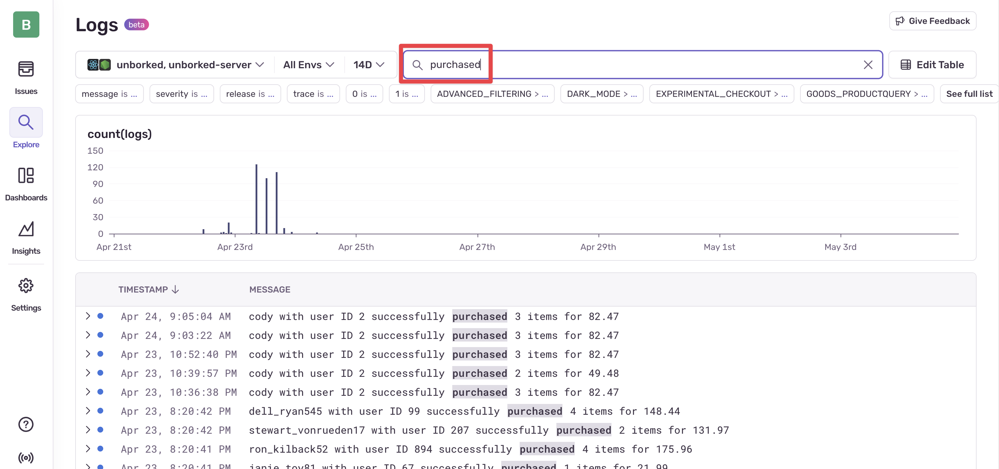
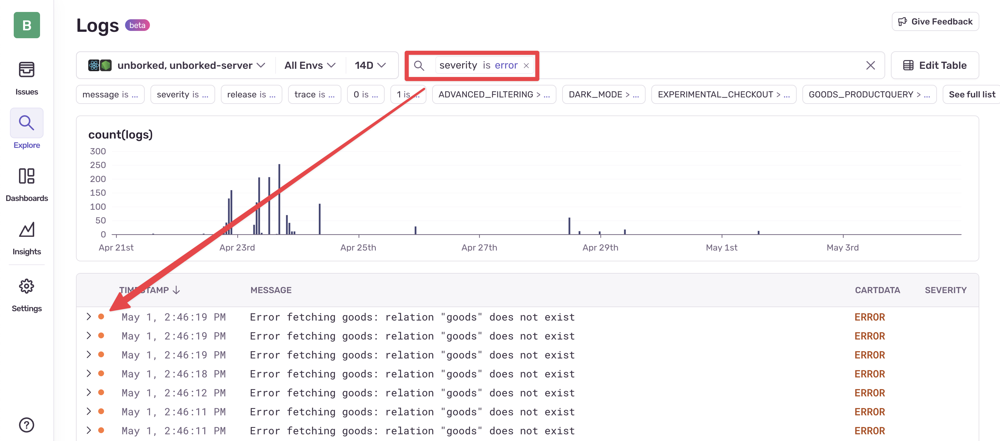
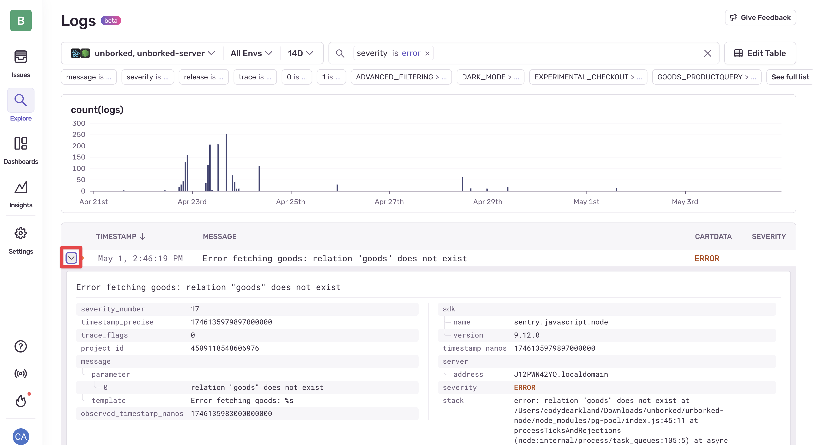
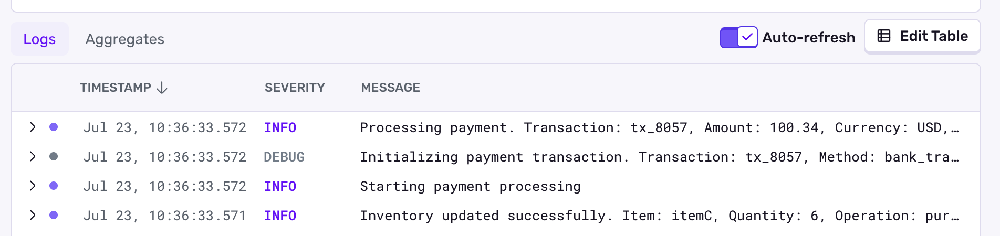
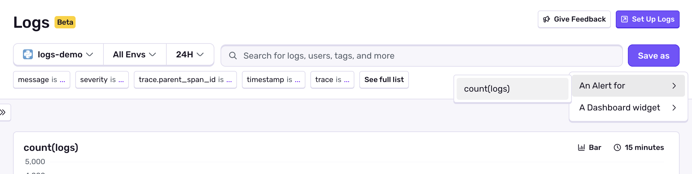

## Overview

With Structured Logs, users can send text-based log information from their applications, whether frontend or backend, to Sentry. Once in Sentry, these logs can be viewed alongside relevant errors, searched by text-string, or searched using their individual parameters.

<Arcade src="https://demo.arcade.software/PalOCHofpcO3DqvA4Rzr?embed" />

Not everything that you want to track in your application generates an error event. You might want to arbitrarily track information happening in your application for many reasons, such as:

- Debugging information like navigation actions, page interactions, or query results
- User specific events
- Configuration items that users or an application are receiving

## Set up Logs

To get started with Logs, navigate to the [Getting Started](/product/explore/logs/getting-started/) and select your SDK from the list.

## Viewing and Searching Logs

Raw text search is case sensitive and allows you to search for specific strings within log entries.



You can also search using the default properties (like `severity`) or additional custom properties that you've added to your log entries.



Log entries can be expanded to view all properties of logs entry. Individual properties can be added as columns to the results view, allowing you to quickly view properties that matter specifically to you alongside your search results.



You can also enable auto refreshing of the logs view to see your latest logs as they come in.



Conditions in which auto-refresh is disabled:

- Auto-refresh is only supported when sorting by time in descending order.
- Auto-refresh is only supported when using a relative time period, like "Last 15 minutes" or "Last 7 days", not absolute dates like "2025-07-23".
- Auto-refresh is disabled due to high data volume (100 logs per second). Try adding a filter to reduce the number of logs.
- Auto-refresh wil be disabled due to reaching a max auto-refresh time of 10 minutes.
- Auto-refresh will be disabled if there is an error fetching logs.
- Auto-refresh is not available in the aggregates view.

## Log based Alerts and Dashboard widgets

You can create Alert rules and dashboard widgets based on your log queries.




## AI-Powered Log Analysis

Your Sentry logs can be leveraged with AI agents and tooling for debugging, summarizing, and automated analysis. This opens up powerful workflows for understanding your application's behavior and resolving issues faster.

### Using Sentry CLI for AI Integration

The [Sentry CLI](/cli/logs/) provides command-line access to your logs, making it easy to feed log data directly into AI tools and scripts. You can fetch recent logs or stream them in real-time:

```bash
# Fetch recent logs
sentry-cli logs list --project=my-project --org=my-org

# Stream logs in real-time
sentry-cli logs list --project=my-project --org=my-org --live
```

This is particularly useful for:
- Copying and pasting logs into AI agents for analysis
- Building automated scripts that process log data with AI models
- Creating debugging workflows that combine command-line tools with AI assistance

### Sentry MCP Server

For deeper integration with AI tools, the [Sentry MCP Server](/product/sentry-mcp/) provides secure connectivity between your Sentry data (including logs) and LLM clients using the Model Context Protocol. With MCP, you can:

- Access Sentry issues, errors, and logs directly within AI agents
- Query projects and search for errors contextually
- Integrate with clients like Claude, Cursor, VS Code, and other MCP-compatible tools

The MCP server enables natural language queries like:
- "Check Sentry for errors in `components/UserProfile.tsx` and propose solutions"
- "Tell me about the recent issues in my project and analyze the logs"
- "Find all unresolved crashes and summarize the error patterns"

### Automatic AI Analysis with Seer

[Seer](/product/ai-in-sentry/seer/), Sentry's AI debugging agent, automatically uses logs alongside other telemetry data to provide intelligent issue analysis. When Seer analyzes issues, it:

- Examines structured logs from your applications to understand context
- Combines log data with issue details, tracing data, and performance metrics
- Provides root cause analysis and automated code fixes based on comprehensive data including logs
- Automatically scans issues as they're ingested, using log context to determine actionability

Seer's integration means your logs automatically contribute to smarter debugging workflows without requiring manual intervention.

### Getting Started

To leverage these AI-powered log analysis capabilities:

1. **CLI Integration**: [Install and configure the Sentry CLI](/cli/installation/) for command-line log access
2. **MCP Integration**: Set up the [Sentry MCP Server](/product/sentry-mcp/) for AI tool integration
3. **Seer Access**: Enable [Seer's AI features](/product/ai-in-sentry/seer/) in your organization settings for automatic log-powered analysis

## Video - Getting Started with Sentry Logs

<VimeoEmbed id="1081149414?h=4094d6e14f" />
