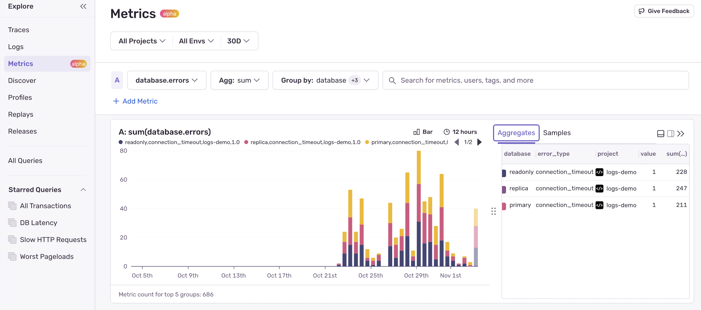
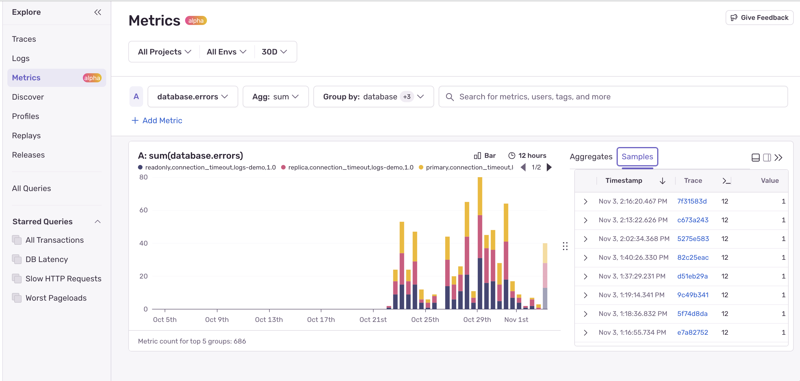

<Alert level="info">
  Metrics is currently in Open Beta for non-Enterprise plans customers that have JavaScript or Python SDK based projects. If you have any questions or feedback comment on this [GitHub discussion](https://github.com/getsentry/sentry/discussions/102275) or contact us at feedback-metrics@sentry.io . Features in beta are still in-progress and may have bugs. We recognize the irony.  
</Alert>

## Overview

With Sentry Metrics, you can send [counters](#counters), [gauges](#gauges), and [distributions](#distributions) from your code to track application health signals like `email.sent`, `checkout.failed`, or `queue.depth`. What makes Sentry's Metrics unique is that every metric event is **trace-connected**, meaning you can click directly into the related traces, logs, and errors when something looks off.

<Arcade src="https://demo.arcade.software/wNDJOXTJw64xiuVi7Hp6?embed" />

Unlike traditional metrics tools that only show _if_ something's changed, Sentry's trace-connected metrics let you understand _why_ it changed. When a `checkout.failed` counter spikes, you can click into a sample and see the exact trace, spans, logs, and errors that produced that metric event.

Not everything in your application generates an error or requires full tracing. Metrics are perfect for tracking:

- **Business events**: `checkout.started`, `checkout.failed`, `payment.declined`, `refund.issued`
- **Application health**: `email.sent`, `email.failed`, `job.processed`, `job.retried`
- **Resource utilization**: `queue.depth`, `pool.in_use`, `cache.hit_rate`
- **User behavior**: `search.zero_results`, `feature.enabled`, `configuration.loaded`

## Set up Metrics

To get started with Metrics, navigate to the [Getting Started](/product/explore/metrics/getting-started/) page and select your SDK from the list.

## Metric Types

Sentry supports three types of metrics:

### Counters

Counters track how many times something happened. Each increment adds to a cumulative total.

**Aggregation methods**: `sum`, `per_second`, and `per_minute`.

**Use cases**: events that occur over time
- `email.sent` - Track total emails sent
- `checkout.failed` - Track failed checkout attempts
- `api.request` - Track API calls

### Gauges

Gauges set a specific value at a point in time, like a snapshot. The latest value replaces the previous one.

**Aggregation methods**: `min`, `max`, `avg`, `per_second`, and `per_minute`.

**Use cases**: current state or level
- `queue.depth` - Current number of items in queue
- `pool.in_use` - Active connections in a pool
- `memory.usage` - Current memory consumption

### Distributions

Distributions record numeric values to compute statistical aggregates.

**Aggregation methods**: `p50`, `p75`, `p95`, `p99`, `avg`, `sum`, `min`, `max`, `count`, `per_second`, and `per_minute`. 

**Use cases**: values that vary and need statistical analysis
- `cart.amount_usd` - Purchase amounts for revenue tracking
- `query.duration_ms` - Query latency for performance monitoring
- `file.size_bytes` - File sizes for storage analysis

## Viewing and Exploring Metrics

The Metrics Explorer provides two main views:

### Aggregates View

The Aggregates tab shows trends and totals across any attributes you've added to your metrics. You can:

- View time-series charts showing metric trends
- Group by custom attributes (e.g., `sum(metrics_value)` grouped by `email_type`)
- Apply filters to drill down into specific segments
- Compare multiple time periods

Use this view to spot trends, identify anomalies, and understand aggregate behavior across your application.

### Samples View

The Samples tab shows individual metric events with **direct links to their traces**. This is where trace-connected metrics shine:

- See each individual metric event as it occurred
- Click any sample to open the full trace waterfall
- View related spans, logs, and errors from the same moment
- Understand the exact context that produced each metric

When you notice a spike or dip in the Aggregates view, switch to Samples to drill into specific occurrences and find the root cause.

## Trace-Connected Debugging Flow

Sentry's metrics enable a seamless debugging workflow:

1. **Spot the anomaly**: Notice a spike in your Aggregates view (e.g., `checkout.failed` increased 3x)
2. **Open samples**: Switch to the Samples tab to see individual metric events
3. **Pick a trace**: Click on a sample to open the full trace that produced it
4. **Find the cause**: Examine spans for slow queries, check logs for error messages, view related exceptions
5. **Fix the issue**: With full context in hand, identify and resolve the root cause

Instead of "metric alert → guesswork," debugging becomes a **single flow**: Metric spike → sample → trace → root cause.

## Metric Attributes

Each metric event automatically includes:

| **Field**           | **Description**                                                                 |
|----------------------|---------------------------------------------------------------------------------|
| **name**             | The metric identifier (e.g., `checkout.failed`)                                |
| **kind**             | The metric type (counter, gauge, or distribution)                              |
| **value**            | The numeric value                                                              |
| **trace_id**         | Links to the active trace when the metric was recorded                         |
| **span_id**          | Links to the specific span within the trace                                    |
| **unit** *(optional)*| Unit of measurement (e.g., `usd`, `ms`, `bytes`)                               |
| **custom attributes**| Any key-value pairs you add for grouping and filtering                         |

## Alerts and Dashboard Widgets

<Alert level="info">
  Alerts and dashboard widgets for Metrics are coming soon.
</Alert>

You'll soon be able to:
- Create alert rules based on metric queries
- Add metric visualizations to dashboards
- Set up notifications when metrics cross thresholds
- Save common queries for quick access

## When to Use Metrics

Metrics are best for **application and code-based health signals** — numeric indicators of whether your application logic is behaving as expected.

**Good candidates for metrics:**
- Business KPIs tied to code execution
- Application health indicators
- Resource utilization tracking
- User action counts
- Success/failure rates

**Not ideal for metrics:**
- Infrastructure metrics (CPU, memory, disk) - use APM tools
- Log aggregation - use [Logs](/product/explore/logs/)
- Full request tracing - use [Traces](/product/explore/trace-explorer/)

## AI-Powered Metric Analysis

Your Sentry metrics can be leveraged with AI agents and tooling for debugging and automated analysis:

- **[Sentry CLI](/cli/)**: Provides command-line access to your metrics data for feeding into AI tools and scripts
- **[Sentry MCP Server](/product/sentry-mcp/)**: Enables natural language queries and deep integration with AI tools like Claude, Cursor, and VS Code using the Model Context Protocol
- **[Seer](/product/ai-in-sentry/seer/)**: Sentry's AI debugging agent can use metrics alongside traces, logs, and errors to provide intelligent issue analysis

## Beta Feedback

We'd love to hear your feedback:

- Are the SDK APIs easy enough to send your desired metrics?
- Any feedback about the Metrics Explorer UX - what could make this better?
- Any default metrics you'd like Sentry to send automatically?

Share your thoughts on [GitHub](https://github.com/getsentry/sentry/discussions/102275) or email us at [feedback-metrics@sentry.io](mailto:feedback-metrics@sentry.io).

