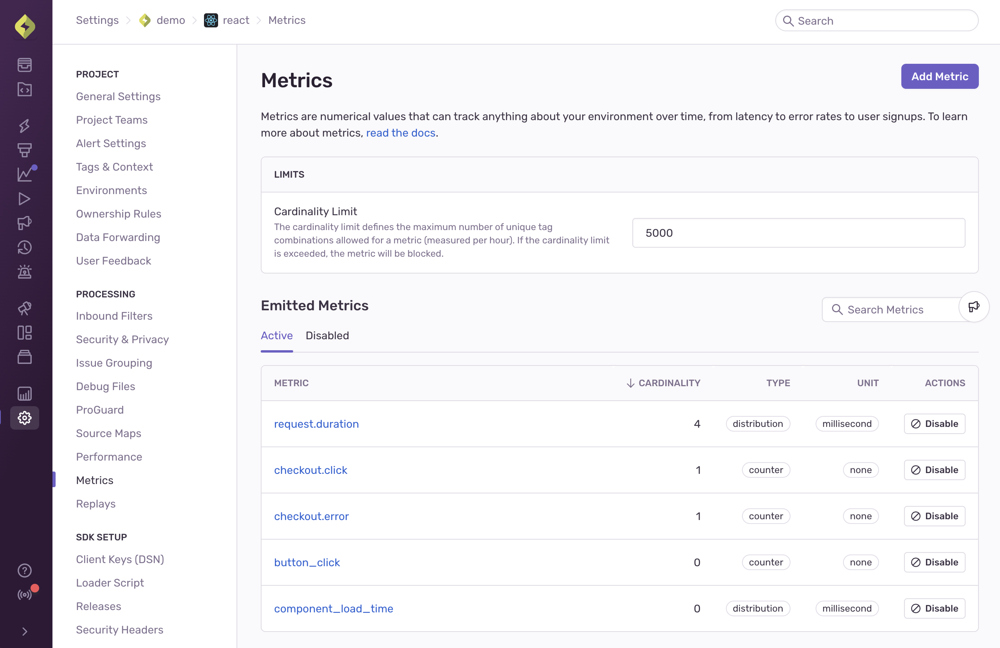
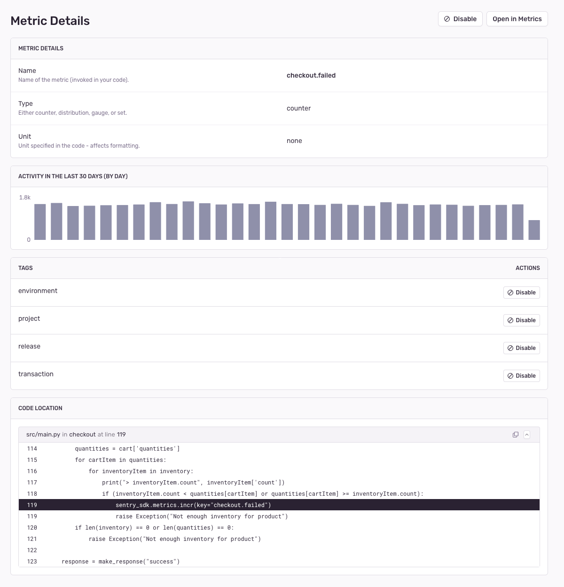
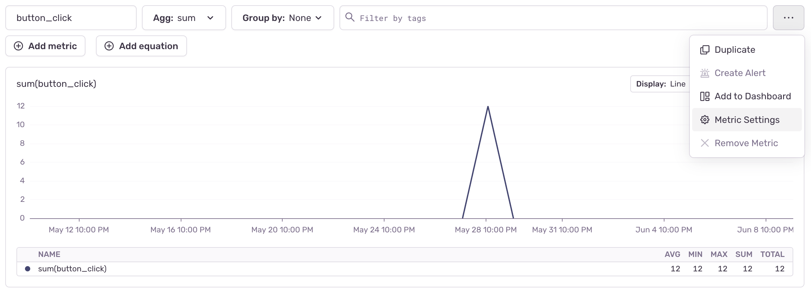

<Include name="feature-stage-beta-metrics.mdx" />

<Include name="metrics-api-change.mdx" />

The Metrics settings page allows you to see and manage the metrics emitted within a project all in one place. You can access it by navigating to your project settings and selecting *Metrics* from the left sidebar.

## Emitted Metrics

On the Metrics settings page you can see a list of active metrics being emitted for your project. For each metric, you can see:
- the type (counter, gauge, distribution or set)
- the unit (e.g. second, millisecond, bytes, etc)
- the [cardinality](/product/metrics/#cardinality)

Users with Admin, Manager or Owner privileges within your organization also have the ability **disable a metric** by clicking on "Disable". This will block the further ingestion of a metric and make it inaccessible in Metrics, Alerts and Dashboards. This can be useful when a metric is no longer desired or has been misconfigured, but it's not immediately possible to stop emitting it on all clients.

## Metric Details

Clicking on a metric takes you to the *Metric Details* page. Here, you can see further details about the individual metric such as:
- the observed volume in the last 30 days
- the associated [tags](/product/metrics/#augmenting-metrics-with-tags)
- the location in your code where the metric is emitted

Users with Admin, Manager or Owner privileges within your organization also have the ability **disable a tag** by clicking on "Disable". This will block the further ingestion of that particular tag on this metric and make it inaccessible in Metrics, Alerts, and Dashboards. This can be useful when a tag is no longer desired or has been misconfigured, but it's not immediately possible to stop emitting it on all clients.

The Metric Details page can also be accessed directly from the Metrics Explorer page, by clicking the 3 dot menu icon next to your query.

