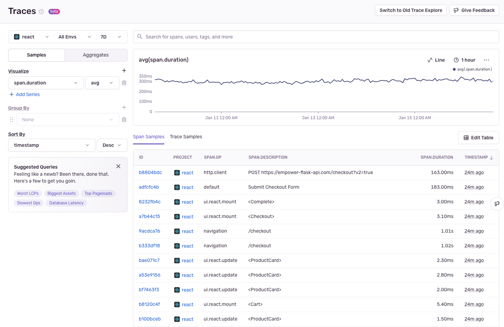
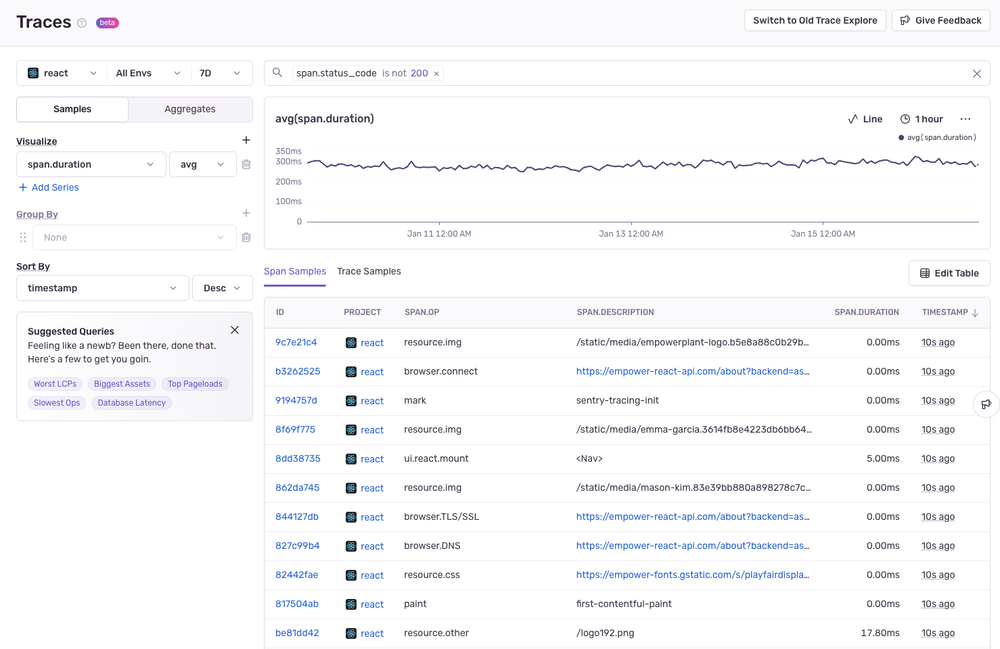
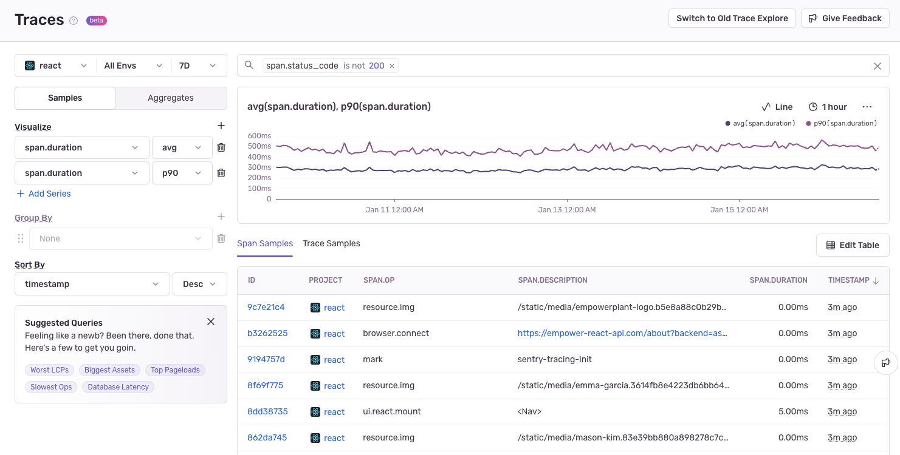
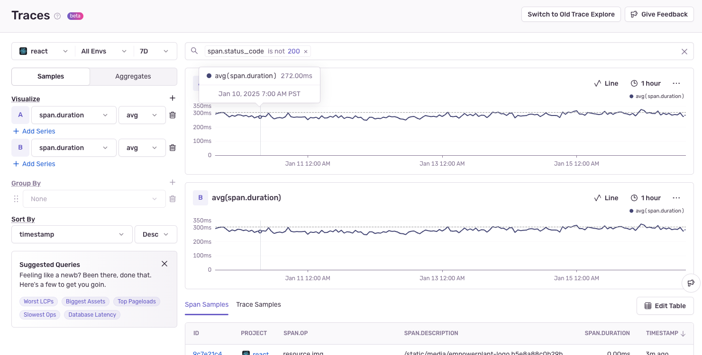
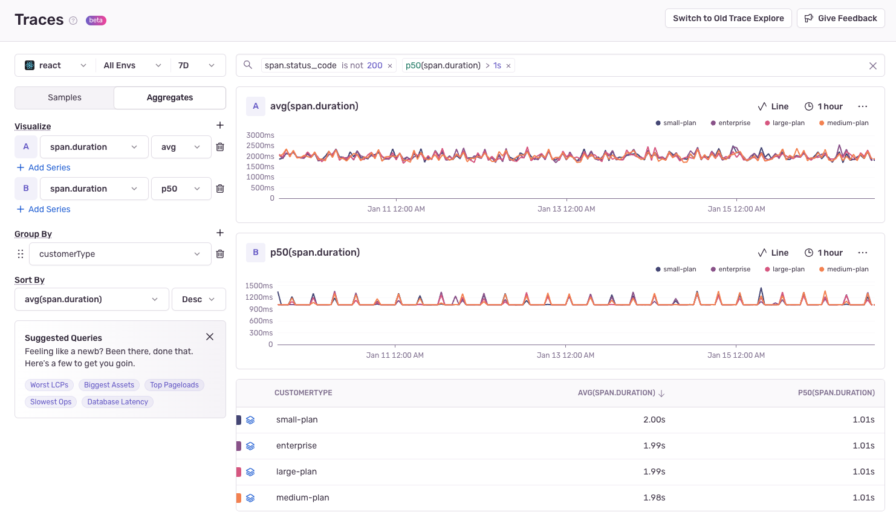
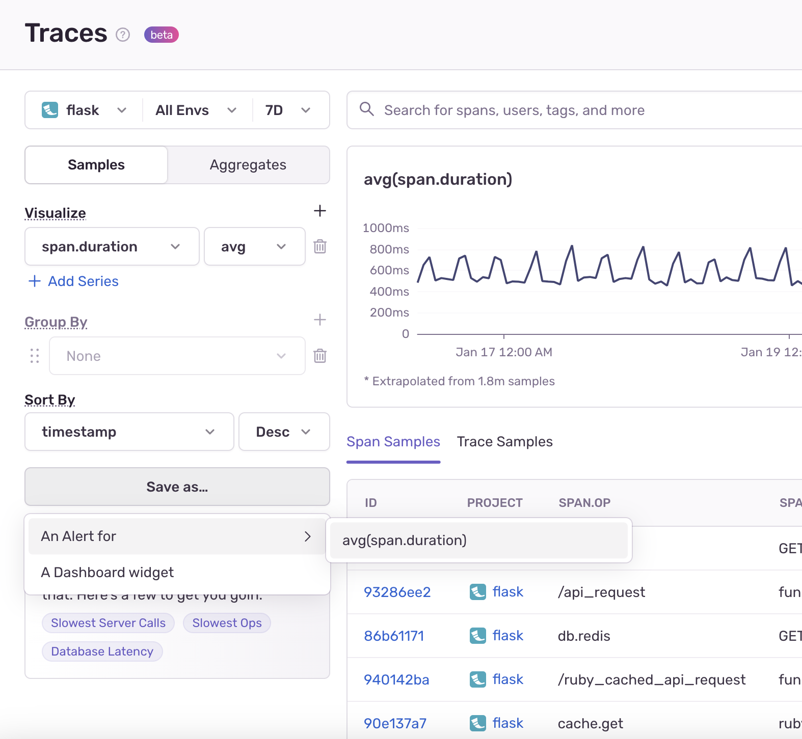

<Alert>
  The new Trace Explorer is currently an Early Adopter feature, to use it you will need to [enable your Early Adopter status](/organization/early-adopter-features/). If you are not an Early Adopter, you will still see the [classic Trace Explorer](/product/explore/traces/).
</Alert>

The [**Trace Explorer**](https://sentry.io/orgredirect/organizations/:orgslug/traces/) in Sentry is designed to make investigating performance issues easier and more intuitive. You can now explore span samples, visualize span attributes, and aggregate your data with flexible queries and filters. This guide will walk you through the key concepts and features of the Trace Explorer.

## Key Concepts

### Traces

- A trace represents a single transaction or request through your system.
- It captures a series of operations (_spans_) that show how different parts of your application interacted during that transaction.
- Each trace is identified by a **Trace ID**, which you can use to follow a request across services or projects (For example, from your frontend framework to your backend service).

### Spans

- A _span_ represents an individual operation within a trace. This could be a database query, HTTP request, or UI rendering task.
- Each span has:
  - **Attributes**: Key-value pairs like `http.method`, `db.query`, `span.description`, or custom tags, providing additional context.
  - **Duration (`span.duration`)**: The time to complete the operation, used to measure performance.

## Browsing Span and Trace samples

Trace Explorer allows you to browse span and trace samples effortlessly. Here's how:

1. **Search for Samples**:
   - Use the search bar to filter results based on attributes like `span.op`, `http.method`, or any custom tags.
   - You can edit columns in span tables to view any attribute.
   - You can switch between **Span Samples** and **Trace Samples** tabs depending on your focus.
1. **Inspect Samples**:

   - Clicking on a **Span ID** or **Trace ID** opens the **Trace Waterfall View**, showing the sequence of operations and their durations.
   - You can explore individual spans in detail or see the trace's overall structure.

1. **Sort Samples**:
   - Use the **Sort By** dropdown or click on the table column headers to sort your data by `span.duration`, `timestamp`, or any other field.

## Visualizing Span Attributes

Trace Explorer makes it easy to visualize metrics aggregated from any span attribute.

1. **Set Up Visualization**:
   - Use the **Visualize** section to add metrics like `avg(span.duration)` or `p90(span.duration)` to the same chart by clicking **Add Series** or a different chart by clicking the **+** icon.
   - You can also create custom visualizations such as:
     - **P90 of span durations**: Useful for identifying outliers.
     - **Average cache size**: Analyze attributes specific to backend spans.
2. **Filter Your Data**:
   - Refine your visualization by applying filters in the search bar, such as `span.op:db` to focus on database spans or `http.status_code:500` for errors.

The line chart updates dynamically as you apply filters, helping you track trends and identify anomalies.

## Aggregating Span Data

Dive deeper into your data with aggregation capabilities in Trace Explorer.

1. **Enable Aggregate Grouping**:
   - Click the **Aggregates** toggle to switch span samples to aggregate data.
   - You can add grouping, filters, and calculations for deeper analysis.
2. **Group By Attributes**:
   - Use the **Group By** section to group spans by any attribute, like `http.method`, `span.op`, or custom tags.
   - For example:
     - Group spans by `http.method` to compare the performance of `GET` vs `POST` requests.
     - Analyze spans by `db.table` to find slow database operations.
3. **Apply HAVING Conditions**:
   - After grouping, use **cell actions** to filter results directly in the table.
   - For example:
     - Filter for spans where `avg(span.duration) > 1s` to focus on long-running operations.

## Creating Alerts and Dashboard Widgets From Queries

You can create Alerts and Dashboard widgets from your queries by clicking the "Save As" button:

## Practical Examples

- **Diagnosing Slow Pages**:
  - Search for `span.op:navigation` and visualize `p90(span.duration)` to pinpoint slow page loads.
- **Finding Problematic API Calls**:
  - Group by `http.url` and filter where `avg(span.duration) > 2s` to identify slow external API calls.
- **Database Query Analysis**: Group by `db.query` and sort by `avg(span.duration)` to find inefficient queries.

With these tools, the Trace Explorer gives you powerful ways to understand your application's performance, identify bottlenecks, and make informed optimizations.
