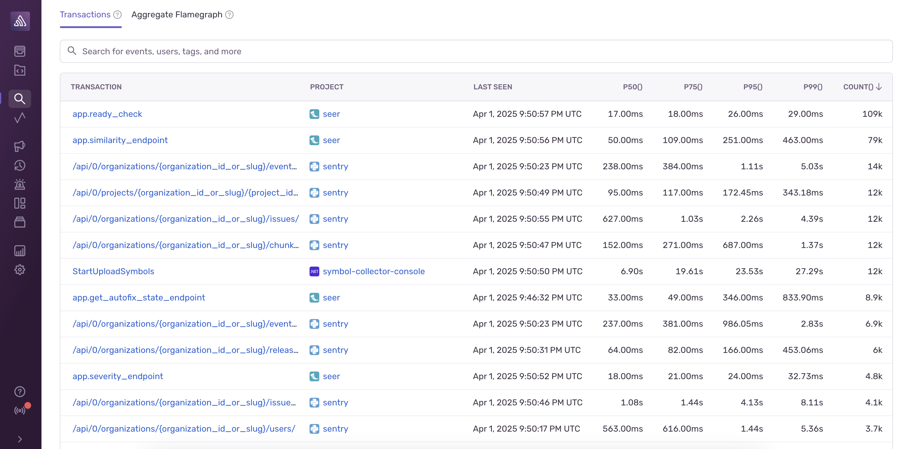
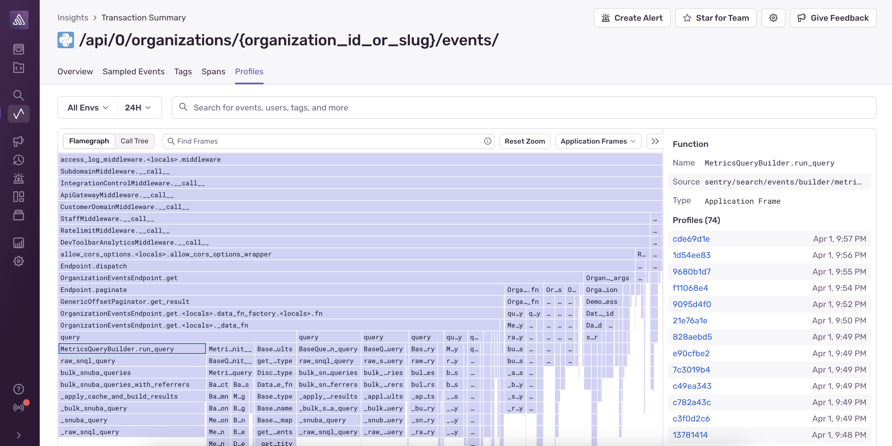
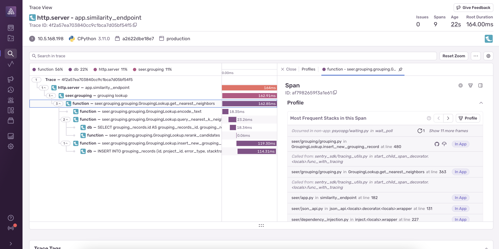

Sentry’s Profiling products provide precise, code-level visibility into application execution in a production environment.

## When Should You Use Profiling?

Profiling helps you understand where time is being spent in your application at a **function level**. While [tracing](/concepts/key-terms/tracing/) can help you capture information about the higher level operations (HTTP requests, database queries, UI rendering, etc.) that consume time in your application, profiling helps you debug performance by visualizing the call stacks on every thread, throughout the execution of your application.

This is especially helpful in situations where you are missing explicit instrumentation (spans and logs) that might help you narrow in on where an issue is occurring. Profiling requires *no additional instrumentation* and will automatically capture information on the functions and lines of code that take the most time as your application runs. 

Profiling helps you quickly identify performance bottlenecks, enabling you to build in [performance as a feature](https://blog.codinghorror.com/performance-is-a-feature/) from day one.

## Profiling Products

<Alert>

**The currently supported platforms are:**

- [Android (Java and Kotlin only)](/platforms/android/profiling/)
- [iOS and macOS (Swift and Objective-C only)](/platforms/apple/profiling/)
- [Python](/platforms/python/profiling/)
- [Node.js](/platforms/javascript/guides/node/profiling/)
- [PHP (including Laravel and Symfony)](/platforms/php/profiling/)
- [Browser JavaScript [beta]](/platforms/javascript/profiling/)
- [Ruby [beta]](/platforms/ruby/profiling/)
- [React Native [beta]](/platforms/react-native/profiling/)
- [Flutter [experimental, iOS and macOS only]](/platforms/dart/guides/flutter/profiling/)
- [.NET [experimental]](/platforms/dotnet/profiling/)

</Alert>

Sentry supports profiling for both backend and frontend use cases with two products:
* **Continuous Profiling** enables *continuously* profiling backend services to find code paths that are causing excessive resource usage and high infrastructure cost.
* **UI Profiling** enables profiling critical user flows (or entire user sessions) in browser and [mobile](/product/explore/profiling/mobile-app-profiling/) apps to find code paths that are causing janky scrolling and animations, high interaction latency, and slow load times that contribute to a poor user experience.

## Profiling Page

On the [**Profiling**](https://sentry.io/orgredirect/organizations/:orgslug/profiling/) page, you’ll find high level metrics on the slowest functions in the selected project(s), as well as any functions that have regressed or improved in performance within the selected time range.

On the **Slowest Functions** widget, you can click on the ellipses button (...) on each function to see a list of example profiles containing that function. On the **Most Regressed/Improved Functions** widget, you can click on the function duration before & after the change to see before & after example profiles containing that function.

Below the function metrics, you’ll find two tabs: **Transactions** and **Aggregate Flamegraph**. 

If [tracing](/concepts/key-terms/tracing/) is enabled, **Transactions** shows a list of all of the transactions instrumented in the selected projects, allowing you to break down profiling data by endpoints, routes, user flows, etc. It gives you a more focused view of application performance within a *specific* part of the application.

The **Aggregate Flamegraph** tab does _not_ require tracing to be enabled, and will show you a high level view of all of the most frequent code paths within the selected projects. This gives you a more general view of where time is being spent overall in a service or application.

### Transactions Tab
<Alert>
The transactions list will not be populated if tracing is not enabled for at least one of the selected projects.
</Alert>

The **Transactions** tab, by default, shows a list of all transactions in the selected projects sorted by the frequency (count) of the transaction. The list can also be sorted by duration (p50/75/90/95), project, timestamp, etc. by clicking on the column headers in the table. The transactions list can also be filtered by specifying a query using the search bar. For example, you can search for transactions from specific users or transactions that are tagged with a custom attribute.

Click the name of a transaction to navigate to the **Transaction Summary** page, which contains aggregated performance data that is scoped to that transaction. By default, the **Profiles** tab is selected, which contains an [aggregate flame graph](/product/explore/profiling/flame-charts-graphs) showing the most frequent code paths that were profiled within that transaction. This flame graph behaves the same as the flame graph in the **Aggregate Flamegraph** tab described below.

### Aggregate Flamegraph Tab

The **Aggregate Flamegraph** tab shows a [flame graph](/product/explore/profiling/flame-charts-graphs) with aggregated information on the frequency of code paths within the selected projects. 

The wider frames represent more **frequent** code paths, which are likely more relevant optimization opportunities. You can click on a frame to select it, which will populate the sidebar on the right with links to example profiles containing the selected function. 

## Zooming Into Traces Using Profiling

If you are already looking at a trace and have insufficient information to debug the root cause of the problem, profiling data can help fill in the gaps. If there is profiling data associated with the trace, there are two ways to get to it from the [**Trace View**](/concepts/key-terms/tracing/trace-view/).

One way is to select a span and scroll down to the **Profile** section of the span details:

The **Most Frequent Stacks in this Span** widget shows a paginated list of call stacks in descending order of frequency that indicates where in the code most of the time in the selected span is spent. Click the **>** button to page through the other stacks, or click the **Profile** button to view the entire profile in the flame graph viewer.

The other way is to click the **Profiles** tab in the Trace View, which will show a list a profile events across *all* spans contained within the trace:

## Getting Started

Read the [Getting Started guide](/product/explore/profiling/getting-started) to start using Continuous Profiling and UI Profiling.

<PageGrid />
