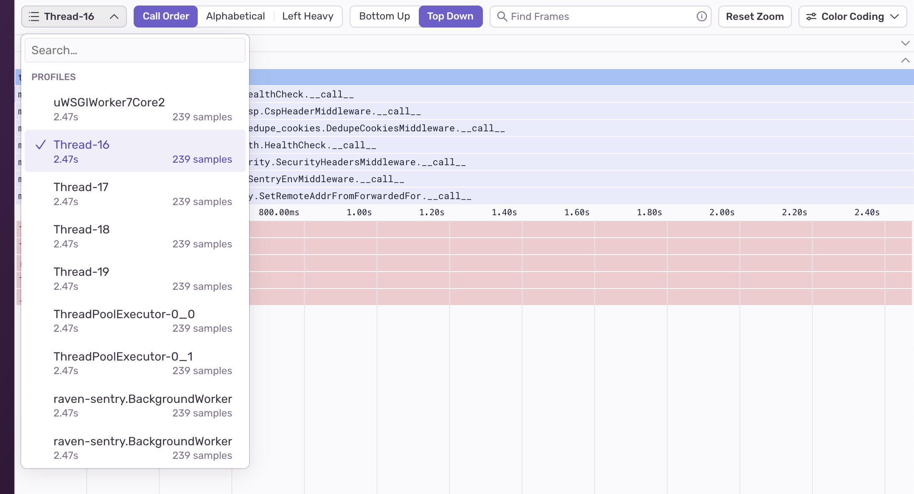
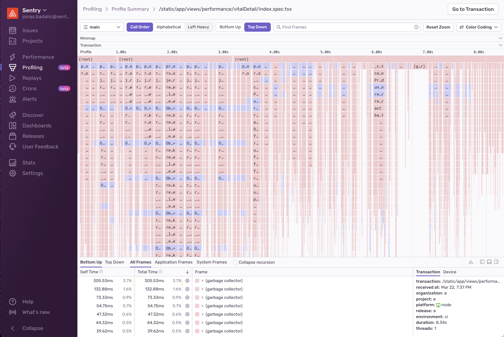

Profiling can be used to gain insight into the exact functions and lines of code that are impacting performance. Each profile has a detailed view that illustrates the code that was running in your application and service while the profile was collected, with different ways to filter and visualize the data. To learn how to set up profiling and access profiling data, see the [**Profiling**](/product/explore/profiling/) documentation.

The main visualization on the Profile Details page is a flame graph. Learn more about flame graphs in [**Flame Graphs and Aggregated Flame Graphs**](/product/explore/profiling/flame-charts-graphs).

## Thread Selector

A flame graph can only show data from one thread at a time. You can use the thread selector dropdown to choose which thread to look at.

## Flame Graph Sorting Options

Samples are displayed in chronological (call) order by default. You can change the way samples are sorted in the flame graph with these options:

- **Call Order:** The default sorting order which displays samples in chronological order.
- **Alphabetical:** Sorts samples by frame name.
- **Left Heavy:** Sorts samples from highest weight to lowest weight.

When you use alphabetical or left heavy sorting, adjacent frames with the same name are merged and their durations are summed. This helps when your profile has a lot of tiny stacks (called “hair”) which are easier to see when summed together.

_Example of a NodeJS flame graph with a lot of “hair” vs the merged visualization. Notice how the right side of the second graph is able to display the sum durations for loading our modules._

**Bottom Up/Top Down**

Flame graphs represent profile data with leaves either at the top or the bottom. This toggle lets you choose which visualization style your flame graphs default to.

## Search

The search bar allows you to search for function names inside the profile. It supports fuzzy search and regular expressions.

## Flame Graph Colors

The **Color Coding** toggle offers different ways to color the flame graph:

- **By System vs. Application Frame** (default)
- **By Symbol Name:** Each unique function frame has its own color. When a unique function appears in different places in the graph it can be identified by its color.
- **By Package:** Frames from different packages or modules share the same color.
- **By System Frame:** System frames each have their own color so you can easily tell them apart. Application frames are grey.
- **By Application Frame:** Application frames each have their own color. System frames are grey.
- **By Recursion:** Only recursive functions are colored, the rest are grey. Supports both indirect as well as direct recursion.
- **By Frequency:** All frames are the same color, but the more often a function appears, the darker it gets.

## Minimap

The **Minimap** shows a zoomed-out view of the profile, with the currently displayed section in a box. You can click and drag the minimap to quickly navigate to a different part of the profile. Holding the Shift key while scrolling will trigger zoom. Releasing the shift key will scroll in both vertical and horizontal directions.

## Trace

The **Trace** section below the **Minimap** renders a tree of spans. It is a condensed representation of the same data shown in the [**Trace View**](/concepts/key-terms/tracing/trace-view/). This view is helpful for cross-referencing profiling data with span data.

## Tree View

The bottom of the screen shows a tree representation of the flame graph. It provides an alternate view that enables you to see and sort functions by name, time spent in them, and their type (application or system).

By default, the tree displays “Bottom Up”, which shows the leafmost functions, or those with the most time at the top of a call stack. Long-running leaf functions are a good first indicator of performance bottlenecks.

In “Bottom Up” view, expanding a row of the table shows the function's parent functions. In “Top Down” view, expanding a row shows all the children functions that function has called (also known as callees).

## Trace and Environment View

This section of the **Profile Details** page shows metadata about the trace and environment (OS, device, etc.) associated with this profile.

