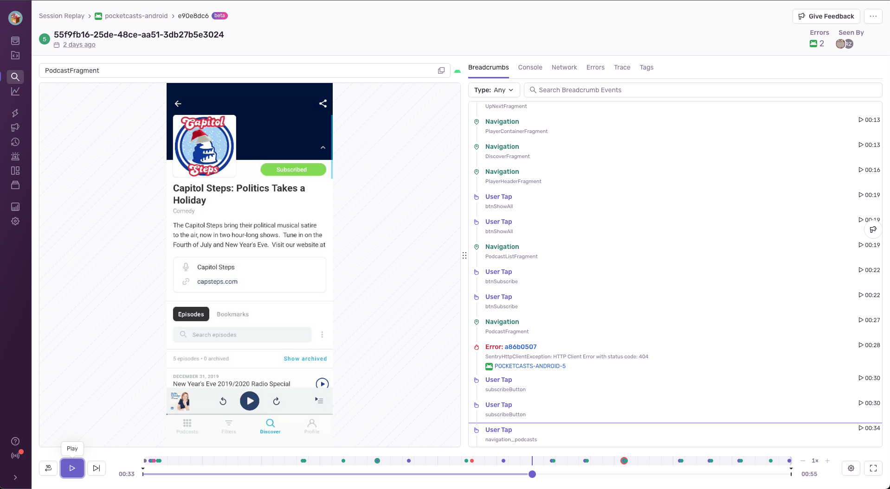
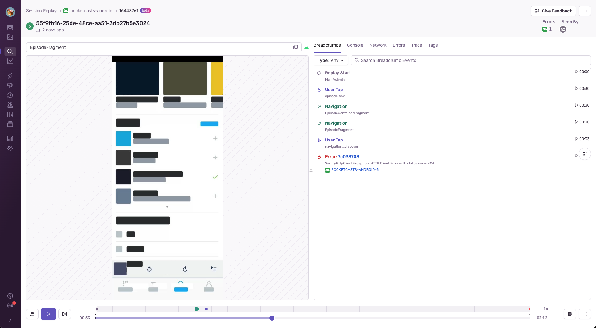

Session Replay allows you to see reproductions of user sessions, which can help you understand what happened before, during, and after an error or performance issue occurred. As you play back each session, you'll be able to see every user interaction in relation to network requests, frontend and backend errors, backend spans, and more.

Replays help you see exactly how the user experience is impacted by errors. Because they're integrated with our Issues product, you'll be able to see session replays connected to error events on the [Issue Details](/product/issues/issue-details/) page in Sentry. To make sure backend errors are also included in the replay, see our [backend set up instructions](/product/explore/session-replay/getting-started/#replays-for-backend-errors).

## What is Session Replay?

Session Replay for Mobile works by taking snapshots of the view hierarchy as well as a screenshot within the same frame, at the rate of one per second. These screenshots are then compressed into a video file representing a segment of the user’s session. All these small segments are then streamed into Sentry with additional trace identifiers, breadcrumbs, and other useful debugging information to compose the full user session.

The user session (replay) lasts until the user closes the app, the app crashes, the user puts the app in the background for over 30 seconds, or the session reaches 60 minutes in duration. The result is a video playback that can help you reproduce bugs in your mobile app, including hard-to-debug issues related to backend APIs and microservices.

To redact anything potentially sensitive and preserve maximum user privacy, the view hierarchy is used to find the position of controls such as text boxes, images, labels, and buttons. Redaction is done with a block that's drawn over these controls, using the most predominant color of the control.

## Replay Details

Every replay has a detailed view that contains the embedded video player and rich debugging context. Playing back the video will allow you to see every user interaction in relation to network requests, frontend and backend errors, backend spans, and more.  Almost every component on this page is connected through timestamps.

The below list shows the breakdown of each component and why it’s valuable:

- **Breadcrumbs:** The replay breadcrumbs show when key user interactions took place, specifically: user taps with the relevant component, navigations, when the user put the app in background or foreground, and [custom breadcrumbs](/product/sentry-basics/integrate-backend/configuration-options/#breadcrumbs) set by your organization. Breadcrumbs also provide insight into the device of a given user session at particular timestamps:
      - `device battery` (when battery level or charging status changes)
      - `orientation` (when the user rotates the device)
      - `connectivity` (when this status changes between wifi, cellular, and offline).

These breadcrumbs are synced with the replay player and will auto-scroll as the video plays. Some [breadcrumb types](/product/issues/issue-details/breadcrumbs/) visible in Issue Details are not 1:1 to the replay breadcrumbs list. On the Replay Details page, the trail of events typically seen in the Issue Details page are instead displayed in the Network and Console components.

- **Timeline:** This is the section at the bottom of the Replay Details page that illustrates where significant events (such as errors, device battery, and user interactions) happen over the course of the replay. This allows users to easily scrub to key events by dragging across the timeline. It also visually conveys the amount of time that took place between events and has a zoom functionality so you can easily zoom-in to distinguish between events that happened close together.

- **Network:** This is a list of all network requests that were initiated by the app while the replay recording was active. As the video plays, there’s a visual indicator that tracks through the table of network requests, highlighting which requests happened prior to, or next to this point in the video. When a request fails, it is highlighted in red. You can also click the timestamp on the far right of each request to bring yourself to that point in the replay player.

- **Console:** Some debugging messages that don't belong in the breadcrumb list will show up here. For example, a custom `console.log` in React Native. Logs from [Logcat](https://docs.sentry.io/platforms/android/integrations/logcat/) and [Timber](https://docs.sentry.io/platforms/android/integrations/timber/) are also supported and will show up here.

- **Errors:** All the errors that occurred in the replay (including in your backend), with links to the corresponding events and [issue(s)](/product/issues/issue-details/error-issues/), as well as the impact these issues have had holistically across all users on your application, seen when you hover over the issue ID.

- **Tags:** A complete list of built-in fields and custom tags associated with a replay, such as operating system version and name, device specs, release, and user details.

- **Trace:** A view that connects all the [trace(s)](/product/sentry-basics/tracing/distributed-tracing/#traces-transactions-and-spans) that happened during the replay.

## SDKs Supported

Session Replay for mobile is currently available for Android and iOS on both native SDKs, as well as for React Native and Flutter.

We recommend updating to the latest version, but the minimum versions supported are:

- [iOS](/platforms/apple/guides/ios/session-replay/), [8.43.0](https://github.com/getsentry/sentry-cocoa/releases)
- [Android](/platforms/android/session-replay/), [7.20.0](https://github.com/getsentry/sentry-java/releases)
- [React Native](/platforms/react-native/session-replay/), [6.5.0](https://github.com/getsentry/sentry-react-native/releases)
- [Flutter](/platforms/flutter/session-replay/), [8.12.0](https://github.com/getsentry/sentry-dart/releases)

## Frequently Asked Questions

**How do you protect user data?**

Sentry is privacy-focused so protecting user data is always top of mind. That’s why by default, our privacy configuration is very aggressive and redacts all text and images to ensure no sensitive user information is collected. We also provide server-side scrubbing on debugging context to additionally filter on the server as an added precaution.

Additionally, we offer a self-serve deletion capability of individual replays in the UI.

**What is the performance overhead of the Replay package?**

For most mobile applications, the performance overhead of our client SDK will be imperceptible to end-users. In our own testing, the overhead was not noticeable by end-users. However, this testing was not exhaustive and you may discover the recording overhead may negatively impact your mobile application performance depending on your application complexity.

To reduce the performance overhead, we only take screenshots when something changes on the screen. Our default frame rate is 1 frame per second.
If you experience any performance degradations after installing Session Replay, please open an issue on GitHub for your respective SDK: [Android](https://github.com/getsentry/sentry-java/issues/new/choose), [iOS](https://github.com/getsentry/sentry-cocoa/issues/new/choose), [React Native](https://github.com/getsentry/sentry-react-native/issues/new/choose), and [Flutter](https://github.com/getsentry/sentry-dart/issues/new/choose).

**How much does it cost to use Session Replay for mobile?**

Session Replay for Mobile is currently available for all plans. Check out our [pricing page](https://sentry.io/pricing/) for details.

**Are unhandled exceptions (for example, crashes) available as part of Session Replay for mobile?**

Yes, Session Replay for Mobile covers handled and unhandled exceptions as well as ANRs/App Hangs and native (NDK) crashes. Make sure to use the latest SDK version as mentioned in [SDKs Supported](#sdks-supported).

**How does Session Replay for mobile work if my app is offline?**

Session Replay for Mobile currently supports offline mode only when `onErrorSampleRate` is specified. When an error happens, the SDK will capture the segment it recorded until that time (up to 30 seconds) and store it to disk. When the application comes back online, that segment will be sent to Sentry together with the error.

Currently `sessionSampleRate` is not supported in offline mode. Please subscribe to this [GitHub issue](https://github.com/getsentry/sentry/issues/68287) for updates.
