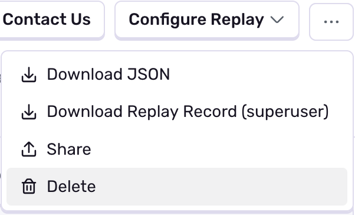
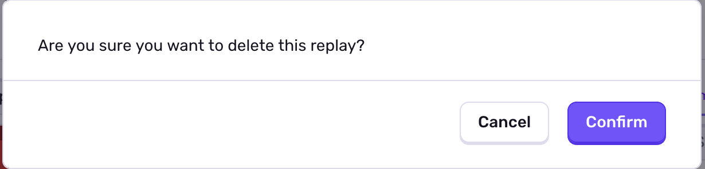
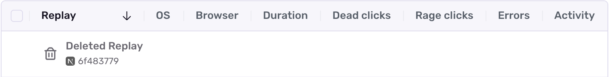
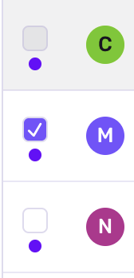
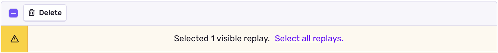
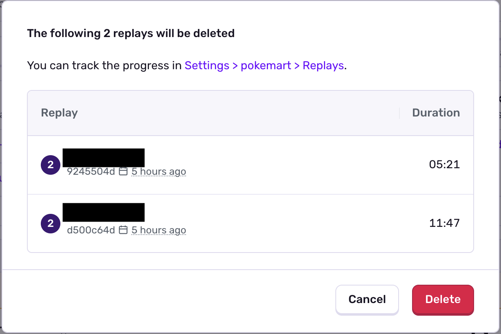

<Include name="session-replay-web-report-bug.mdx" />

Sentry exposes delete functionality which can quickly remove unwanted or incorrectly masked session replays.

## Deleting a Single Replay

To delete a session replay visit the replay's details page. In the upper right corner click the three dots button. Click "Delete Replay".

Click "Confirm".

You will be returned to the index page. Refresh the page to see the deleted session replay row.

## Deleting Replays in Bulk

Replays can be bulk deleted from a selection set or from a query. To bulk delete replays click the empty checkbox on the left-hand side of the session replay row.

Click the "Delete" button to delete from the selection set.

Alternatively click "Select all replays" to select every replay which matches the query. To alter the query you may adjust your time range, environment, project, or enter any number of search conditions in the search box.

Click "Delete".

A pop up will link to a progress monitoring screen.

