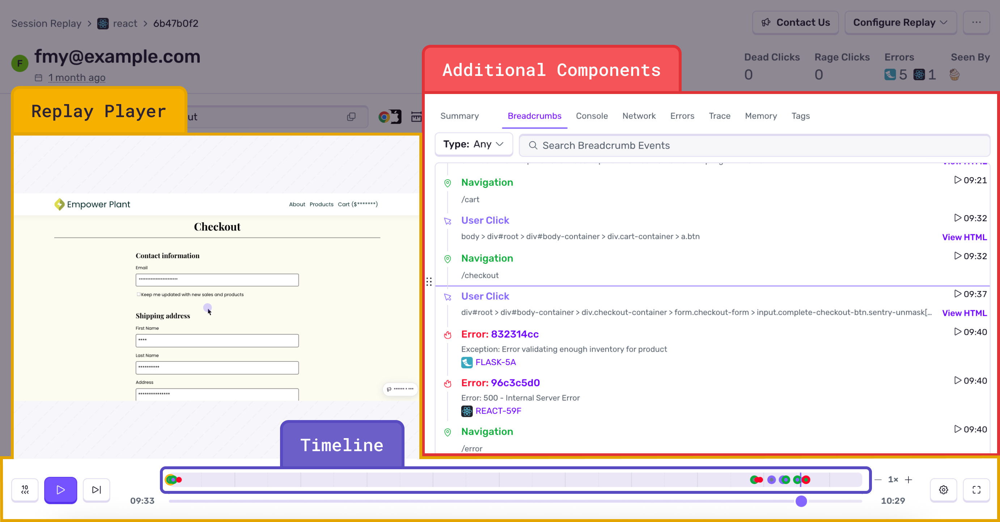
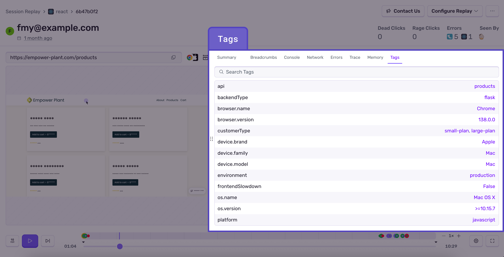
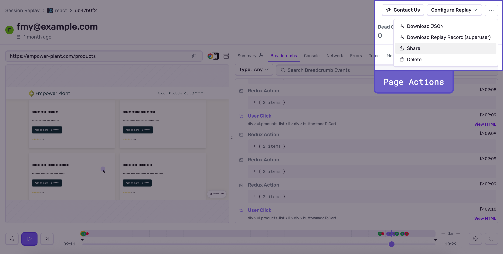

<Include name="session-replay-web-report-bug.mdx" />

Every replay has a detailed view that contains the embedded video player and rich debugging context. Playing back the video will allow you to see every user interaction in relation to frontend and backend errors, console messages, DOM events, network requests and more depending on your platform. It's like having [DevTools](https://developer.chrome.com/docs/devtools/overview/) active for your production user sessions. Almost every component on this page is connected through timestamps.

## Components Overview

### Replay Player

The video-like reproduction of a user session allows you to visualize exactly what actions the user took during their session and how the application behaved within their specific environment, including device, OS, latency, settings, and more. Most importantly, you can see which actions led to an error, which takes the guesswork out of debugging.

<Alert>

By default, the Session Replay SDK is configured to redact all text, user input, and media elements. See all privacy configuration options [here](/platform-redirect/?next=/session-replay/privacy/).

</Alert>

### AI-Powered Replay Summary [Web Only]

<Alert>
This feature is currently in Beta, which means that this feature is still in-progress and may have bugs. We recognize the irony.
</Alert>

Sentry now provides **AI-powered replay summaries** that automatically analyze what happened during a user session and give you a short play-by-play to help debug issues faster. Rather than watch an entire replay, you can now get a quick overview of what happened and focus on the specific interactions that led to the issue. This tab includes:

- **AI Summary:** An LLM-powered description of the user's journey
- **Chapters:** Each chapter summarizes related sets of breadcrumbs, network requests, and console logs, ordered by time range. Click a chapter to expand its contents and see the underlying events. Red chapters highlight errors, pink chapters highlight feedback

### Breadcrumbs

The replay breadcrumbs show when key user interactions took place. Breadcrumbs are synced with the replay player and will auto-scroll as the video plays.

**Both web and mobile replays include:**
- **Custom Breadcrumbs:** Learn more about configuring [custom breadcrumbs](/product/sentry-basics/integrate-backend/configuration-options/#breadcrumbs)

**Web-specific breadcrumbs include:**
- **User Clicks:** including [rage clicks](/product/issues/issue-details/replay-issues/rage-clicks/) and [dead clicks](/product/issues/issue-details/replay-issues/rage-clicks/#detection-criteria)
- **Navigations and Page Loads:** [Learn more about spans](/product/sentry-basics/distributed-tracing/)
- **Web Vitals:** and an overall performance score [Learn more](/product/insights/web-vitals/)

**Mobile-specific breadcrumbs include:**
- Backgrounding and foregrounding
- Network connectivity changes
- Battery usage

<Alert>

Some [breadcrumb types](/product/issues/issue-details/breadcrumbs/) visible in **Issue Details** are not a one-to-one representation of the replay breadcrumbs list. The trail of events typically seen in the Issue Details page are now displayed in the Console and Network components of the **Replay Details** page.

</Alert>

### Timeline

The timeline section at the bottom of the **Replay Details** page illustrates where significant events (such as errors, user interactions, and more) happen over the course of the replay. This allows users to easily scrub to key events by dragging across the timeline. It also visually conveys the amount of time that took place between events and has a zoom functionality, so you can easily zoom in to distinguish between events that happen close together.

### Console

A list of debugging messages that don't belong in the breadcrumbs list will appear here. For web, this includes `console.log` statements and browser-generated messages to the developer. For React Native, custom `console.log` will appear here, and in Android, logs from [Logcat](/platforms/android/integrations/logcat/) and [Timber](/platforms/android/integrations/timber/) are also supported.

### Network

This tab contains a list of all network requests that were initiated by the app while the replay recording was active. As the video plays, there is a visual indicator that tracks through the table of network requests, highlighting which requests happened prior to or next to this point in the video. You can also click the timestamp on the far right of each request to bring yourself to that point in the replay player.

<Alert>

If configured for web, Sentry can also show the actual [HTTP request body and headers](/platform-redirect/?next=/session-replay/configuration/#network-details).

</Alert>

### Errors

See all the errors that occurred in the replay (including in your backend), with links to the corresponding events and [issue(s)](/product/issues/issue-details/error-issues/), as well as the impact these issues have had holistically across all users on your application.

### Trace

Connects all the [trace(s)](/product/sentry-basics/tracing/distributed-tracing/#traces-transactions-and-spans) that happened during the replay.

<Alert>

Due to transaction sampling, this view may be missing traces.

</Alert>

### Memory [Web Only]

The view shows a heap size chart displaying the total amount of memory being used by JavaScript objects.

<Alert>

This view is only available when the replay was recorded on a [Chromium-based](https://www.chromium.org/chromium-projects/) browser.

</Alert>

### Tags

A complete list of built-in fields and custom tags associated with a replay, such as operating system version and name, device specs, release, and user details.

## Replay Actions

### Share Replays

Share a replay at a specific timestamp with a Sentry member by clicking the "Share" button in the top-right corner of the **Replay Details** page. This allows you to share replays at the point of a critical event or user flow with other Sentry members in your organization.

### Delete Replays

Delete an individual replay by clicking the "Delete" button in the top-right corner of the **Replay Details** page. You cannot delete replays that are in progress. **Deleting replays does not affect your quota.**

## Retention and Filtering

### Retention

Replays are retained for 90 days in Sentry for paid plans (the same retention period as other event types, such as Errors and Transactions). For free plans, replays are retained for 30 days in Sentry. The retention period is not configurable.

### Inbound Filtering

If you've chosen not to capture certain errors by applying any of the below inbound filter rules, those same rules will also apply to Session Replays.

- IP Addresses
- Releases
- Request URLs
- User-Agents

<Alert>

Because filtered outcomes are emitted per **segment** whereas successful outcomes are emitted per **replay** (a replay being a collection of segments), you may see a noticeable increase in filtered outcomes on your [Stats](https://sentry.io/orgredirect/organizations/:orgslug/stats) page. This is not an error.

</Alert>
