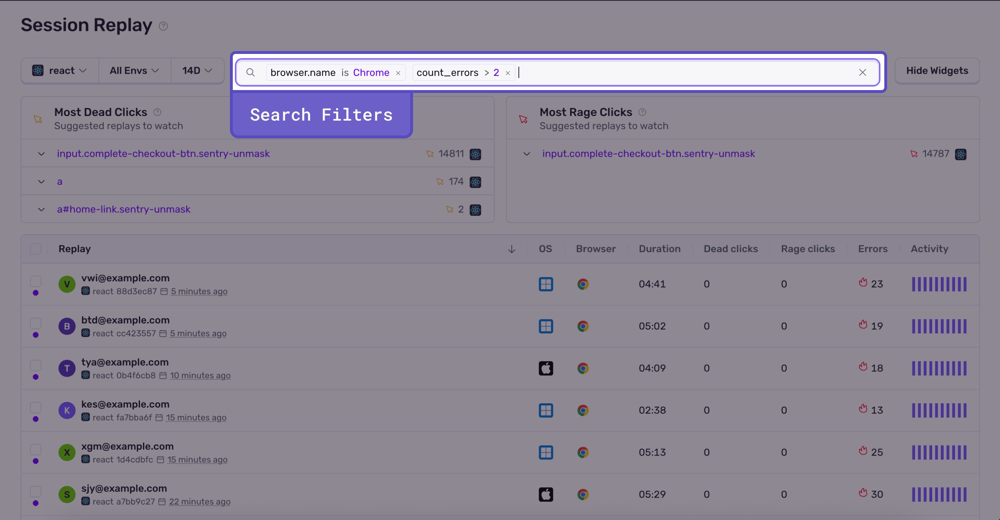
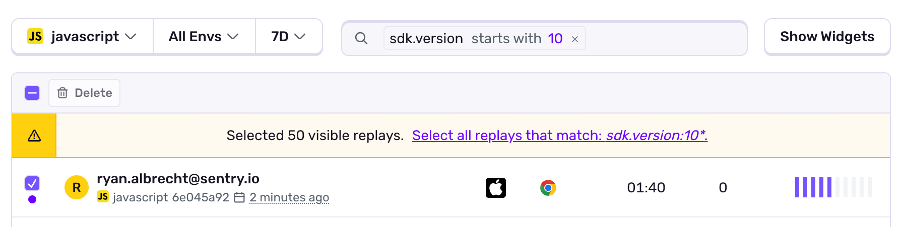
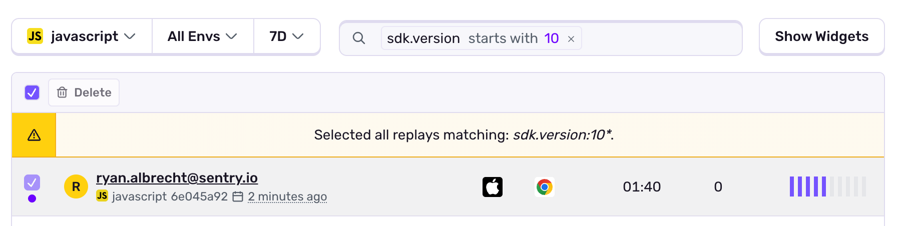

<Include name="session-replay-web-report-bug.mdx" />

You can search for or browse replays of user sessions on the **Replay** page, where they’re organized chronologically by default. You’ll see the following information for each session:

- **Project**: The project in which the session was recorded.
- **Start Time**: How long ago the replay was triggered. (Replays can appear here while the recording is still in progress.)
- **Duration**: The length of the replay. (Recordings can range from 1 second to 60 minutes.)
- **Errors:** The number of frontend errors identified by Sentry, as encountered in the replay. (Sometimes the error count reported is different from the actual errors captured. Read more in [Error Linking](/platform-redirect/?next=/session-replay/#error-linking).)
- **Activity**: The activity level as determined by the number of errors encountered, their duration, and the number of UI events
- **Dead Clicks**: User clicks on `a` and `button` tags that do not result in any page activity after 7 seconds (i.e. no HTML was added, removed, or updated; no visual changes were observed in the page)
- **Rage Clicks**: Five or more clicks on a dead element (it exhibits no page activity after 7 seconds.) Rage clicks are a subset of dead clicks

The **Replay** page also has two widgets titled "Most Dead Clicks" and "Most Rage Clicks" that show the selectors with the most rage or dead clicks. Expanding the selector will show example replays where that selector was clicked. You can also click the "See all selectors" button to view all selectors that have gotten rage or dead clicks. SDK version `7.60.1` or higher is required to see rage and dead click data on the **Replay** page.

By default, the IP address is used to identify each replay on this page. This can be changed in your organization and project settings. If you’d like to set an email or a username instead, call [Sentry.setUser()](/platform-redirect/?next=/enriching-events/identify-user) in your client-side configuration. If you’ve enabled the option to prevent storing of IP addresses in either your project-level or organization-wide settings, the IP address will appear redacted on the **Replay** page. For more information, read about [several data scrubbing options](/security-legal-pii/scrubbing/server-side-scrubbing/) in the Sentry app on either an organization or a project level.

Replays can appear on this page while they’re still in progress. You can’t delete in-progress replays.

Each replay will bring users to the [**Replay Details**](/product/explore/session-replay/web/replay-details/) page.

## Filtering Replays

All replays have built-in key fields, and may have [custom tags](/platform-redirect/?next=/enriching-events/tags/) if you have them set up. The search bar operates similarly to the one in the Discover [Query Builder](/product/explore/discover-queries/query-builder/#filter-by-search-conditions). Use it to search for keys and specific values. This will filter down your list of replays so you can quickly find the ones with the criteria you care about. For example, you can refine your replays search to a specific browser by using `browser.version:` as a key field and assigning the version as a value. For a list of all the built-in key fields and replay properties, check out our [Searchable Properties](/concepts/search/searchable-properties/session-replay/) documentation.

## Deleting Replays

Replays can be deleted either individually or in bulk. Deleting replays in bulk requires project:write or project:admin access.

When a replay is deleted, it is permanently removed from Sentry's servers, with the exception of its metadata. The metadata rows are archived and remain inaccessible to users. They are retained only until they are removed according to your organization's [data retention policy](https://sentry.io/security/#data-retention). These metadata rows may also be eagerly deleted, but doing so requires manual intervention. To request this, please file a support ticket by emailing support@sentry.io.

To delete a [single replay](/product/explore/session-replay/web/replay-details/#delete-replays), go to the Replay Details page and click the "Delete" link, which is located under the "..." (more options) button.

To delete multiple replays at once, go to the **Replay** page and use the checkboxes next to each replay row to select the ones you want to delete. Then, click the "Delete" button to remove the selected replays. Deleting a large number of replays takes some time to complete. If a job is running you will see a banner at the top of the Replay list and a link to 'Track Progress'. You can also visit Settings > Project > MyProject > Replays to see the history of previous deletion jobs.

Alternatively, you can delete all replays that match a search query by clicking "Select all" at the top of the results list. This selects every replay matching the current filters, not just those visible on the page.

